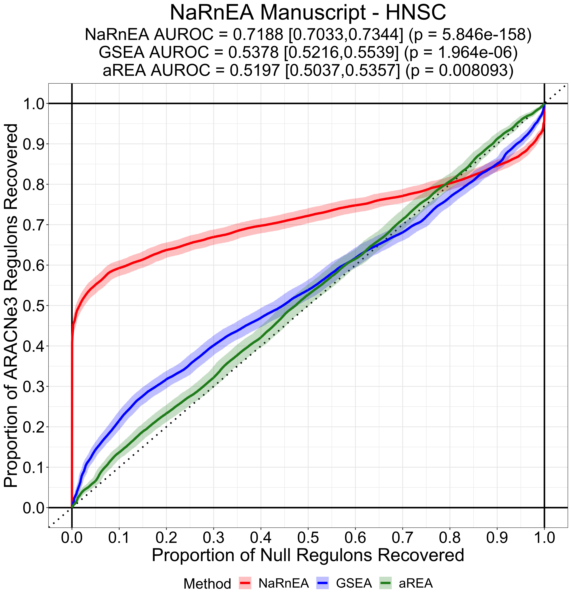
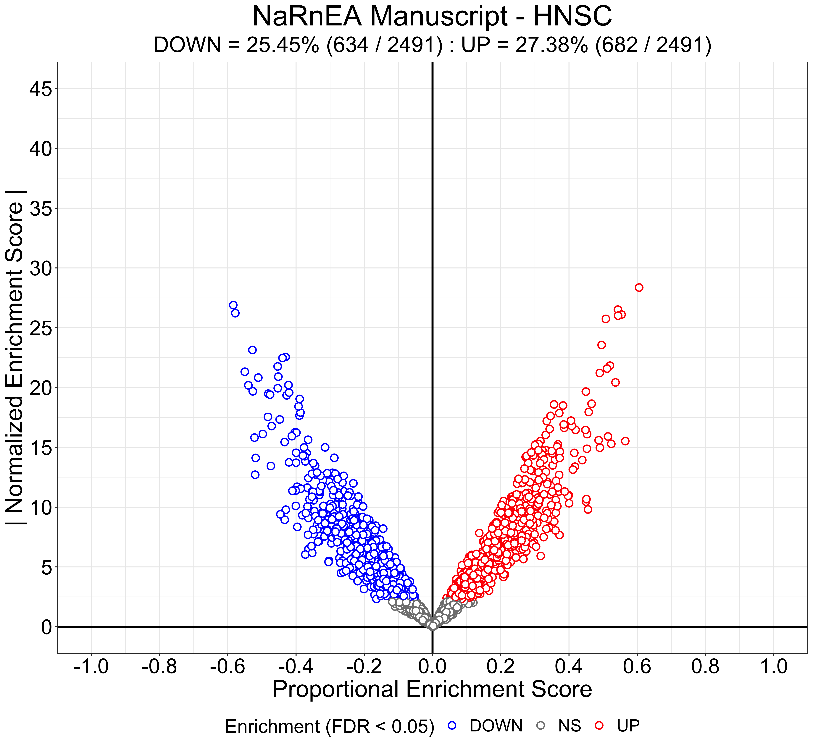

```{r include = FALSE, eval = TRUE}
library(knitr)
opts_chunk$set(collapse = TRUE, comment = "#>", tidy = TRUE, tidy.opts=list(width.cutoff=70))
```

### Description

##### This code is designed to reproduce the analysis from the manuscript for Nonparametric analytical Rank-based Enrichment Analysis (`NaRnEA`) for the head-neck squamous cell carcinoma (HNSC) cancer subtype using data from The Cancer Genome Atlas (TCGA) and the Clinical Proteomic Tumor Analysis Consortium (CPTAC).

### Citing `NaRnEA` and `ARACNe3`

##### If you use `NaRnEA` and/or `ARACNe3` in your research, please cite our preprint on bioRxiv [here](https://www.biorxiv.org/search/NaRnEA).

### Prepare the Workspace

##### All the packages needed for this vignette can be found on CRAN, BioConductor, or Github. The code below was optimized on a MacBook; if you are running this code on another operating system, some commands may need to be changed. For example, the `system` command should be replaced by `shell` for users running this code on a Windows machine. 

```{r include = TRUE, echo = TRUE, eval = FALSE}
# create the figure output directory
system("mkdir PNG_Figures")

# install BiocManager
install.packages("BiocManager")
library(BiocManager)

# install the other packages using BiocManager
install("tidyverse")
install("Rcpp")
install("BH")
install("DESeq2")
install("biomaRt")
install("mblm")
install("viper")
install("pROC")
install("TCGAbiolinks")
install("devtools")

# load the packages
library(tidyverse)
library(Rcpp)
library(BH)
library(DESeq2)
library(biomaRt)
library(mblm)
library(viper)
library(pROC)
library(TCGAbiolinks)
library(devtools)

# download the NaRnEA codebase from GitHub and unzip it, then install the NaRnEA R package using the devtools package. For subsequent functionality, make sure the NaRnEA codebase directory is present in the working directory. 
devtools::install(pkg = "NaRnEA", build_vignettes = TRUE)
library(NaRnEA)

# source the ARACNe3 Rcpp adaptive partitioning function
sourceCpp(paste("NaRnEA", "data", "ARACNe3", "ljv_apmi_estimator.cpp", sep = "/"))

# set the figure output value, the seed for the random number generator, and the specifier for the number of significant figures
figure.output.value <- 1
sim.seed <- 1
sig.figs <- 4

# set the seed for the random number generator
set.seed(sim.seed)

# set the current putative transcriptional regulators as the Entrez ID transcription factors (TFs) and Entrez ID co-transcription factors (coTFs)
cur.regulator.names <- c(readRDS(paste("NaRnEA", "data", "ARACNe3", "Entrez_TF.rds", sep = "/")), readRDS(paste("NaRnEA", "data", "ARACNe3", "Entrez_coTF.rds", sep = "/")))
cur.regulator.names <- sort(unique(cur.regulator.names))

# create the current output directory
cur.output.dir <- "HNSC_Output"
system(paste("mkdir ", cur.output.dir, sep = ""))
```

### Download Gene Expression Data From The Cancer Genome Atlas

##### The head-neck squamous cell carcinoma gene expression data is publicly available from The Cancer Genome Atlas (TCGA). We can use the `TCGAbiolinks` R package to download the data and prepare the counts matrix for analysis.

```{r include = TRUE, echo = TRUE, eval = FALSE}
# use the TCGAbiolinks R package to load in the count-based gene expression profiles for the TCGA HNSC cohort and the associated metadata
cur.project.name <- "TCGA-HNSC"
cur.query <- GDCquery(project = cur.project.name, data.category = "Transcriptome Profiling", data.type = "Gene Expression Quantification", workflow.type = "HTSeq - Counts")
GDCdownload(cur.query)

cur.tcga.meta.data <- getResults(query = cur.query)

cur.tcga.counts.files <- list.files(path = "GDCdata", pattern = "counts.gz", recursive = TRUE, full.names = TRUE)
cur.tcga.file.names <- unlist(lapply(cur.tcga.counts.files,function(x){
	y <- strsplit(x = x, split = "/", fixed = TRUE)[[1]]
	z <- y[length(y)]
	return(z)
}))
cur.tcga.case.values <- cur.tcga.meta.data[match(cur.tcga.file.names, cur.tcga.meta.data$file_name), "cases"]

cur.tcga.total.counts.mat <- lapply(cur.tcga.counts.files, function(sub.file){
	y <- read.table(file = sub.file, sep = "\t", header = FALSE, row.names = 1)
	z <- as.numeric(y[which(substr(rownames(y),1,5) == "ENSG0"),1])
	names(z) <- rownames(y)[which(substr(rownames(y),1,5) == "ENSG0")]
	return(z)
})
names(cur.tcga.total.counts.mat) <- cur.tcga.case.values
cur.tcga.total.counts.mat <- do.call("cbind", cur.tcga.total.counts.mat)
rownames(cur.tcga.total.counts.mat) <- unlist(lapply(strsplit(x = rownames(cur.tcga.total.counts.mat), split = ".", fixed = TRUE),function(x){return(x[1])}))

# use the biomaRt R package to convert the ensembl gene names to entrez id gene names
cur.mart <- useEnsembl(biomart = "ensembl", dataset = "hsapiens_gene_ensembl")
cur.possible.attributes <- listAttributes(mart = cur.mart)
cur.gene.conversion.data <- getBM(attributes = c("ensembl_transcript_id", "ensembl_gene_id", "entrezgene_id", "external_gene_name", "gene_biotype"), mart = cur.mart)

sub.gene.conversion.data <- cur.gene.conversion.data
colnames(sub.gene.conversion.data) <- c("enst.values","ensg.values","entrez.values","hugo.values","biotype.values")
sub.gene.conversion.data <- sub.gene.conversion.data[which(sub.gene.conversion.data$biotype.values == "protein_coding"),]
sub.gene.conversion.data <- sub.gene.conversion.data[which(!is.na(sub.gene.conversion.data$entrez.values)),]
sub.gene.conversion.data$entrez.values <- paste("g",as.character(sub.gene.conversion.data$entrez.values),"",sep = "_")

cur.tcga.entrez.counts.list <- lapply(sort(unique(as.character(sub.gene.conversion.data$entrez.values))),function(sub.entrez.value){
	sub.ensg.values <- unique(sub.gene.conversion.data[which(sub.gene.conversion.data$entrez.values == sub.entrez.value),"ensg.values"])
	sub.idx.values <- match(sub.ensg.values, rownames(cur.tcga.total.counts.mat))
	sub.idx.values <- sub.idx.values[is.finite(sub.idx.values)]
	return(sub.idx.values)
})
names(cur.tcga.entrez.counts.list) <- sort(unique(as.character(sub.gene.conversion.data$entrez.values)))

cur.tcga.entrez.counts.mat <- t(sapply(cur.tcga.entrez.counts.list,function(sub.idx.values){
	if(length(sub.idx.values) == 0){
		y <- rep(0, times = ncol(cur.tcga.total.counts.mat))
		names(y) <- colnames(cur.tcga.total.counts.mat)
	} else if(length(sub.idx.values) == 1){
		y <- as.numeric(cur.tcga.total.counts.mat[sub.idx.values,])
		names(y) <- colnames(cur.tcga.total.counts.mat)
	} else {
		y <- colSums(cur.tcga.total.counts.mat[sub.idx.values,])
		names(y) <- colnames(cur.tcga.total.counts.mat)
	}
	return(y)
}))

saveRDS(object = cur.tcga.entrez.counts.mat, file = paste(cur.output.dir,"/TCGA_HNSC_Entrez_Counts_Mat.rds", sep = "")) 
```

### Separate Gene Expression Profiles for Network Reverse-Engineering and Gene Set Analysis

##### We now separate the data into paired and unpaired gene expression profiles. Paired gene expression profiles (i.e. gene expression profiles belonging to primary tumor biopsies and adjacent normal tissue biopsies from the same patient) will be used to build a differential gene expression signature of primary tumor vs. adjacent normal tissue. Unpaired gene expression profiles will be used for transcriptional regulatory network reverse-engineering with `ARACNe3`.

```{r include = TRUE, echo = TRUE, eval = FALSE}
# separate gene expression profiles which come from primary tumor samples and gene expression profiles which come from adjacent normal tissue samples
cur.tcga.tumor.counts.mat <- cur.tcga.entrez.counts.mat[,which(substr(colnames(cur.tcga.entrez.counts.mat), start = 13, stop = 15) == "-01")]

cur.tcga.tissue.counts.mat <- cur.tcga.entrez.counts.mat[,which(substr(colnames(cur.tcga.entrez.counts.mat), start = 13, stop = 15) == "-11")]

# identify the gene expression profiles which are paired (i.e. which come from a single patient) and separate these from the unpaired gene expression profiles
paired.barcode.values <- intersect(substr(colnames(cur.tcga.tumor.counts.mat),1,12), substr(colnames(cur.tcga.tissue.counts.mat),1,12))

cur.paired.tumor.counts.mat <- cur.tcga.tumor.counts.mat[,match(paired.barcode.values,substr(colnames(cur.tcga.tumor.counts.mat), 1, 12))]

saveRDS(object = cur.paired.tumor.counts.mat, file = paste(cur.output.dir,"/TCGA_HNSC_Paired_Tumor_Counts_Mat.rds", sep = "")) 

cur.paired.tissue.counts.mat <- cur.tcga.tissue.counts.mat[,match(paired.barcode.values,substr(colnames(cur.tcga.tissue.counts.mat), 1, 12))]

saveRDS(object = cur.paired.tissue.counts.mat, file = paste(cur.output.dir,"/TCGA_HNSC_Paired_Tissue_Counts_Mat.rds", sep = "")) 

# set the unpaired primary tumor gene expression profiles to be used for network reverse-engineering with ARACNe3
cur.network.tumor.counts.mat <- cur.tcga.tumor.counts.mat[,match(setdiff(colnames(cur.tcga.tumor.counts.mat),colnames(cur.paired.tumor.counts.mat)), colnames(cur.tcga.tumor.counts.mat))]

saveRDS(object = cur.network.tumor.counts.mat, file = paste(cur.output.dir,"/TCGA_HNSC_Network_Tumor_Counts_Mat.rds", sep = "")) 
```

### Reverse-Engineer the Context Specific Transcriptional Regulatory Network with `ARACNe3`

##### Before reverse-engineering the transcriptional regulatory network, we normalize the unpaired gene expression profiles for sequencing depth as counts per million (CPM). The CPM values for each gene are then copula-transformed across the unpaired gene expression profiles; this procedure simplifies the estimation of mutual information via adaptive partitioning by ensuring that gene expression marginals are explicitly uniform. As a final pre-processing step, we subset our list of putative transcriptional regulators to those which are represented in the unpaired gene expression profiles. 

```{r include = TRUE, echo = TRUE, eval = FALSE}
# normalize network tumor gene expression profiles for sequencing depth (counts per million)
cur.network.tumor.cpm.mat <- apply(cur.network.tumor.counts.mat,2,function(x){
	y <- 1E6*x/sum(x)
	return(y)
})

# copula-transform the network tumor counts per million to simplify downstream analyses
set.seed(sim.seed)
cur.network.tumor.copula.mat <-  t(apply(cur.network.tumor.cpm.mat,1,function(x){
	y <- rank(x, ties.method = "random")/(1 + length(x))
	return(y)
}))

# subset the regulators to those that are present in the gene expression profiles
sub.regulator.names <- cur.regulator.names[which(cur.regulator.names%in%rownames(cur.network.tumor.copula.mat))]
```

##### `ARACNe3` generates decorrelated estimates of the transcriptional regulatory network topology (i.e. subnetworks) by subsampling from the entire set of gene expression profiles provided by the user. A subsampling proportion of ~63.21% is used to achieve an equivalent level of decorrelation to a sample bootstrapping procedure (i.e. sampling with replacement). Subsampling is used instead of sample bootstrapping as sample bootstrapping increases the bias and variance of the adaptive partitioning mutual information estimator. 

\n

##### We generate a list of subsampling indices, one for each subnetwork, which we refer to as folds. These subnetworks will be reverse-engineered and integrated until a stopping criterion is met; in our case, the stopping criterion is that every regulator has at least 50 targets. 

```{r include = TRUE, echo = TRUE, eval = FALSE}
# create the subnetwork downsampling fold list 
set.seed(sim.seed)
cur.max.subnetwork.num <- 100
cur.downsample.proportion <- (1 - exp(-1))
cur.downsample.num <- ceiling(ncol(cur.network.tumor.copula.mat)*cur.downsample.proportion)

cur.downsample.fold.list <- lapply(seq(from = 1, to = cur.max.subnetwork.num, by = 1), function(i){
	y <- sample(1:ncol(cur.network.tumor.copula.mat), size = cur.downsample.num, replace = FALSE)
	return(y)
})

saveRDS(object = cur.downsample.fold.list, file = paste(cur.output.dir,"/TCGA_HNSC_", ncol(cur.network.tumor.copula.mat),"_ARACNe3_Fold_List.rds", sep = ""))
```

##### `ARACNe3` calculates the statistical significance of mutual information, which is estimated between a putative transcriptional regulator and a potential target, using a null distribution for mutual information that is also estimated using adaptive partitioning. This null model is adjusted for the dataset under consideration and is computed from >1,000,000 mutual information values estimated between shuffled gene expression marginals; this shuffling procedure ensures that the resulting copula-transformed vectors are independent. An empirical cumulative distribution function (eCDF) is used to model the null distribution up to the 95th percentile. Beyond the 95th percentile, the null distribution of mutual information is modeled using robust linear regression fit to the logarithmically transformed quantiles. 

```{r include = TRUE, echo = TRUE, eval = FALSE}
# select the copula-transformed network gene expression profiles for the first subnetwork
sub.gep.mat <- cur.network.tumor.copula.mat[, cur.downsample.fold.list[[1]]]

# select enough null regulators to estimate null mutual information values for the mutual information null distribution
set.seed(sim.seed)
cur.null.mi.values <- 1E6
null.regulator.names <- sample(setdiff(rownames(sub.gep.mat), sub.regulator.names), size = ceiling((cur.null.mi.values/nrow(sub.gep.mat))))

# write the copula-transformed gene expression data for the current ARACNe3 subnetwork to the output directory as a properly formatted TXT file
sub.gep.output.data <- as.data.frame(cbind(gene = rownames(sub.gep.mat), sub.gep.mat))
colnames(sub.gep.output.data) <- c("gene",paste("Sample",1:ncol(sub.gep.mat),sep = ""))
rownames(sub.gep.output.data) <- NULL
write.table(sub.gep.output.data, file = paste(cur.output.dir,"/exp_mat.txt",sep = ""), quote = FALSE, sep = "\t", row.names = FALSE, col.names = TRUE)

# write the subset regulator names to the output directory
write.table(sub.regulator.names, file = paste(cur.output.dir,"/sub_regulator_data.txt",sep = ""), quote = FALSE, sep = "\t", row.names = FALSE, col.names = FALSE)

# create the null subsampled and copula-transformed gene expression matrix and write to the output directory
set.seed(sim.seed)
null.gep.mat <- t(apply(sub.gep.mat,1,function(x){
	y <- sample(1:length(x), size = length(x), replace = FALSE)/(1 + length(x))
	return(y)
}))
dimnames(null.gep.mat) <- dimnames(sub.gep.mat)

null.gep.output.data <- as.data.frame(cbind(gene = rownames(null.gep.mat), null.gep.mat))
colnames(null.gep.output.data) <- c("gene",paste("Sample",1:ncol(null.gep.mat),sep = ""))
rownames(null.gep.output.data) <- NULL
write.table(null.gep.output.data, file = paste(cur.output.dir,"/null_exp_mat.txt",sep = ""), quote = FALSE, sep = "\t", row.names = FALSE, col.names = TRUE)

# write the null regulator names to the output directory
write.table(null.regulator.names, file = paste(cur.output.dir,"/null_regulator_data.txt",sep = ""), quote = FALSE, sep = "\t", row.names = FALSE, col.names = FALSE)

# create a dummy mutual information threshold file written to zero (necessary for the ARACNe jar to run)
write.table(x = "0", file = paste(cur.output.dir,"/miThreshold_p1E-8_samples", ncol(sub.gep.mat),".txt", sep = ""), quote = FALSE, sep = "\t", row.names = FALSE, col.names = FALSE)

aracne3.jar.path <- paste(.libPaths(), "NaRnEA", "data", "ARACNe3", "aracne.jar", sep = "/")

# compute the null mutual information values with the null gene expression profiles and the null regulators use the ARACNe jar
cur.command <- paste("java -Xmx5G -jar ", aracne3.jar.path, " -e ", paste(cur.output.dir,"/null_exp_mat.txt", sep = ""), " -o ", cur.output.dir, " --tfs ", paste(cur.output.dir,"/null_regulator_data.txt", sep = ""), " --pvalue 1E-8", "--threads 1", " --seed 1", " --nobootstrap", " --nodpi", sep = "")

system(cur.command)

# load in the null mutual information values
cur.null.mi.values <- read.table(file = paste(cur.output.dir,"nobootstrap_network.txt", sep = "/"), header = TRUE, sep = "\t")
cur.null.mi.values <- as.numeric(cur.null.mi.values$MI)

# fit a piecewise null model for mutual information using an eCDF and robust linear regression regression
set.seed(sim.seed)

tmp.null.y.values <- seq(from = -9, to = -3, length.out = 1000)

tmp.null.x.values <- -1*quantile(x = (-1*cur.null.mi.values), probs = exp(tmp.null.y.values), names = FALSE)

tmp.null.data <- data.frame(x.values = tmp.null.x.values, y.values = tmp.null.y.values)

cur.null.tsr.model <- mblm(y.values ~ x.values, tmp.null.data)
```

##### Having fit the dataset-specific null distribution for mutual information estimated through adaptive partitioning, we can now estimate the mutual information between all putative regulators and potential targets and calculate the statistical significance for each putative regulatory interaction (i.e. the right-tailed p-value) using the gene expression profiles for the first subsampling fold. These p-values are corrected for multiple hypothesis testing using the methodology of Benjamini and Hochberg in order to control the False Discovery Rate (FDR) at some prespecified level. In this analysis, we control the FDR at 0.05, so we expect that 95% of the putative transcriptional regulatory interactions which pass the threshold will have non-zero mutual information.

```{r include = TRUE, echo = TRUE, eval = FALSE}
# remove the null mutual information estimation file and estimate the mutual information values between the true regulators and all potential target genes
cur.command <- paste("rm ", cur.output.dir, "/nobootstrap_network.txt", sep = "")
system(cur.command)

cur.command <- paste("java -Xmx5G -jar ", aracne3.jar.path, " -e ", paste(cur.output.dir,"/exp_mat.txt", sep = ""), " -o ", cur.output.dir, " --tfs ", paste(cur.output.dir,"/sub_regulator_data.txt", sep = ""), " --pvalue 1E-8", "--threads 1", " --seed 1", " --nobootstrap", " --nodpi", sep = "")

system(cur.command)

# load in the true mutual information values
cur.true.mi.values <- read.table(file = paste(cur.output.dir,"nobootstrap_network.txt", sep = "/"), header = TRUE, sep = "\t")
cur.true.mi.values <- as.numeric(cur.true.mi.values$MI)

# calculate the statistical significance (i.e. right-tailed p-values) for the true mutual information values using the eCDF. If the right-tailed p-value calculated with the eCDF is less than 0.05, recalculate the right-tailed p-value with the robust regression null model
cur.true.tsr.log.p.values <- (as.numeric(cur.null.tsr.model$coefficients[2])*(cur.true.mi.values) + as.numeric(cur.null.tsr.model$coefficients[1]))
cur.true.log.p.values <- log((1 - ecdf(cur.null.mi.values)(cur.true.mi.values)))
cur.true.log.p.values[which(cur.true.log.p.values < .05)] <- cur.true.tsr.log.p.values[which(cur.true.log.p.values < .05)]

# set an FDR threshold
cur.mi.threshold.fdr.value <- 0.05

# identify the smallest mutual information value which satisfies the FDR threshold according to the methodology of Benjamini and Hochberg
set.seed(sim.seed)

cur.true.rank.values <- rank(x = cur.true.log.p.values, ties.method = "random")
cur.true.check.values <- ((cur.true.log.p.values + log(length(cur.true.log.p.values)) - log(cur.true.rank.values)) <= log(cur.mi.threshold.fdr.value))
cur.mi.threshold.value <- min(cur.true.mi.values[which(cur.true.check.values)])

# write the newly computed mutual information threshold to the appropriate file in the output directory
write.table(x = cur.mi.threshold.value, file = paste(cur.output.dir,"/miThreshold_p1E-8_samples", ncol(sub.gep.mat),".txt", sep = ""), quote = FALSE, sep = "\t", row.names = FALSE, col.names = FALSE)
```

##### We can now use the newly computed mutual information threshold and begin reverse-engineering `ARACNe3`subnetworks using two distinct network pruning steps. In the first pruning step we remove all edges from the network which are less than the mutual information threshold. In the second pruning step, all three-gene cliques in the putative transcriptional regulatory subnetwork remaining after mutual information threshold pruning are identified and the edge in the three-gene clique with the smallest mutual information is marked for subsequent removal. All three-gene cliques are inspected regardless of order. The `ARACNe3` subnetworks are reverse-engineered until the stopping criterion has been met (e.g. at least 50 targets per regulator) or until all subsampling folds have been used (e.g. 100). 

```{r include = TRUE, echo = TRUE, eval = FALSE}
# remove the previous mutual information values from the output directory and reverse-engineer the first ARACNe3 subnetwork with both network pruning steps
cur.command <- paste("rm ", cur.output.dir, "/nobootstrap_network.txt", sep = "")
system(cur.command)

cur.command <- paste("java -Xmx5G -jar ", aracne3.jar.path, " -e ", paste(cur.output.dir,"/exp_mat.txt", sep = ""), " -o ", cur.output.dir, " --tfs ", paste(cur.output.dir,"/sub_regulator_data.txt", sep = ""), " --pvalue 1E-8", "--threads 1", " --seed 1", " --nobootstrap", sep = "")

system(cur.command)

# load in the edges for the first ARACNe3 subnetwork
cur.subnetwork.data <- read.table(file = paste(cur.output.dir,"nobootstrap_network.txt", sep = "/"), header = TRUE, sep = "\t")

# extract the edge names and write them to the output directory
cur.subnetwork.edge.values <- paste(as.character(cur.subnetwork.data$Regulator), as.character(cur.subnetwork.data$Target), sep = "---")

saveRDS(cur.subnetwork.edge.values, file = paste(cur.output.dir,"aracne3_subnetwork_1_edges.rds", sep = "/"))

# begin compiling count data for the ARACNe3 subnetwork edges
sub.loop.edge.values <- cur.subnetwork.edge.values

compiled.edge.counts <- rep(1, times = length(sub.loop.edge.values))
names(compiled.edge.counts) <- sub.loop.edge.values

# check if all regulators have at least 50 targets
cur.regulator.count.values <- sapply(strsplit(x = names(compiled.edge.counts), split = "---", fixed = TRUE),function(x){return(x[1])})
cur.regulator.count.values <- factor(cur.regulator.count.values, levels = sub.regulator.names)
cur.regulator.count.values <- table(cur.regulator.count.values)

cur.stop.check.value <- (mean(as.numeric(cur.regulator.count.values) >= 50) == 1)

# continue reverse-engineering ARACNe3 subnetworks until all the stopping criterion is met or until all subsampling folds have been used
cur.subnetwork.fold.num <- 1

while(((cur.stop.check.value == 0) & (cur.subnetwork.fold.num < cur.max.subnetwork.num))){
	
	# iterate the current subnetwork fold number
	cur.subnetwork.fold.num <- (cur.subnetwork.fold.num + 1)
	
	# subset the copula-transformed network gene expression data to the samples for the current subnetwork 
	sub.gep.mat <- cur.network.tumor.copula.mat[, cur.downsample.fold.list[[cur.subnetwork.fold.num]]]
	
	# write the subsampled and copula-transformed gene expression data to the output directory as a properly formatted TXT file after removing the previous gene expression profile matrix
	cur.command <- paste("rm ", cur.output.dir, "/exp_mat.txt", sep = "")
	system(cur.command)
	
	sub.gep.output.data <- as.data.frame(cbind(gene = rownames(sub.gep.mat), sub.gep.mat))
	colnames(sub.gep.output.data) <- c("gene",paste("Sample",1:ncol(sub.gep.mat),sep = ""))
	rownames(sub.gep.output.data) <- NULL
	write.table(sub.gep.output.data, file = paste(cur.output.dir,"/exp_mat.txt",sep = ""), quote = FALSE, sep = "\t", row.names = FALSE, col.names = TRUE)
	
	# reverse-engineer the current ARACNe3 subnetwork
	cur.command <- paste("rm ", cur.output.dir, "/nobootstrap_network.txt", sep = "")
	system(cur.command)
	
	cur.command <- paste("java -Xmx5G -jar ", aracne3.jar.path, " -e ", paste(cur.output.dir,"/exp_mat.txt", sep = ""), " -o ", cur.output.dir, " --tfs ", paste(cur.output.dir,"/sub_regulator_data.txt", sep = ""), " --pvalue 1E-8", "--threads 1", " --seed 1", " --nobootstrap", sep = "")
	
	system(cur.command)

	# load in the current ARACNe3 subnetwork
	cur.subnetwork.data <- read.table(file = paste(cur.output.dir,"nobootstrap_network.txt", sep = "/"), header = TRUE, sep = "\t")
	
	# extract the edge names and write them to the output directory
	cur.subnetwork.edge.values <- paste(as.character(cur.subnetwork.data$Regulator), as.character(cur.subnetwork.data$Target), sep = "---")
	
	saveRDS(cur.subnetwork.edge.values, file = paste(cur.output.dir,"/aracne3_subnetwork_",cur.subnetwork.fold.num,"_edges.rds", sep = ""))
	
	# add the edges to the compiled aracne edge counts
	sub.loop.edge.values <- cur.subnetwork.edge.values
	
	sub.loop.inter.edge.values <- intersect(sub.loop.edge.values,names(compiled.edge.counts))
	
	sub.loop.diff.edge.values <- setdiff(sub.loop.edge.values, sub.loop.inter.edge.values)
	
	compiled.edge.counts[match(sub.loop.inter.edge.values, names(compiled.edge.counts))] <- (1 + compiled.edge.counts[match(sub.loop.inter.edge.values, names(compiled.edge.counts))])
	
	sub.loop.diff.counts <- rep(1, times = length(sub.loop.diff.edge.values))
	names(sub.loop.diff.counts) <- sub.loop.diff.edge.values
	
	compiled.edge.counts <- c(compiled.edge.counts, sub.loop.diff.counts)
	
	# check if the stopping criteria is met (i.e. all regulators have at least 50 targets)
	cur.regulator.count.values <- sapply(strsplit(x = names(compiled.edge.counts), split = "---", fixed = TRUE),function(x){return(x[1])})
	cur.regulator.count.values <- factor(cur.regulator.count.values, levels = sub.regulator.names)
	cur.regulator.count.values <- table(cur.regulator.count.values)
	
	cur.stop.check.value <- (mean(as.numeric(cur.regulator.count.values) >= 50) == 1)
	
}
```

##### After the stopping criterion has been met, the putative transcriptional regulatory interactions from all subnetworks are integrated to form a context-specific, ensemble `ARACNe3` transcriptional regulatory network. The Spearman correlation coefficient is computed between each putative regulator and each putative target using all gene expression profiles (i.e. without subsampling); this is taken to be the Mode of Regulation for `NaRnEA`. The mutual information is computed between each putative regulator and each putative target using all gene expression profiles (i.e. without subsampling); this is used, along with the number of subnetworks in which a putative transcriptional regulatory interaction appeared, to compute the Regulation Confidence for `NaRnEA`. 

```{r include = TRUE, echo = TRUE, eval = FALSE}
# extract the regulator and target names from the final compiled ARACNe3 network data
cur.regulator.values <- strsplit(x = names(compiled.edge.counts), split = "---", fixed = TRUE)
cur.target.values <- unlist(lapply(cur.regulator.values,function(x){return(x[2])}))
cur.regulator.values <- unlist(lapply(cur.regulator.values,function(x){return(x[1])}))
cur.count.values <- as.numeric(compiled.edge.counts)

# combine the ARACNe3 network data into a list and compute, for each edge, the Spearman correlation and the mutual information using all gene expression profiles
cur.network.data.list <- lapply(sub.regulator.names,function(sub.reg.name){
	sub.keep.idx <- which(cur.regulator.values == sub.reg.name)
	
	sub.network.data <- data.frame(regulator.values = cur.regulator.values[sub.keep.idx], target.values = cur.target.values[sub.keep.idx], count.values = cur.count.values[sub.keep.idx])
	
	sub.cor.values <- cor(x = as.matrix(cur.network.tumor.copula.mat[match(sub.reg.name,rownames(cur.network.tumor.copula.mat)),]), y = t(cur.network.tumor.copula.mat[match(sub.network.data$target.values,rownames(cur.network.tumor.copula.mat)),]), method = "pearson")[1,]
	
	sub.network.data$scc.values <- as.numeric(sub.cor.values)
	
	sub.cop.mat <- cur.network.tumor.copula.mat[match(c(sub.reg.name, sub.network.data$target.values),rownames(cur.network.tumor.copula.mat)),]
	
	# estimate the mutual information using Rcpp APMI
	sub.mi.values <- sapply(sub.network.data$target.values,function(sub.gene.name){
		z <- sum(APMI(vec_x = as.numeric(sub.cop.mat[match(sub.reg.name,rownames(sub.cop.mat)),]), vec_y = as.numeric(sub.cop.mat[match(sub.gene.name,rownames(sub.cop.mat)),])))
		return(z)
	})
	
	sub.network.data$mi.values <- as.numeric(sub.mi.values)
	
	return(sub.network.data)
})
names(cur.network.data.list) <- sub.regulator.names

# compute the Regulation Confidence and Mode of Regulation between each regulator and its target genes
aracne3.network.data.list <- lapply(cur.network.data.list,function(sub.data){
	new.data <- sub.data[order(sub.data$count.values, sub.data$mi.values, decreasing = TRUE),]
	new.data$rc.values <- seq(from = nrow(new.data), to = 1, by = -1)/nrow(new.data)
	new.data$mor.values <- new.data$scc.values
	return(new.data)
})

saveRDS(object = aracne3.network.data.list, file = paste(cur.output.dir,"/TCGA_HNSC_", ncol(cur.network.tumor.copula.mat),"_ARACNe3_Final_Network_List.rds", sep = "")) 
```

### Prepare the Paired Gene Expression Profiles for Gene Set Analysis

##### DESeq2 is used to perform a variance stabilizing transformation on the paired gene expression profiles so that sequencing depth is accounted for across different samples and the data are more amenable to downstream methods for estimating differential gene expression signatures.

```{r include = TRUE, echo = TRUE, eval = FALSE}
# create a DESeqDataSet object for the paired tumor and tissue gene expression profiles
cur.combo.counts.mat <- cbind(cur.paired.tumor.counts.mat, cur.paired.tissue.counts.mat)
cur.combo.meta.data <- data.frame(Site = rep("TCGA", times = ncol(cur.combo.counts.mat)), Project = rep("HNSC", times = ncol(cur.combo.counts.mat)), Type = c(rep("Tumor", times = ncol(cur.paired.tumor.counts.mat)), rep("Tissue", times = ncol(cur.paired.tissue.counts.mat))))
cur.combo.meta.data$Type <- factor(cur.combo.meta.data$Type, levels = c("Tumor", "Tissue"))

cur.combo.dds <- DESeqDataSetFromMatrix(countData = cur.combo.counts.mat, colData = cur.combo.meta.data, design = ~1)

cur.combo.dds$Type <- relevel(cur.combo.dds$Type, ref = "Tissue")

# compute a blinded variance stabilizing transformation of the paired tumor and tissue gene expression profiles 
cur.combo.vsd.mat <- assay(vst(object = cur.combo.dds, blind = TRUE))

saveRDS(cur.combo.vsd.mat, file = paste(cur.output.dir,"/Combo_VSD_Mat.rds", sep = ""))
```

### Create the NULL Gene Sets 

##### In addition to evaluating the sensitivity of `NaRnEA`, `GSEA`, and `VIPER` by testing for the enrichment of `ARACNe3`-inferred regulon gene sets, we will evaluate the specificity of these methods by testing for the enrichment of null gene sets. A null gene set is created from each `ARACNe3`-inferred regulon gene set with identical parameterization (i.e. Regulation Confidence and Mode of Regulation) by swapping out `ARACNe3`-inferred gene set members for genes randomly selected from the gene set complement. 

```{r include = TRUE, echo = TRUE, eval = FALSE}
# create a null transcriptional regulatory network for TCGA HNSC by replacing ARACNe3-inferred gene set members with random genes from each gene set's complement non-overlapping genes 
set.seed(sim.seed)

null.network.data.list <- lapply(aracne3.network.data.list,function(sub.old.data){
	sub.new.data <- sub.old.data
	sub.new.data$target.values <- sample(x = setdiff(rownames(cur.combo.vsd.mat), sub.old.data$target.values), size = nrow(sub.new.data), replace = FALSE)
	return(sub.new.data)
})

saveRDS(object = null.network.data.list, file = paste(cur.output.dir,"/TCGA_HNSC_", ncol(cur.network.tumor.copula.mat),"_NULL_Network_List.rds", sep = "")) 
```

### Test For Gene Set Enrichment with `NaRnEA`

##### We use `NaRnEA` to test for the enrichment of `ARACNe3`-inferred regulon gene sets and null gene sets in a differential gene expression signature estimated between primary tumor gene expression profiles and adjacent normal tissue gene expression profiles following the DESeq2 variance stabilizing transformation. The differential gene expression signature is estimated with the Mann-Whitney-U test where the gene-level statistic is the rank-biserial correlation. The `NaRnEA` two-sided p-values for the `ARACNe3`-inferred regulon gene sets and the `NaRnEA` two-sided p-values for the null gene sets are used to construct a receiver operating characteristic (ROC) curve under the alternative hypothesis that the `NaRnEA` two-sided p-values from the null gene sets will stochastically dominate the `NaRnEA` two-sided p-values from the `ARACNe3`-inferred regulon gene sets. Two-sided p-values for `NaRnEA` are computed analytically using the newly developed `NaRnEA` Maximum Entropy null model for gene set enrichment. 

```{r include = TRUE, echo = TRUE, eval = FALSE}
# compute a differential gene expression signature of Tumor vs. Tissue using a Mann-Whitney-U test for NaRnEA (outputting the rank-biserial correlation for each gene)
cur.tumor.vs.tissue.mwu.ges <- sapply(rownames(cur.combo.vsd.mat), function(sub.gene, sub.test.idx, sub.ref.idx){
	sub.total.values <- as.numeric(rank(x = cur.combo.vsd.mat[match(sub.gene,rownames(cur.combo.vsd.mat)),], ties.method = "random"))
	sub.test.values <- as.numeric(sub.total.values)[sub.test.idx]
	sub.ref.values <- as.numeric(sub.total.values)[sub.ref.idx]
	sub.wilcox.res <- wilcox.test(x = sub.test.values, y = sub.ref.values, paired = FALSE, alternative = "two.sided")
	sub.rbs.value <- (2*as.numeric(sub.wilcox.res$statistic)/(length(sub.test.idx)*length(sub.ref.idx)) - 1)
	return(sub.rbs.value)
}, sub.test.idx = which(substr(colnames(cur.combo.vsd.mat), start = 13, stop = 15) == "-01"), sub.ref.idx = which(substr(colnames(cur.combo.vsd.mat), start = 13, stop = 15) == "-11"))

saveRDS(cur.tumor.vs.tissue.mwu.ges, file = paste(cur.output.dir,"/Tumor_vs_Tissue_MWU_GES.rds", sep = ""))

# test for the enrichment of the ARACNe3-inferred regulon gene sets in the gene expression signature with NaRnEA
cur.aracne3.narnea.res <- lapply(aracne3.network.data.list,function(sub.gene.set.data, cur.ges){
	sub.rc.values <- as.numeric(sub.gene.set.data$rc.values)
	names(sub.rc.values) <- as.character(sub.gene.set.data$target.values)
	
	sub.mor.values <- as.numeric(sub.gene.set.data$mor.values)
	names(sub.mor.values) <- as.character(sub.gene.set.data$target.values)
	
	sub.narnea.res <- NaRnEA(signature = cur.ges, regulation.confidence = sub.rc.values, mode.of.regulation = sub.mor.values, ledge = TRUE)
	
	return(sub.narnea.res)
}, cur.ges = cur.tumor.vs.tissue.mwu.ges)

saveRDS(cur.aracne3.narnea.res, file = paste(cur.output.dir,"/ARACNe3_NaRnEA_Res.rds", sep = ""))

# test for the enrichment of the NULL regulon gene sets in the gene expression signature with NaRnEA
cur.null.narnea.res <- lapply(null.network.data.list,function(sub.gene.set.data, cur.ges){
	sub.rc.values <- as.numeric(sub.gene.set.data$rc.values)
	names(sub.rc.values) <- as.character(sub.gene.set.data$target.values)
	
	sub.mor.values <- as.numeric(sub.gene.set.data$mor.values)
	names(sub.mor.values) <- as.character(sub.gene.set.data$target.values)
	
	sub.narnea.res <- NaRnEA(signature = cur.ges, regulation.confidence = sub.rc.values, mode.of.regulation = sub.mor.values, ledge = FALSE)
	
	return(sub.narnea.res)
}, cur.ges = cur.tumor.vs.tissue.mwu.ges)

saveRDS(cur.null.narnea.res, file = paste(cur.output.dir,"/NULL_NaRnEA_Res.rds", sep = ""))

# calculate the receiver operating characteristic (ROC) curve for NaRnEA comparing the two-sided p-values from the ARACNe3-inferred regulon gene set enrichment with the two-sided p-values from the null regulon gene set enrichment
cur.aracne3.narnea.p.values <- 2*pnorm(q = abs(sapply(cur.aracne3.narnea.res,function(x){return(x$nes)})), lower.tail = FALSE)

cur.null.narnea.p.values <- 2*pnorm(q = abs(sapply(cur.null.narnea.res,function(x){return(x$nes)})), lower.tail = FALSE)

cur.aracne3.vs.null.narnea.roc <- roc(cases = cur.aracne3.narnea.p.values, controls = cur.null.narnea.p.values, direction = ">")

saveRDS(cur.aracne3.vs.null.narnea.roc, file = paste(cur.output.dir,"/ARACNe3_vs_NULL_NaRnEA_ROC.rds", sep = ""))
```

### Test for Gene Set Enrichment with Gene Set Enrichment Analysis (`GSEA`) 

##### We use `GSEA` to test for the enrichment of `ARACNe3`-inferred regulon gene sets and null gene sets in a differential gene expression signature estimated between primary tumor gene expression profiles and adjacent normal tissue gene expression profiles following the DESeq2 variance stabilizing transformation. The differential gene expression signature is estimated using the Broad Institute's `GSEA` command line tool (download [here](http://www.gsea-msigdb.org/gsea/downloads.jsp)) where the gene-level statistic is the signal-to-noise ratio. The `GSEA` two-sided p-values for the `ARACNe3`-inferred regulon gene sets and the `GSEA` two-sided p-values for the null gene sets are used to construct a receiver operating characteristic (ROC) curve under the alternative hypothesis that the `GSEA` two-sided p-values from the null gene sets will stochastically dominate the `GSEA` two-sided p-values from the `ARACNe3`-inferred regulon gene sets. Two-sided p-values for `GSEA` are estimated using permutation; p-values smaller than their empirical minimum value, which is determined by the total number of permutations, are corrected (i.e. 1/1001).

```{r include = TRUE, echo = TRUE, eval = FALSE}
# set the location of the GSEA command line bash file
cur.gsea.script.path <- "GSEA_4.1.0/gsea-cli.sh"

# output the ARACNe3-inferred regulon gene sets in a format compatible with GSEA
write.table(x = paste(c(names(aracne3.network.data.list)[1],names(aracne3.network.data.list)[1], as.character(aracne3.network.data.list[[1]]$target.values)), collapse = "\t"), file = paste(cur.output.dir,"TCGA_HNSC_ARACNe3_Gene_Sets.gmt",sep = "/"), append = FALSE, quote = FALSE, sep = "\t", row.names = FALSE, col.names = FALSE)
for(i in 2:length(aracne3.network.data.list)){
	write.table(x = paste(c(names(aracne3.network.data.list)[i],names(aracne3.network.data.list)[i], as.character(aracne3.network.data.list[[i]]$target.values)), collapse = "\t"), file = paste(cur.output.dir,"TCGA_HNSC_ARACNe3_Gene_Sets.gmt",sep = "/"), append = TRUE, quote = FALSE, sep = "\t", row.names = FALSE, col.names = FALSE)
}

# output the NULL regulon gene sets in a format compatible with GSEA
write.table(x = paste(c(names(null.network.data.list)[1],names(null.network.data.list)[1], as.character(null.network.data.list[[1]]$target.values)), collapse = "\t"), file = paste(cur.output.dir,"TCGA_HNSC_NULL_Gene_Sets.gmt",sep = "/"), append = FALSE, quote = FALSE, sep = "\t", row.names = FALSE, col.names = FALSE)
for(i in 2:length(null.network.data.list)){
	write.table(x = paste(c(names(null.network.data.list)[i],names(null.network.data.list)[i], as.character(null.network.data.list[[i]]$target.values)), collapse = "\t"), file = paste(cur.output.dir,"TCGA_HNSC_NULL_Gene_Sets.gmt",sep = "/"), append = TRUE, quote = FALSE, sep = "\t", row.names = FALSE, col.names = FALSE)
}

# output the variance-stabilized gene expression data for the paired tumor and tissue samples
cur.gene.exp.output <- cbind(rownames(cur.combo.vsd.mat), rownames(cur.combo.vsd.mat), cur.combo.vsd.mat)
colnames(cur.gene.exp.output) <- c("NAME", "DESCRIPTION", colnames(cur.combo.vsd.mat))
rownames(cur.gene.exp.output) <- NULL
write.table(cur.gene.exp.output, file = paste(cur.output.dir, "TCGA_HNSC_Tumor_and_Tissue_Gene_Expression_Data.txt", sep = "/"), sep = "\t", quote = FALSE, row.names = FALSE, col.names = TRUE)

# output the sample group classification structure 
write.table(x = paste(ncol(cur.combo.vsd.mat),2,1,collapse = "\t"), file = paste(cur.output.dir, "TCGA_HNSC_Tumor_and_Tissue_Test_Class_Output.cls", sep = "/"), quote = FALSE, sep = "\t", append = FALSE, row.names = FALSE, col.names = FALSE)
write.table(x = paste("#","Tumor","Tissue",collapse = "\t"), file = paste(cur.output.dir, "TCGA_HNSC_Tumor_and_Tissue_Test_Class_Output.cls", sep = "/"), quote = FALSE, sep = "\t", append = TRUE, row.names = FALSE, col.names = FALSE)
write.table(x = paste(c(rep("Tumor", times = ncol(cur.paired.tumor.counts.mat)),rep("Tissue", times = ncol(cur.paired.tissue.counts.mat))),collapse = "\t"), file = paste(cur.output.dir, "TCGA_HNSC_Tumor_and_Tissue_Test_Class_Output.cls", sep = "/"), quote = FALSE, sep = "\t", append = TRUE, row.names = FALSE, col.names = FALSE)

# set the parameter names for the GSEA command line script
cur.expression.file <- paste(cur.output.dir,"TCGA_HNSC_Tumor_and_Tissue_Gene_Expression_Data.txt", sep = "/")
cur.phenotype.file <- paste(cur.output.dir,"TCGA_HNSC_Tumor_and_Tissue_Test_Class_Output.cls", sep = "/")
cur.aracne3.gene.set.file <- paste(cur.output.dir,"TCGA_HNSC_ARACNe3_Gene_Sets.gmt", sep = "/")
cur.null.gene.set.file <- paste(cur.output.dir,"TCGA_HNSC_NULL_Gene_Sets.gmt", sep = "/")
cur.aracne3.output.label <- "TCGA_HNSC_ARACNe3_Analysis"
cur.null.output.label <- "TCGA_HNSC_NULL_Analysis"

# test for the enrichment of the ARACNe3-inferred regulon gene sets in the tumor vs. tissue gene expression data with GSEA
cur.command <- paste(cur.gsea.script.path, " GSEA", " -res ", cur.expression.file, " -cls ", cur.phenotype.file, "#Tumor_versus_Tissue", " -gmx ", cur.aracne3.gene.set.file, " -collapse No_Collapse", " -mode Max_probe", " -norm meandiv", " -nperm 1000", " -permute phenotype", " -rnd_type no_balance", " -scoring_scheme weighted", " -rpt_label ", cur.aracne3.output.label, " -metric Signal2Noise", " -sort real", " -order descending", " -create_gcts false", " -create_svgs false", " -include_only_symbols false", " -make_sets true", " -median false", " -num 100", " -plot_top_x 10", " -rnd_seed ", sim.seed, " -save_rnd_lists false", " -set_max 5000", " -set_min 15", " -zip_report false", " -out ", cur.output.dir, sep = "")
system(cur.command)

cur.aracne3.gsea.res <- as.data.frame(rbind(read.table(file = list.files(path = list.files(path = cur.output.dir, pattern = cur.aracne3.output.label, full.names = TRUE, include.dirs = TRUE), pattern = "gsea_report_for_Tumor", full.names = TRUE)[2], header = TRUE, sep = "\t"),read.table(file = list.files(path = list.files(path = cur.output.dir, pattern = cur.aracne3.output.label, full.names = TRUE, include.dirs = TRUE), pattern = "gsea_report_for_Tissue", full.names = TRUE)[2], header = TRUE, sep = "\t")))
rownames(cur.aracne3.gsea.res) <- tolower(cur.aracne3.gsea.res$NAME)
cur.aracne3.gsea.res <- cur.aracne3.gsea.res[match(names(aracne3.network.data.list),rownames(cur.aracne3.gsea.res)),]
colnames(cur.aracne3.gsea.res) <- c("name.values", "dup.name.values", "detail.values", "size.values", "es.values", "nes.values", "p.values", "fdr.values", "fwer.values", "rank.at.max.values", "leading.edge.values", "x.values")
cur.aracne3.gsea.res$size.values <- as.numeric(cur.aracne3.gsea.res$size.values)
cur.aracne3.gsea.res$es.values <- as.numeric(cur.aracne3.gsea.res$es.values)
cur.aracne3.gsea.res$nes.values <- as.numeric(cur.aracne3.gsea.res$nes.values)
cur.aracne3.gsea.res$p.values <- as.numeric(cur.aracne3.gsea.res$p.values)
cur.aracne3.gsea.res$fdr.values <- as.numeric(cur.aracne3.gsea.res$fdr.values)
cur.aracne3.gsea.res$fwer.values <- as.numeric(cur.aracne3.gsea.res$fwer.values)

saveRDS(cur.aracne3.gsea.res, file = paste(cur.output.dir,"/ARACNe3_GSEA_Res.rds", sep = ""))

# test for the enrichment of the NULL regulon gene sets in the tumor vs. tissue gene expression data with GSEA
cur.command <- paste(cur.gsea.script.path, " GSEA", " -res ", cur.expression.file, " -cls ", cur.phenotype.file, "#Tumor_versus_Tissue", " -gmx ", cur.null.gene.set.file, " -collapse No_Collapse", " -mode Max_probe", " -norm meandiv", " -nperm 1000", " -permute phenotype", " -rnd_type no_balance", " -scoring_scheme weighted", " -rpt_label ", cur.null.output.label, " -metric Signal2Noise", " -sort real", " -order descending", " -create_gcts false", " -create_svgs false", " -include_only_symbols false", " -make_sets true", " -median false", " -num 100", " -plot_top_x 10", " -rnd_seed ", sim.seed, " -save_rnd_lists false", " -set_max 5000", " -set_min 15", " -zip_report false", " -out ", cur.output.dir, sep = "")
system(cur.command)

cur.null.gsea.res <- as.data.frame(rbind(read.table(file = list.files(path = list.files(path = cur.output.dir, pattern = cur.null.output.label, full.names = TRUE, include.dirs = TRUE), pattern = "gsea_report_for_Tumor", full.names = TRUE)[2], header = TRUE, sep = "\t"),read.table(file = list.files(path = list.files(path = cur.output.dir, pattern = cur.null.output.label, full.names = TRUE, include.dirs = TRUE), pattern = "gsea_report_for_Tissue", full.names = TRUE)[2], header = TRUE, sep = "\t")))
rownames(cur.null.gsea.res) <- tolower(cur.null.gsea.res$NAME)
cur.null.gsea.res <- cur.null.gsea.res[match(names(null.network.data.list),rownames(cur.null.gsea.res)),]
colnames(cur.null.gsea.res) <- c("name.values", "dup.name.values", "detail.values", "size.values", "es.values", "nes.values", "p.values", "fdr.values", "fwer.values", "rank.at.max.values", "leading.edge.values", "x.values")
cur.null.gsea.res$size.values <- as.numeric(cur.null.gsea.res$size.values)
cur.null.gsea.res$es.values <- as.numeric(cur.null.gsea.res$es.values)
cur.null.gsea.res$nes.values <- as.numeric(cur.null.gsea.res$nes.values)
cur.null.gsea.res$p.values <- as.numeric(cur.null.gsea.res$p.values)
cur.null.gsea.res$fdr.values <- as.numeric(cur.null.gsea.res$fdr.values)
cur.null.gsea.res$fwer.values <- as.numeric(cur.null.gsea.res$fwer.values)

saveRDS(cur.null.gsea.res, file = paste(cur.output.dir,"/NULL_GSEA_Res.rds", sep = ""))

# calculate the ROC curve for GSEA comparing the two-sided p-values from the ARACNe3-inferred regulon gene set enrichment with the two-sided p-values from the NULL regulon gene set enrichment
cur.aracne3.gsea.p.values <- cur.aracne3.gsea.res$p.values
cur.aracne3.gsea.p.values[which(cur.aracne3.gsea.p.values < 1/1001)] <- (1/1001)

cur.null.gsea.p.values <- cur.null.gsea.res$p.values
cur.null.gsea.p.values[which(cur.null.gsea.p.values < 1/1001)] <- (1/1001)

cur.aracne3.vs.null.gsea.roc <- roc(cases = cur.aracne3.gsea.p.values, controls = cur.null.gsea.p.values, direction = ">")

saveRDS(cur.aracne3.vs.null.gsea.roc, file = paste(cur.output.dir,"/ARACNe3_vs_NULL_GSEA_ROC.rds", sep = ""))
```

### Test for Gene Set Enrichment with Virtual Inference of Protein Activity by Enriched Regulon Analysis (`VIPER`)

##### We use `VIPER` to test for the enrichment of `ARACNe3`-inferred regulon gene sets and null gene sets in a differential gene expression signature estimated between primary tumor gene expression profiles and adjacent normal tissue gene expression profiles following the DESeq2 variance stabilizing transformation. The differential gene expression signature here is estimated using Welch's two-sample test from the `VIPER` R package where the gene-level statistic is the z-score. The `VIPER` two-sided p-values for the `ARACNe3`-inferred regulon gene sets and the `VIPER` two-sided p-values for the null gene sets are used to construct a receiver operating characteristic (ROC) curve under the alternative hypothesis that the `VIPER` two-sided p-values from the null gene sets will stochastically dominate the `VIPER` two-sided p-values from the `ARACNe3`-inferred regulon gene sets. Two-sided p-values for `VIPER` are estimated using permutation; p-values smaller than their empirical minimum value, which is determined by the total number of permutations, are corrected (i.e. 1/1001).  

```{r include = TRUE, echo = TRUE, eval = FALSE}
# estimate the differential gene expression signature for tumor vs. tissue using the VIPER rowTtest function
cur.tumor.vs.tissue.ttest.ges <- rowTtest(x = cur.combo.vsd.mat[,which(substr(colnames(cur.combo.vsd.mat), start = 13, stop = 15) == "-01")], y = cur.combo.vsd.mat[,which(substr(colnames(cur.combo.vsd.mat), start = 13, stop = 15) == "-11")], alternative = "two.sided")

cur.tumor.vs.tissue.ttest.ges <- (qnorm(p = cur.tumor.vs.tissue.ttest.ges$p.value/2, lower.tail = FALSE)*sign(cur.tumor.vs.tissue.ttest.ges$statistic))[,1]

saveRDS(cur.tumor.vs.tissue.ttest.ges, file = paste(cur.output.dir,"/Tumor_vs_Tissue_Ttest_GES.rds", sep = ""))

# estimate the VIPER null model using the VIPER ttestNull function
cur.tumor.vs.tissue.nullmodel <- ttestNull(x = cur.combo.vsd.mat[,which(substr(colnames(cur.combo.vsd.mat), start = 13, stop = 15) == "-01")], y = cur.combo.vsd.mat[,which(substr(colnames(cur.combo.vsd.mat), start = 13, stop = 15) == "-11")], per = 1000, repos = TRUE, verbose = TRUE)

saveRDS(cur.tumor.vs.tissue.nullmodel, file = paste(cur.output.dir,"/Tumor_vs_Tissue_Ttest_NullModel.rds", sep = ""))

# test for the enrichment of the ARACNe3-inferred regulon gene sets in the gene expression signature using the VIPER msviper function
cur.aracne3.interactome <- lapply(aracne3.network.data.list,function(sub.data){
	sub.regul <- list(tfmode = as.numeric(sub.data$mor.values), likelihood = as.numeric(sub.data$rc.values))
	names(sub.regul$tfmode) <- as.character(sub.data$target.values)
	return(sub.regul)
})
class(cur.aracne3.interactome) <- "regulon"
cur.aracne3.interactome

cur.aracne3.viper.res <- msviper(ges = cur.tumor.vs.tissue.ttest.ges, regulon = cur.aracne3.interactome, nullmodel = cur.tumor.vs.tissue.nullmodel)

saveRDS(cur.aracne3.viper.res, file = paste(cur.output.dir,"/ARACNe3_VIPER_Res.rds", sep = ""))

# test for the enrichment of the NULL regulon gene sets in the gene expression signature using the VIPER msviper function
cur.null.interactome <- lapply(null.network.data.list,function(sub.data){
	sub.regul <- list(tfmode = as.numeric(sub.data$mor.values), likelihood = as.numeric(sub.data$rc.values))
	names(sub.regul$tfmode) <- as.character(sub.data$target.values)
	return(sub.regul)
})
class(cur.null.interactome) <- "regulon"
cur.null.interactome

cur.null.viper.res <- msviper(ges = cur.tumor.vs.tissue.ttest.ges, regulon = cur.null.interactome, nullmodel = cur.tumor.vs.tissue.nullmodel)

saveRDS(cur.null.viper.res, file = paste(cur.output.dir,"/NULL_VIPER_Res.rds", sep = ""))

# calculate the ROC curve for VIPER comparing the two-sided p-values from the ARACNe3-inferred regulon gene set enrichment with the two-sided p-values from the null regulon gene set enrichment
cur.aracne3.viper.p.values <- cur.aracne3.viper.res$es$p.value
cur.aracne3.viper.p.values[which(cur.aracne3.viper.p.values < 1/1001)] <- (1/1001)

cur.null.viper.p.values <- cur.null.viper.res$es$p.value
cur.null.viper.p.values[which(cur.null.viper.p.values < 1/1001)] <- (1/1001)

cur.aracne3.vs.null.viper.roc <- roc(cases = cur.aracne3.viper.p.values, controls = cur.null.viper.p.values, direction = ">")

saveRDS(cur.aracne3.vs.null.viper.roc, file = paste(cur.output.dir,"/ARACNe3_vs_NULL_VIPER_ROC.rds", sep = ""))
```

### Visualize the Reciever Operating Characteristic (ROC) Curves for `NaRnEA`, `GSEA`, and `VIPER` 

##### We can now visualize the ROC curves for each gene set analysis method and compare their performance. We can use the Mann-Whitney U test to test the null hypothesis that the area under the ROC curve (AUROC) is equal to 0.5 for each method; we would expect an AUROC of 0.5 for a gene set analysis method which could not accurately distinguish between `ARACNe3`-inferred regulon gene sets and null gene sets. We can use Delong's test to test the null hypothesis that the AUROC for two different gene set analysis methods are equal. From this analysis, we find that `NaRnEA` substantially outperforms both `GSEA` and `VIPER`.

```{r include = TRUE, echo = TRUE, eval = FALSE}
# visualize the ability of each method to distinguish between ARACNe3-inferred regulon gene sets and null regulon gene sets using a receiver operating characteristic (ROC) curves with stratified bootstraps to estimate the ROC curve confidence intervals
cur.spec.step <- 5E-4
cur.input.spec.values <- seq(from = (1 - cur.spec.step), to = (cur.spec.step), by = (-1*cur.spec.step))

cur.aracne3.vs.null.narnea.coords <- ci.coords(roc = cur.aracne3.vs.null.narnea.roc, x = cur.input.spec.values, input = "specificity", ret = "sensitivity", conf.level = 0.95, boot.n = 2000, boot.stratified = TRUE)

cur.narnea.plot.data <- data.frame(x.values = c(0,(1 - cur.input.spec.values), 1), y.lower.values = c(0,as.numeric(cur.aracne3.vs.null.narnea.coords$sensitivity[,1]),1), y.mid.values = c(0,as.numeric(cur.aracne3.vs.null.narnea.coords$sensitivity[,2]),1), y.upper.values = c(0,as.numeric(cur.aracne3.vs.null.narnea.coords$sensitivity[,3]),1), method.values = rep("NaRnEA", times = (2 + length(cur.input.spec.values))))

cur.aracne3.vs.null.gsea.coords <- ci.coords(roc = cur.aracne3.vs.null.gsea.roc, x = cur.input.spec.values, input = "specificity", ret = "sensitivity", conf.level = 0.95, boot.n = 2000, boot.stratified = TRUE)

cur.gsea.plot.data <- data.frame(x.values = c(0,(1 - cur.input.spec.values), 1), y.lower.values = c(0,as.numeric(cur.aracne3.vs.null.gsea.coords$sensitivity[,1]),1), y.mid.values = c(0,as.numeric(cur.aracne3.vs.null.gsea.coords$sensitivity[,2]),1), y.upper.values = c(0,as.numeric(cur.aracne3.vs.null.gsea.coords$sensitivity[,3]),1), method.values = rep("GSEA", times = (2 + length(cur.input.spec.values))))

cur.aracne3.vs.null.viper.coords <- ci.coords(roc = cur.aracne3.vs.null.viper.roc, x = cur.input.spec.values, input = "specificity", ret = "sensitivity", conf.level = 0.95, boot.n = 2000, boot.stratified = TRUE)

cur.viper.plot.data <- data.frame(x.values = c(0,(1 - cur.input.spec.values), 1), y.lower.values = c(0,as.numeric(cur.aracne3.vs.null.viper.coords$sensitivity[,1]),1), y.mid.values = c(0,as.numeric(cur.aracne3.vs.null.viper.coords$sensitivity[,2]),1), y.upper.values = c(0,as.numeric(cur.aracne3.vs.null.viper.coords$sensitivity[,3]),1), method.values = rep("VIPER", times = (2 + length(cur.input.spec.values))))

plot.data <- rbind(cur.narnea.plot.data, cur.viper.plot.data, cur.gsea.plot.data)
plot.data$method.values <- factor(plot.data$method.values, levels = c("NaRnEA", "GSEA", "VIPER"))

colour.value.vec <- c("NaRnEA" = "red1", "GSEA" = "blue1", "VIPER" = "forestgreen")

fill.value.vec <- colour.value.vec

x.breaks <- seq(from = 0, to = 1, by = .1)

y.breaks <- x.breaks

cur.narnea.vs.gsea.auc.res <- roc.test(roc1 = cur.aracne3.vs.null.narnea.roc, roc2 = cur.aracne3.vs.null.gsea.roc, method = "delong", alternative = "two.sided")
cur.narnea.vs.gsea.auc.res
2*pnorm(q = abs(cur.narnea.vs.gsea.auc.res$statistic), lower.tail = FALSE)
(pnorm(q = abs(cur.narnea.vs.gsea.auc.res$statistic), lower.tail = FALSE, log.p = TRUE) + log(2))/log(10)

cur.narnea.vs.viper.auc.res <- roc.test(roc1 = cur.aracne3.vs.null.narnea.roc, roc2 = cur.aracne3.vs.null.viper.roc, method = "delong", alternative = "two.sided")
cur.narnea.vs.viper.auc.res
2*pnorm(q = abs(cur.narnea.vs.viper.auc.res$statistic), lower.tail = FALSE)
(pnorm(q = abs(cur.narnea.vs.viper.auc.res$statistic), lower.tail = FALSE, log.p = TRUE) + log(2))/log(10)

cur.viper.vs.gsea.auc.res <- roc.test(roc1 = cur.aracne3.vs.null.viper.roc, roc2 = cur.aracne3.vs.null.gsea.roc, method = "delong", alternative = "two.sided")
cur.viper.vs.gsea.auc.res
2*pnorm(q = abs(cur.viper.vs.gsea.auc.res$statistic), lower.tail = FALSE)
(pnorm(q = abs(cur.viper.vs.gsea.auc.res$statistic), lower.tail = FALSE, log.p = TRUE) + log(2))/log(10)

sig.figs <- 4

cur.title <- "NaRnEA Manuscript - HNSC"
cur.subtitle <- paste("NaRnEA AUROC = ", signif(as.numeric(ci.auc(roc = cur.aracne3.vs.null.narnea.roc, conf.level = 0.95))[2], sig.figs), " [",signif(as.numeric(ci.auc(roc = cur.aracne3.vs.null.narnea.roc, conf.level = 0.95))[1], sig.figs),",",signif(as.numeric(ci.auc(roc = cur.aracne3.vs.null.narnea.roc, conf.level = 0.95))[3], sig.figs),"] (p = ",signif(wilcox.test(x = cur.aracne3.vs.null.narnea.roc$cases, y = cur.aracne3.vs.null.narnea.roc$controls, alternative = "less")$p.value, sig.figs),")", "\n", "GSEA AUROC = ", signif(as.numeric(ci.auc(roc = cur.aracne3.vs.null.gsea.roc, conf.level = 0.95))[2], sig.figs), " [",signif(as.numeric(ci.auc(roc = cur.aracne3.vs.null.gsea.roc, conf.level = 0.95))[1], sig.figs),",",signif(as.numeric(ci.auc(roc = cur.aracne3.vs.null.gsea.roc, conf.level = 0.95))[3], sig.figs),"] (p = ",signif(wilcox.test(x = cur.aracne3.vs.null.gsea.roc$cases, y = cur.aracne3.vs.null.gsea.roc$controls, alternative = "less")$p.value, sig.figs),")", "\n", "VIPER AUROC = ", signif(as.numeric(ci.auc(roc = cur.aracne3.vs.null.viper.roc, conf.level = 0.95))[2], sig.figs), " [",signif(as.numeric(ci.auc(roc = cur.aracne3.vs.null.viper.roc, conf.level = 0.95))[1], sig.figs),",",signif(as.numeric(ci.auc(roc = cur.aracne3.vs.null.viper.roc, conf.level = 0.95))[3], sig.figs),"] (p = ",signif(wilcox.test(x = cur.aracne3.vs.null.viper.roc$cases, y = cur.aracne3.vs.null.viper.roc$controls, alternative = "less")$p.value, sig.figs),")", sep = "")
cur.x.lab <- "False Positive Rate"
cur.y.lab <- "True Positive Rate"
cur.colour.lab <- "Method"
cur.fill.lab <- "Method"

ggplot(plot.data) + theme_bw() + geom_hline(colour = "black", lwd = 1, yintercept = range(y.breaks)) + geom_vline(colour = "black", lwd = 1, xintercept = range(x.breaks)) + geom_abline(colour = "black", lwd = 1, intercept = 0, slope = 1, linetype = "dotted") + geom_ribbon(aes(x = x.values, ymin = y.lower.values, ymax = y.upper.values, fill = method.values, colour = method.values), alpha = .25, lwd = 0) + geom_line(aes(x = x.values, y = y.mid.values, colour = method.values), lwd = 1.5) + scale_x_continuous(limits = range(x.breaks), breaks = x.breaks) + scale_y_continuous(limits = range(y.breaks), breaks = y.breaks) + scale_colour_manual(values = colour.value.vec) + scale_fill_manual(values = fill.value.vec) + theme(plot.title = element_text(hjust = 0.5, colour = "black", size = 30), plot.subtitle = element_text(hjust = 0.5, colour = "black", size = 23), axis.title = element_text(hjust = 0.5, colour = "black", size = 25), axis.text.x = element_text(hjust = 0.5, colour = "black", size = 22), axis.text.y = element_text(hjust = 1, colour = "black", size = 22), legend.title = element_text(hjust = 0, colour = "black", size = 20), legend.text = element_text(hjust = 0, colour = "black", size = 18), legend.position = "bottom") + labs(title = cur.title, subtitle = cur.subtitle, x = cur.x.lab, y = cur.y.lab, colour = cur.colour.lab, fill = cur.fill.lab)

ggsave(filename = paste("Fig_", figure.output.value, "_1.png", sep = ""), dpi = 500, path = "PNG_Figures", device = "png", width = 11, height = 11.5, units = "in")
```



### Identify Statistically Significant Gene Set Enrichment for `NaRnEA`, `GSEA`, and `VIPER`

##### In addition to evaluating ROC curves for each method, we can compute the proportion of `ARACNe3`-inferred regulon gene sets or null gene sets for which we reject the null hypothesis at a False Positive Rate (FPR) less than 0.05, a False Discovery Rate (FDR) less than 0.05, or a Family Wise Error Rate (FWER) less than 0.05. This analysis demonstrates that `NaRnEA` is a far more sensitive gene set analysis method than either `GSEA` or `VIPER`; neither of the latter methods reject the null hypothesis for any of the `ARACNe3`-inferred regulon gene sets after correcting for multiple hypothesis testing to control the FDR or FWER. Furthermore, `NaRnEA` is a highly specific gene set analysis method; it does not reject the null hypothesis for any of the null gene sets after correcting for multiple hypothesis testing to control the FDR or FWER.  

```{r include = TRUE, echo = TRUE, eval = FALSE}
# calculate the proportion of ARACNe3-inferred regulon gene sets which are enriched for each method at an FPR of 0.05
cur.aracne3.narnea.fpr.conf.int <- c(as.numeric(binom.test(x = sum(p.adjust(p = cur.aracne3.narnea.p.values, method = "none") < 0.05), n = length(cur.aracne3.interactome), alternative = "two.sided")$conf.int)[1], as.numeric(binom.test(x = sum(p.adjust(p = cur.aracne3.narnea.p.values, method = "none") < 0.05), n = length(cur.aracne3.interactome), alternative = "two.sided")$estimate), as.numeric(binom.test(x = sum(p.adjust(p = cur.aracne3.narnea.p.values, method = "none") < 0.05), n = length(cur.aracne3.interactome), alternative = "two.sided")$conf.int)[2])

cur.aracne3.gsea.fpr.conf.int <- c(as.numeric(binom.test(x = sum(p.adjust(p = cur.aracne3.gsea.p.values, method = "none") < 0.05), n = length(cur.aracne3.interactome), alternative = "two.sided")$conf.int)[1], as.numeric(binom.test(x = sum(p.adjust(p = cur.aracne3.gsea.p.values, method = "none") < 0.05), n = length(cur.aracne3.interactome), alternative = "two.sided")$estimate), as.numeric(binom.test(x = sum(p.adjust(p = cur.aracne3.gsea.p.values, method = "none") < 0.05), n = length(cur.aracne3.interactome), alternative = "two.sided")$conf.int)[2])

cur.aracne3.viper.fpr.conf.int <- c(as.numeric(binom.test(x = sum(p.adjust(p = cur.aracne3.viper.p.values, method = "none") < 0.05), n = length(cur.aracne3.interactome), alternative = "two.sided")$conf.int)[1], as.numeric(binom.test(x = sum(p.adjust(p = cur.aracne3.viper.p.values, method = "none") < 0.05), n = length(cur.aracne3.interactome), alternative = "two.sided")$estimate), as.numeric(binom.test(x = sum(p.adjust(p = cur.aracne3.viper.p.values, method = "none") < 0.05), n = length(cur.aracne3.interactome), alternative = "two.sided")$conf.int)[2])

# calculate the proportion of null regulon gene sets which are enriched for each method at an FPR of 0.05
cur.null.narnea.fpr.conf.int <- c(as.numeric(binom.test(x = sum(p.adjust(p = cur.null.narnea.p.values, method = "none") < 0.05), n = length(cur.null.interactome), alternative = "two.sided")$conf.int)[1], as.numeric(binom.test(x = sum(p.adjust(p = cur.null.narnea.p.values, method = "none") < 0.05), n = length(cur.null.interactome), alternative = "two.sided")$estimate), as.numeric(binom.test(x = sum(p.adjust(p = cur.null.narnea.p.values, method = "none") < 0.05), n = length(cur.null.interactome), alternative = "two.sided")$conf.int)[2])

cur.null.gsea.fpr.conf.int <- c(as.numeric(binom.test(x = sum(p.adjust(p = cur.null.gsea.p.values, method = "none") < 0.05), n = length(cur.null.interactome), alternative = "two.sided")$conf.int)[1], as.numeric(binom.test(x = sum(p.adjust(p = cur.null.gsea.p.values, method = "none") < 0.05), n = length(cur.null.interactome), alternative = "two.sided")$estimate), as.numeric(binom.test(x = sum(p.adjust(p = cur.null.gsea.p.values, method = "none") < 0.05), n = length(cur.null.interactome), alternative = "two.sided")$conf.int)[2])

cur.null.viper.fpr.conf.int <- c(as.numeric(binom.test(x = sum(p.adjust(p = cur.null.viper.p.values, method = "none") < 0.05), n = length(cur.null.interactome), alternative = "two.sided")$conf.int)[1], as.numeric(binom.test(x = sum(p.adjust(p = cur.null.viper.p.values, method = "none") < 0.05), n = length(cur.null.interactome), alternative = "two.sided")$estimate), as.numeric(binom.test(x = sum(p.adjust(p = cur.null.viper.p.values, method = "none") < 0.05), n = length(cur.null.interactome), alternative = "two.sided")$conf.int)[2])

# calculate the proportion of ARACNe3-inferred regulon gene sets which are enriched for each method at an FDR of 0.05
cur.aracne3.narnea.fdr.conf.int <- c(as.numeric(binom.test(x = sum(p.adjust(p = cur.aracne3.narnea.p.values, method = "BH") < 0.05), n = length(cur.aracne3.interactome), alternative = "two.sided")$conf.int)[1], as.numeric(binom.test(x = sum(p.adjust(p = cur.aracne3.narnea.p.values, method = "BH") < 0.05), n = length(cur.aracne3.interactome), alternative = "two.sided")$estimate), as.numeric(binom.test(x = sum(p.adjust(p = cur.aracne3.narnea.p.values, method = "BH") < 0.05), n = length(cur.aracne3.interactome), alternative = "two.sided")$conf.int)[2])

cur.aracne3.gsea.fdr.conf.int <- c(as.numeric(binom.test(x = sum(p.adjust(p = cur.aracne3.gsea.p.values, method = "BH") < 0.05), n = length(cur.aracne3.interactome), alternative = "two.sided")$conf.int)[1], as.numeric(binom.test(x = sum(p.adjust(p = cur.aracne3.gsea.p.values, method = "BH") < 0.05), n = length(cur.aracne3.interactome), alternative = "two.sided")$estimate), as.numeric(binom.test(x = sum(p.adjust(p = cur.aracne3.gsea.p.values, method = "BH") < 0.05), n = length(cur.aracne3.interactome), alternative = "two.sided")$conf.int)[2])

cur.aracne3.viper.fdr.conf.int <- c(as.numeric(binom.test(x = sum(p.adjust(p = cur.aracne3.viper.p.values, method = "BH") < 0.05), n = length(cur.aracne3.interactome), alternative = "two.sided")$conf.int)[1], as.numeric(binom.test(x = sum(p.adjust(p = cur.aracne3.viper.p.values, method = "BH") < 0.05), n = length(cur.aracne3.interactome), alternative = "two.sided")$estimate), as.numeric(binom.test(x = sum(p.adjust(p = cur.aracne3.viper.p.values, method = "BH") < 0.05), n = length(cur.aracne3.interactome), alternative = "two.sided")$conf.int)[2])

# calculate the proportion of null regulon gene sets which are enriched for each method at an FDR of 0.05
cur.null.narnea.fdr.conf.int <- c(as.numeric(binom.test(x = sum(p.adjust(p = cur.null.narnea.p.values, method = "BH") < 0.05), n = length(cur.null.interactome), alternative = "two.sided")$conf.int)[1], as.numeric(binom.test(x = sum(p.adjust(p = cur.null.narnea.p.values, method = "BH") < 0.05), n = length(cur.null.interactome), alternative = "two.sided")$estimate), as.numeric(binom.test(x = sum(p.adjust(p = cur.null.narnea.p.values, method = "BH") < 0.05), n = length(cur.null.interactome), alternative = "two.sided")$conf.int)[2])

cur.null.gsea.fdr.conf.int <- c(as.numeric(binom.test(x = sum(p.adjust(p = cur.null.gsea.p.values, method = "BH") < 0.05), n = length(cur.null.interactome), alternative = "two.sided")$conf.int)[1], as.numeric(binom.test(x = sum(p.adjust(p = cur.null.gsea.p.values, method = "BH") < 0.05), n = length(cur.null.interactome), alternative = "two.sided")$estimate), as.numeric(binom.test(x = sum(p.adjust(p = cur.null.gsea.p.values, method = "BH") < 0.05), n = length(cur.null.interactome), alternative = "two.sided")$conf.int)[2])

cur.null.viper.fdr.conf.int <- c(as.numeric(binom.test(x = sum(p.adjust(p = cur.null.viper.p.values, method = "BH") < 0.05), n = length(cur.null.interactome), alternative = "two.sided")$conf.int)[1], as.numeric(binom.test(x = sum(p.adjust(p = cur.null.viper.p.values, method = "BH") < 0.05), n = length(cur.null.interactome), alternative = "two.sided")$estimate), as.numeric(binom.test(x = sum(p.adjust(p = cur.null.viper.p.values, method = "BH") < 0.05), n = length(cur.null.interactome), alternative = "two.sided")$conf.int)[2])

# calculate the proportion of ARACNe3-inferred regulon gene sets which are enriched for each method at an FWER of 0.05
cur.aracne3.narnea.fwer.conf.int <- c(as.numeric(binom.test(x = sum(p.adjust(p = cur.aracne3.narnea.p.values, method = "bonferroni") < 0.05), n = length(cur.aracne3.interactome), alternative = "two.sided")$conf.int)[1], as.numeric(binom.test(x = sum(p.adjust(p = cur.aracne3.narnea.p.values, method = "bonferroni") < 0.05), n = length(cur.aracne3.interactome), alternative = "two.sided")$estimate), as.numeric(binom.test(x = sum(p.adjust(p = cur.aracne3.narnea.p.values, method = "bonferroni") < 0.05), n = length(cur.aracne3.interactome), alternative = "two.sided")$conf.int)[2])

cur.aracne3.gsea.fwer.conf.int <- c(as.numeric(binom.test(x = sum(p.adjust(p = cur.aracne3.gsea.p.values, method = "bonferroni") < 0.05), n = length(cur.aracne3.interactome), alternative = "two.sided")$conf.int)[1], as.numeric(binom.test(x = sum(p.adjust(p = cur.aracne3.gsea.p.values, method = "bonferroni") < 0.05), n = length(cur.aracne3.interactome), alternative = "two.sided")$estimate), as.numeric(binom.test(x = sum(p.adjust(p = cur.aracne3.gsea.p.values, method = "bonferroni") < 0.05), n = length(cur.aracne3.interactome), alternative = "two.sided")$conf.int)[2])

cur.aracne3.viper.fwer.conf.int <- c(as.numeric(binom.test(x = sum(p.adjust(p = cur.aracne3.viper.p.values, method = "bonferroni") < 0.05), n = length(cur.aracne3.interactome), alternative = "two.sided")$conf.int)[1], as.numeric(binom.test(x = sum(p.adjust(p = cur.aracne3.viper.p.values, method = "bonferroni") < 0.05), n = length(cur.aracne3.interactome), alternative = "two.sided")$estimate), as.numeric(binom.test(x = sum(p.adjust(p = cur.aracne3.viper.p.values, method = "bonferroni") < 0.05), n = length(cur.aracne3.interactome), alternative = "two.sided")$conf.int)[2])

# calculate the proportion of null regulon gene sets which are enriched for each method at an FWER of 0.05
cur.null.narnea.fwer.conf.int <- c(as.numeric(binom.test(x = sum(p.adjust(p = cur.null.narnea.p.values, method = "bonferroni") < 0.05), n = length(cur.null.interactome), alternative = "two.sided")$conf.int)[1], as.numeric(binom.test(x = sum(p.adjust(p = cur.null.narnea.p.values, method = "bonferroni") < 0.05), n = length(cur.null.interactome), alternative = "two.sided")$estimate), as.numeric(binom.test(x = sum(p.adjust(p = cur.null.narnea.p.values, method = "bonferroni") < 0.05), n = length(cur.null.interactome), alternative = "two.sided")$conf.int)[2])

cur.null.gsea.fwer.conf.int <- c(as.numeric(binom.test(x = sum(p.adjust(p = cur.null.gsea.p.values, method = "bonferroni") < 0.05), n = length(cur.null.interactome), alternative = "two.sided")$conf.int)[1], as.numeric(binom.test(x = sum(p.adjust(p = cur.null.gsea.p.values, method = "bonferroni") < 0.05), n = length(cur.null.interactome), alternative = "two.sided")$estimate), as.numeric(binom.test(x = sum(p.adjust(p = cur.null.gsea.p.values, method = "bonferroni") < 0.05), n = length(cur.null.interactome), alternative = "two.sided")$conf.int)[2])

cur.null.viper.fwer.conf.int <- c(as.numeric(binom.test(x = sum(p.adjust(p = cur.null.viper.p.values, method = "bonferroni") < 0.05), n = length(cur.null.interactome), alternative = "two.sided")$conf.int)[1], as.numeric(binom.test(x = sum(p.adjust(p = cur.null.viper.p.values, method = "bonferroni") < 0.05), n = length(cur.null.interactome), alternative = "two.sided")$estimate), as.numeric(binom.test(x = sum(p.adjust(p = cur.null.viper.p.values, method = "bonferroni") < 0.05), n = length(cur.null.interactome), alternative = "two.sided")$conf.int)[2])

# view the results for the ARACNe3-inferred regulon gene sets by method
cur.aracne3.narnea.fpr.conf.int
cur.aracne3.narnea.fdr.conf.int
cur.aracne3.narnea.fwer.conf.int

cur.aracne3.viper.fpr.conf.int
cur.aracne3.viper.fdr.conf.int
cur.aracne3.viper.fwer.conf.int

cur.aracne3.gsea.fpr.conf.int
cur.aracne3.gsea.fdr.conf.int
cur.aracne3.gsea.fwer.conf.int

# summarize the results for the null regulon gene sets by method
cur.null.narnea.fpr.conf.int
cur.null.narnea.fdr.conf.int
cur.null.narnea.fwer.conf.int

cur.null.viper.fpr.conf.int
cur.null.viper.fdr.conf.int
cur.null.viper.fwer.conf.int

cur.null.gsea.fpr.conf.int
cur.null.gsea.fdr.conf.int
cur.null.gsea.fwer.conf.int
```

### Visualize `NaRnEA`-Inferred Gene Set Enrichment with a Volcano Plot

##### Volcano plots are often used to visualize the statistical significance of differential gene expression (e.g. negative log-10 p-value) and simultaneously with the effect size of differential gene expression (e.g. log-2-fold-change). We can create an analogous plot for gene set enrichment by plotting the absolute value of the `NaRnEA` Normalized Enrichment Score (|NES|) vs. the `NaRnEA` Proportional Enrichment Score (PES). 

```{r include = TRUE, echo = TRUE, eval = FALSE}
# visualize the NaRnEA-inferred gene set enrichment using a volcano plot with p-values corrected for multiple hypothesis testing to control the False Discovery Rate at 0.05 according to the methodology of Benjamini and Hochberg
plot.data <- as.data.frame(do.call("rbind", lapply(cur.aracne3.narnea.res, function(x){
	y <- c("pes.values" = x$pes, "nes.values" = x$nes)
	return(y)
})))
plot.data$p.values <- 2*pnorm(q = abs(plot.data$nes.values), lower.tail = FALSE)
plot.data$fdr.values <- p.adjust(p = plot.data$p.values, method = "BH")
plot.data$dir.values <- "NS"
plot.data[which(plot.data$pes.values > 0 & plot.data$fdr.values < 0.05),"dir.values"] <- "UP"
plot.data[which(plot.data$pes.values < 0 & plot.data$fdr.values < 0.05),"dir.values"] <- "DOWN"
plot.data$dir.values <- factor(plot.data$dir.values, levels = c("DOWN", "NS", "UP"))

colour.value.vec <- c("DOWN" = "blue1", "NS" = "grey50", "UP" = "red1")

x.breaks <- seq(from = -1, to = 1, by = 0.2)

y.breaks <- seq(from = 0, to = 40, by = 5)

cur.title <- "NaRnEA Manuscript - HNSC"
cur.subtitle <- paste("DOWN = ", signif((100*mean(plot.data$dir.values == "DOWN")), sig.figs), "% (",sum(plot.data$dir.values == "DOWN")," / ",nrow(plot.data),")", " : ", "UP = ", signif((100*mean(plot.data$dir.values == "UP")), sig.figs), "% (",sum(plot.data$dir.values == "UP")," / ",nrow(plot.data),")", sep = "")
cur.x.lab <- "Proportional Enrichment Score"
cur.y.lab <- "| Normalized Enrichment Score |"
cur.color.lab <- "Enrichment (FDR < 0.05)"

ggplot(plot.data) + theme_bw() + geom_hline(colour = "black", lwd = 1, yintercept = 0) + geom_vline(colour = "black", lwd = 1, xintercept = 0) + geom_point(aes(x = pes.values, y = abs(nes.values), colour = dir.values), size = 3, shape = 21, fill = "white", alpha = 1, stroke = 1) + scale_colour_manual(values = colour.value.vec) + scale_x_continuous(limits = range(x.breaks), breaks = x.breaks) + scale_y_continuous(limits = range(y.breaks), breaks = y.breaks) + labs(title = cur.title, subtitle = cur.subtitle, x = cur.x.lab, y = cur.y.lab, colour = cur.color.lab) + theme(plot.title = element_text(hjust = 0.5, colour = "black", size = 30), plot.subtitle = element_text(hjust = 0.5, colour = "black", size = 23), axis.title = element_text(hjust = 0.5, colour = "black", size = 25), axis.text.x = element_text(hjust = 0.5, colour = "black", size = 22), axis.text.y = element_text(hjust = 1, colour = "black", size = 22), legend.title = element_text(hjust = 0, colour = "black", size = 20), legend.text = element_text(hjust = 0, colour = "black", size = 18), legend.position = "bottom")	

ggsave(filename = paste("Fig_", figure.output.value, "_2.png", sep = ""), dpi = 500, path = "PNG_Figures", device = "png", width = 12, height = 11, units = "in")
```



### Compare `NaRnEA`-Inferred Gene Set Enrichment from TCGA with Differential Protein Abundance from CPTAC

##### After correcting for multiple hypothesis testing (FDR < 0.05), `NaRnEA` infers that several hundred `ARACNe3`-inferred regulon gene sets are enriched in the differential gene expression signature between TCGA HNSC primary tumors and adjacent normal tissue. One biological interpretation of positive or negative regulon gene set enrichment is that the transcriptional regulatory protein corresponding with the enriched regulon is more or less active in the TCGA HNSC primary tumors relative to the adjacent normal tissue, respectively. In order to test this hypothesis we can use data from the Clinical Proteomic Tumor Analysis Consortium (CPTAC), which provides proteomic data for dozens of head-neck squamous cell carcinoma primary tumors and adjacent normal tissue. While protein abundance is not the only way to regulate transcriptional regulatory protein activity, we hypothesize that at least a significant subset of the transcriptional regulatory proteins should demonstrate differential abundance in agreement with their `NaRnEA`-inferred regulon gene set enrichment.   

\n 

##### Here we subset our analysis to those transcriptional regulatory proteins which are present in the CPTAC dataset and for which a regulon gene set has been reverse-engineered with `ARACNe3`. We can use a Mann-Whitney U test to infer the differential abundance for each of these proteins between CPTAC HNSC primary tumor and adjacent normal tissue, correct for multiple hypothesis testing (FDR < 0.05), and then use a Chi-Squared test to test for an association with the `NaRnEA`-inferred regulon gene set enrichment for each of these proteins between TCGA HNSC primary tumor and adjacent normal tissue. We find that the `NaRnEA`-inferred regulon gene set enrichment in the TCGA HNSC cohort is strongly associated with Mann-Whitney U test-inferred differential protein abundance in the CPTAC HNSC cohort; furthermore, we find that this association is strongly positive as the congruent categories (TCGA UP & CPTAC UP, TCGA DOWN & CPTAC DOWN) are highly enriched while the incongruent categories (TCGA UP & CPTAC DOWN, TCGA DOWN & CPTAC UP) are substantially depleted. 

```{r include = TRUE, echo = TRUE, eval = FALSE}
# load in the CPTAC protein abundance data for tumor and tissue
cur.cptac.tumor.protein.data <- read.table(file = paste("NaRnEA", "data", "CPTAC", "HS_CPTAC_HNSCC_Proteomics_TMT_Gene_level_Tumor.cct", sep = "/"), header = TRUE, sep = "\t", row.names = 1)

cur.cptac.tissue.protein.data <- read.table(file = paste("NaRnEA", "data", "CPTAC", "HS_CPTAC_HNSCC_Proteomics_TMT_Gene_level_Normal.cct", sep = "/"), header = TRUE, sep = "\t", row.names = 1)

# compute the differential protein abundance of tumor vs. tissue from the CPTAC data using a Mann-Whitney U test (outputting the statistical significance as well as the rank-biserial correlation)
cur.cptac.tumor.vs.tissue.mwu.res <- t(sapply(rownames(cur.cptac.tissue.protein.data), function(sub.gene, cur.test.data, cur.ref.data){
	sub.combo.values <- rank(x = as.numeric(c(unlist(cur.test.data[match(sub.gene,rownames(cur.test.data)),]), unlist(cur.ref.data[match(sub.gene,rownames(cur.ref.data)),]))), ties.method = "random")
	sub.wilcox.res <- wilcox.test(x = sub.combo.values[seq(from = 1, to = ncol(cur.test.data), by = 1)], y = sub.combo.values[seq(from = (ncol(cur.test.data) + 1), to = (ncol(cur.test.data) + ncol(cur.ref.data)), by = 1)], alternative = "two.sided", paired = FALSE)
	sub.p.value <- sub.wilcox.res$p.value
	sub.rbs.value <- 2*as.numeric(sub.wilcox.res$statistic)/(ncol(cur.test.data)*ncol(cur.ref.data)) - 1
	sub.res.vec <- c("p.values" = sub.p.value, "rbs.values" = sub.rbs.value)
	return(sub.res.vec)
}, cur.test.data = cur.cptac.tumor.protein.data, cur.ref.data = cur.cptac.tissue.protein.data))

cur.cptac.tumor.vs.tissue.mwu.res <- as.data.frame(cur.cptac.tumor.vs.tissue.mwu.res)

cur.cptac.tumor.vs.tissue.mwu.res$gene.values <- rownames(cur.cptac.tumor.vs.tissue.mwu.res)

# convert CPTAC gene names to entrez values using the biomaRt R package
sub.cptac.conversion.data <- getBM(attributes = c("external_gene_name", "entrezgene_id"), mart = cur.mart, values = rownames(cur.cptac.tissue.protein.data))

cur.cptac.tumor.vs.tissue.mwu.res$entrez.values <- paste("g", sub.cptac.conversion.data[match(cur.cptac.tumor.vs.tissue.mwu.res$gene.values, as.character(sub.cptac.conversion.data$external_gene_name)),"entrezgene_id"], "", sep = "_")

# subset the CPTAC results to those genes that are present in the ARACNe3-inferred transcriptional regulatory network
sub.cptac.tumor.vs.tissue.mwu.res <- cur.cptac.tumor.vs.tissue.mwu.res[which(cur.cptac.tumor.vs.tissue.mwu.res$entrez.values%in%names(aracne3.network.data.list)),]

# subset the NaRnEA gene set enrichment results to those proteins which are also in the CPTAC data
sub.aracne3.narnea.res <- lapply(cur.aracne3.narnea.res,function(x){
	y <- c("pes.values" = x$pes, "nes.values" = x$nes)
	return(y)
})
sub.aracne3.narnea.res <- as.data.frame(do.call("rbind", sub.aracne3.narnea.res))
sub.aracne3.narnea.res <- sub.aracne3.narnea.res[match(sub.cptac.tumor.vs.tissue.mwu.res$entrez.values, rownames(sub.aracne3.narnea.res)),]

identical(rownames(sub.aracne3.narnea.res), sub.cptac.tumor.vs.tissue.mwu.res$entrez.values)

# combine the results and correct for multiple hypothesis testing to control the False Discovery Rate at 0.05 using the methodology of Benjamini and Hochberg separately for CPTAC differential protein abundance and TCGA gene set enrichment 
sub.aracne3.cptac.combo.res <- data.frame(gene.values = as.character(sub.cptac.tumor.vs.tissue.mwu.res$gene.values), entrez.values = as.character(sub.cptac.tumor.vs.tissue.mwu.res$entrez.values), cptac.rbs.values = as.numeric(sub.cptac.tumor.vs.tissue.mwu.res$rbs.values), cptac.p.values = as.numeric(sub.cptac.tumor.vs.tissue.mwu.res$p.values), tcga.pes.values = sub.aracne3.narnea.res$pes.values, tcga.nes.values = sub.aracne3.narnea.res$nes.values)
sub.aracne3.cptac.combo.res$tcga.p.values <- 2*pnorm(q = abs(sub.aracne3.cptac.combo.res$tcga.nes.values), lower.tail = FALSE)
sub.aracne3.cptac.combo.res$tcga.fdr.values <- p.adjust(p = sub.aracne3.cptac.combo.res$tcga.p.values, method = "BH")
sub.aracne3.cptac.combo.res$cptac.fdr.values <- p.adjust(p = sub.aracne3.cptac.combo.res$cptac.p.values, method = "BH")

# assign directional values to each row separately for TCGA and CPTAC based on statistical significance (FDR < 0.05) and the sign of the respective effect size
sub.aracne3.cptac.combo.res$tcga.dir.values <- "NS"
sub.aracne3.cptac.combo.res[which(sub.aracne3.cptac.combo.res$tcga.pes.values > 0 & sub.aracne3.cptac.combo.res$tcga.fdr.values < 0.05),"tcga.dir.values"] <- "UP"
sub.aracne3.cptac.combo.res[which(sub.aracne3.cptac.combo.res$tcga.pes.values < 0 & sub.aracne3.cptac.combo.res$tcga.fdr.values < 0.05),"tcga.dir.values"] <- "DOWN"
sub.aracne3.cptac.combo.res$tcga.dir.values <- factor(sub.aracne3.cptac.combo.res$tcga.dir.values, levels = c("UP", "NS", "DOWN"))

sub.aracne3.cptac.combo.res$cptac.dir.values <- "NS"
sub.aracne3.cptac.combo.res[which(sub.aracne3.cptac.combo.res$cptac.rbs.values > 0 & sub.aracne3.cptac.combo.res$cptac.fdr.values < 0.05),"cptac.dir.values"] <- "UP"
sub.aracne3.cptac.combo.res[which(sub.aracne3.cptac.combo.res$cptac.rbs.values < 0 & sub.aracne3.cptac.combo.res$cptac.fdr.values < 0.05),"cptac.dir.values"] <- "DOWN"
sub.aracne3.cptac.combo.res$cptac.dir.values <- factor(sub.aracne3.cptac.combo.res$cptac.dir.values, levels = c("DOWN", "NS", "UP"))

saveRDS(object = sub.aracne3.cptac.combo.res, file = paste(cur.output.dir,"/CPTAC_vs_TCGA_ARACNe3_NaRnEA_Res.rds", sep = ""))

# test for an association between TCGA gene set enrichment direction and CPTAC differential protein abundance direction
sub.aracne3.vs.cptac.chisq.res <- chisq.test(x = table(sub.aracne3.cptac.combo.res[,c("tcga.dir.values","cptac.dir.values")]))

# transformed the observed counts in each cell of the resulting three-by-three contingency table into z-scores using the hypergeometric null distribution of the counts in each cell 
sub.aracne3.vs.cptac.zscore.mat <- sapply(levels(sub.aracne3.cptac.combo.res$cptac.dir.values),function(sub.cptac.value){
	y <- sapply(levels(sub.aracne3.cptac.combo.res$tcga.dir.values),function(sub.aracne3.value){
		sub.q.value <- sum((sub.aracne3.cptac.combo.res$tcga.dir.values == sub.aracne3.value) & (sub.aracne3.cptac.combo.res$cptac.dir.values == sub.cptac.value))
		sub.m.value <- sum((sub.aracne3.cptac.combo.res$tcga.dir.values == sub.aracne3.value))
		sub.k.value <- sum((sub.aracne3.cptac.combo.res$cptac.dir.values == sub.cptac.value))
		sub.n.value <- sum((sub.aracne3.cptac.combo.res$tcga.dir.values != sub.aracne3.value))
		if(sub.q.value < ((sub.k.value*sub.m.value)/(sub.m.value + sub.n.value))){
			sub.p.value <- phyper(q = sub.q.value, m = sub.m.value, n = sub.n.value, k = sub.k.value, lower.tail = TRUE, log.p = TRUE)
			sub.z.value <- qnorm(p = sub.p.value, lower.tail = TRUE, log.p = TRUE)
		} else {
			sub.p.value <- phyper(q = sub.q.value, m = sub.m.value, n = sub.n.value, k = sub.k.value, lower.tail = FALSE, log.p = TRUE)
			sub.z.value <- qnorm(p = sub.p.value, lower.tail = FALSE, log.p = TRUE)
		}
		return(sub.z.value)
	})
	return(y)
	
})

# compute the statistical significance (i.e. two-sided p-values) of the z-scores in each cell of the three-by-three contingency table and correct for multiple hypothesis testing to control the Family Wise Error Rate at 0.05 according the methodology of Bonferroni
sub.aracne3.vs.cptac.fwer.mat <- matrix(data = p.adjust(p = 2*pnorm(q = abs(as.numeric(sub.aracne3.vs.cptac.zscore.mat)), lower.tail = FALSE), method = "bonferroni"), byrow = FALSE, nrow = 3, ncol = 3, dimnames = dimnames(sub.aracne3.vs.cptac.zscore.mat))

# evaluate the agreement betwen CPTAC differential protein abundance and TCGA gene set enrichment 
sub.aracne3.vs.cptac.chisq.res$p.value
sub.aracne3.vs.cptac.chisq.res$observed
sub.aracne3.vs.cptac.chisq.res$expected
sub.aracne3.vs.cptac.zscore.mat
sub.aracne3.vs.cptac.fwer.mat
```

### Compare `NaRnEA`-Inferred Ledge Precision with `ARACNe3`-Inferred Regulation Confidence

##### The `ARACNe3`-inferred regulon gene sets have Regulation Confidence values for each gene set member assigned based on the number of `ARACNe3` subnetworks in which that putative transcriptional regulatory interaction appeared as well as the overall mutual information of the putative transcriptional regulatory interaction. The `NaRnEA`-inferred regulon gene set ledge precision values for each gene set member (which are computed from the `NaRnEA`-inferred ledge p-values after correcting for multiple hypothesis testing to control the False Discovery Rate) are inferred based on the extent to which each regulon gene set member contributes to the enrichment of the regulon gene set in the differential gene expression signature inferred between the paired primary tumor and adjacent normal tissue gene expression profiles. These ledge precision values take into account the Mode of Regulation, but do not consider the Regulation Confidence. Thus, one straightforward way of evaluating the fidelity of the `NaRnEA` ledge analysis is to test whether the `NaRnEA`-infered ledge precision values are positively correlated with the `ARACNe3`-inferred Regulation Confidence values. 

\n

##### We restrict our analysis to those `ARACNe3`-inferred regulon gene sets which were inferred to be statistically significantly enriched in the differential gene expression signature between paired primary tumor and adjacent normal tissue gene expression profiles after correcting for multiple hypothesis testing (FDR < 0.05). In overwhelming support for the fidelity of the `NaRnEA` ledge analysis, we find that the `NaRnEA`-inferred ledge precision values have a statistically significant positive Spearman correlation (FDR < 0.05) with the `ARACNe3`-inferred Regulation Confidence values for >90% of the regulon gene sets.

```{r include = TRUE, echo = TRUE, eval = FALSE}
# compute the NaRnEA-inferred ledge precision scores from the NaRnEA-inferred ledge p-values for each ARACNe3-inferred regulon gene set and combine with the ARACNe3-inferred Regulation Confidence values
cur.aracne.narnea.ledge.ppv.vs.rc.list <- lapply(names(cur.aracne3.narnea.res),function(sub.reg.name){
	sub.ledge.precision.values <- (1 - p.adjust(p = cur.aracne3.narnea.res[[match(sub.reg.name,names(cur.aracne3.narnea.res))]]$ledge, method = "BH"))
	sub.rc.values <- aracne3.network.data.list[[match(sub.reg.name,names(aracne3.network.data.list))]]
	sub.rc.values <- sub.rc.values[match(names(sub.ledge.precision.values), as.character(sub.rc.values$target.values)),"rc.values"]
	sub.data <- data.frame(target.values = names(sub.ledge.precision.values), ledge.ppv.values = as.numeric(sub.ledge.precision.values), rc.values = as.numeric(sub.rc.values))
	return(sub.data)
})
names(cur.aracne.narnea.ledge.ppv.vs.rc.list) <- names(cur.aracne3.narnea.res)

# compute the Spearman correlation between the NaRnEA-inferred ledge precision values and the ARACNe3-inferred Regulation Confidence values for each ARACNe3-inferred gene set
cur.scc.res.data <- lapply(cur.aracne.narnea.ledge.ppv.vs.rc.list,function(sub.data){
	y <- cor.test(x = rank(sub.data$ledge.ppv.values, ties.method = "random"), y = rank(sub.data$rc.values, ties.method = "random"), alternative = "greater")
	z <- c("scc.est.values" = as.numeric(y$estimate), "scc.p.values" = as.numeric(y$p.value))
	return(z)
})
cur.scc.res.data <- as.data.frame(do.call("rbind", cur.scc.res.data))

# add the NaRnEA-inferred Proportional Enrichment Scores and Normalized Enrichment Scores to the data
cur.scc.res.data$pes.values <- as.numeric(sapply(rownames(cur.scc.res.data), function(sub.reg.name){
	y <- cur.aracne3.narnea.res[[match(sub.reg.name, names(cur.aracne3.narnea.res))]]$pes
	return(y)
}))

cur.scc.res.data$nes.values <- as.numeric(sapply(rownames(cur.scc.res.data), function(sub.reg.name){
	y <- cur.aracne3.narnea.res[[match(sub.reg.name, names(cur.aracne3.narnea.res))]]$nes
	return(y)
}))

# compute the statistical significance of NaRnEA-inferred gene set enrichment (two-sided p-values) and correct for multiple hypothesis testing to control the False Discovery Rate at 0.05 using the methodology of Benjamini and Hochberg
cur.scc.res.data$p.values <- 2*pnorm(q = abs(cur.scc.res.data$nes.values), lower.tail = FALSE)
cur.scc.res.data$fdr.values <- p.adjust(p = cur.scc.res.data$p.values, method = "BH")

# subset the results to those gene sets which are statistically significantly enriched in the tumor vs. tissue gene expression signature according to NaRnEA (FDR < 0.05)
sub.scc.res.data <- cur.scc.res.data[which(cur.scc.res.data$fdr.values < 0.05),]

# correct the Spearman correlation test one-tailed p-values in this subset group of gene sets to control the False Discovery Rate at 0.05 according to the methodology of Benjamini and Hochberg
sub.scc.res.data$scc.fdr.values <- p.adjust(p = sub.scc.res.data$scc.p.values, method = "BH")

# estimate the proportion of these gene sets which are enriched in the tumor vs. tissue gene expression signature according to NaRnEA (FDR < 0.05) that have statistically significant positive Spearman correlation between the NaRnEA-inferred ledge precision values and the ARACNe3-inferred Regulation Confidence values
binom.test(x = sum(sub.scc.res.data$scc.fdr.values < 0.05), n = nrow(sub.scc.res.data))
```


