```{r, include = FALSE}
library(knitr)
opts_chunk$set(collapse = TRUE, comment = "#>", tidy = TRUE, tidy.opts=list(width.cutoff=70))
```

# Simulated Gene Set Analysis

## Introduction

Non-parametric analytical Rank-based Enrichment Analysis (`NaRnEA`) is a novel statistical method created by Griffin et al. in 2020 for the purpose of performing powerful and accurate gene set analysis. To read more about the theory behind `NaRnEA` and how it compares with Gene Set Enrichment Analysis (GSEA), which was created by Subramanian et al. in 2005, check out the preprint of the `NaRnEA` manuscript on bioRxiv ([link](https://www.biorxiv.org/search/NaRnEA)).

### Installing NaRnEA

For these analyses we'll need to install and load several R packages, including `NaRnEA`. For all of our visualization we'll be using the `ggplot2` package ([link](https://ggplot2.tidyverse.org/)), created by Hadley Wickham as part of the tidyverse. 

```{r, eval = FALSE}
install.packages("BiocManager")
library(BiocManager)

install("ggplot2")
library(ggplot2)

install("devtools")
library(devtools)

install_github(repo = "califano-lab/NaRnEA", force = TRUE, build_vignettes = TRUE)
library(NaRnEA)
```

### Simulated Gene Expression Signatures

Simulated data offers the perfect way to familiarize ourselves with `NaRnEA` and gene set analysis in general. Once we've worked our way through these simulated data we'll proceed with leveraging `NaRnEA` to identify Master Regulators of lung cancer in the `NaRnEA` User Guide - Part 2. 

The statistician George Box popularized the idea that "all models are wrong, but some are useful." While transcriptomic data from eukaryotic systems is undoubtedly more complex than the simulated data we will be using, our level of control over the simulated data, and by extension our knowledge of the true state of the data, is far greater than anything we can ever achieve in the real world.

In order to simulate a gene expression signature, we'll need to determine how many genes we want in our signature and the background sampling distribution for these genes. For the sake of simplicity we'll use 20,000 genes, which is approximately the number of protein-coding genes in the human genome. We'll simulate the gene expression signature value for each gene independently and identically from a uniform distribution on the interval [-10,10]. We'll repeat this process 5,000 times in order to create 5,000 gene expression signatures and store all of them in a single matrix. For these simulations we've set the seed for the random number generator for the sake of reproducibility, but feel free to change the seed to verify that these results are consistent.

```{r, eval = FALSE}
sim.seed <- 11
sig.figs <- 3

set.seed(sim.seed)

gene.num <- 20000
sample.num <- 5000

null.ges.min <- -10
null.ges.max <- 10

synthetic.ges.mat <- matrix(data = NA, nrow = gene.num, ncol = sample.num)
synthetic.ges.mat <- apply(synthetic.ges.mat,2,function(x){
	y <- runif(n = length(x), min = null.ges.min, max = null.ges.max)
	return(y)
})
rownames(synthetic.ges.mat) <- paste("g",1:nrow(synthetic.ges.mat),"",sep = "_")
colnames(synthetic.ges.mat) <- paste("s",1:ncol(synthetic.ges.mat),"",sep = "_")
```

### Synthetic Gene Set

Now let's create a synthetic gene set. `NaRnEA` expects each gene in a gene set to be parameterized with a Regulation Confidence (`likelihood`) and a Mode of Regulation (`tfmode`). The Regulation Confidence parameter is used as a weight when determining the extent to which each of the gene set members contributes to the overall enrichment of the gene set. The Mode of Regulation parameter is used to determine whether upregulation or downregulation of each gene set member in a gene expression signature contributes positively or negatively to the enrichment of the gene set. `NaRnEA` expects each gene set to be structured as `list` object. For our gene set we'll use 100 targets (`NaRnEA` expects a minimum of 30). We'll randomly simulate our Regulation Confidence values independently and identically with a uniform distribution on the interval [0,1] and we'll randomly simulate our Mode of Regulation values independently and identically with a uniform distribution on the interval [-1,1].

```{r, eval = FALSE}
set.seed(sim.seed)

gene.set.size <- 100
gene.set.rc.min <- 0
gene.set.rc.max <- 1
gene.set.mor.min <- -1
gene.set.mor.max <- 1

synthetic.gene.set <- list(tfmode = runif(n = gene.set.size, min = gene.set.mor.min, max = gene.set.mor.max), likelihood = runif(n = gene.set.size, min = gene.set.rc.min, max = gene.set.rc.max))
names(synthetic.gene.set$tfmode) <- sample(rownames(synthetic.ges.mat), size = gene.set.size, replace = FALSE)
```

### Gene Set Analysis under the Null Hypothesis

Since the genes in the synthetic gene set were selected at random, the null hypothesis of gene set analysis is true for our synthetic gene set in all 5,000 of our simulated gene expression signatures. 

### Visualizing Gene Set Enrichment in a Single Gene Expression Signature

Let's visualize the enrichment of our synthetic gene set in a single gene expression signature using the `EnrichmentAnalysisPlot` function included in the `NaRnEA` package. 

```{r, eval = FALSE}
EnrichmentAnalysisPlot(cur.ges = synthetic.ges.mat[,2], cur.regul = synthetic.gene.set)
```

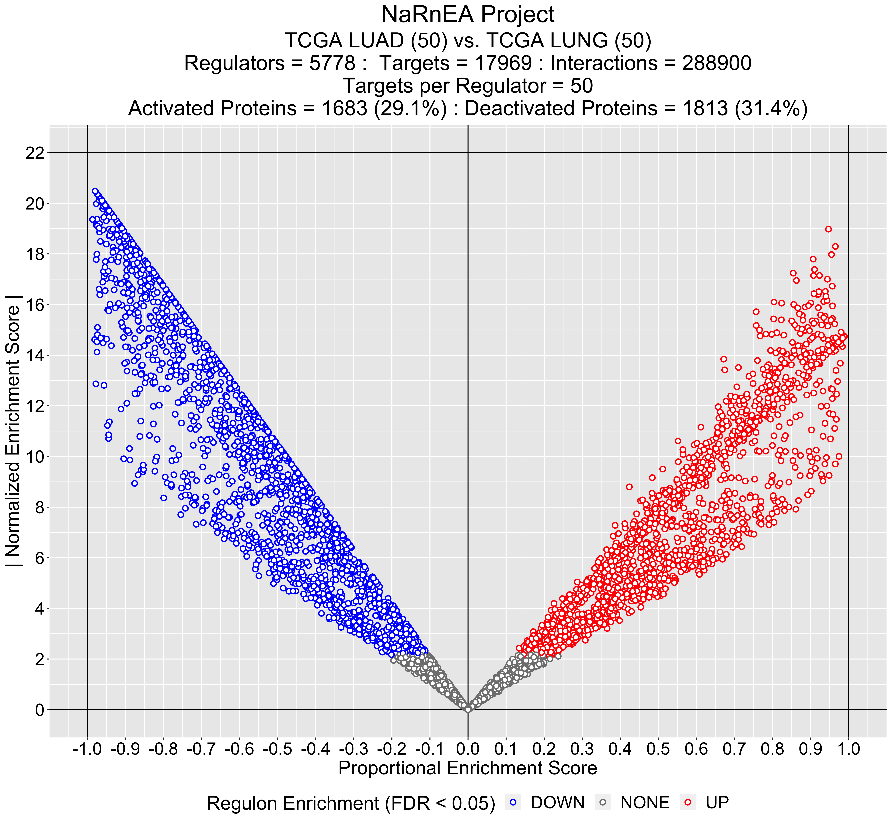{#id .class width=100% height=100%}

At the very top of the plot we can see the quantitative output of `NaRnEA`: the Proportional Enrichment Score (PES), the Normalized Enrichment Score (NES), and the statistical significance (two-sided p-value). 

The `NaRnEA` PES is the effect size of gene set enrichment that functions like a correlation coefficient (it's actually inspired by the rank-biserial correlation effect size of the Mann-Whitney-U test). The `NaRnEA` PES ranges between (-1) and (1) and has an expected value of (0) when the null hypothesis of gene set analysis is true. 

The `NaRnEA` NES is the test statistic of gene set enrichment; when the null hypothesis of gene set analysis is true the `NaRnEA` NES is a standard normal random variable with an expected value of (0) and a standard deviation of (1). `NaRnEA` makes use of this to calculate the statistical significance of gene set enrichment without relying on permutations or approximations via the standard normal cumulative distribution function.

The position of each gene set member in the ordered gene expression signature is visualized at the top of the plot with a vertical bar. The color of these vertical bars depends on the Mode of Regulation for the target; by default genes with a positive Mode of Regulation are more red, genes with a negative Mode of Regulation are more blue, and genes with a Mode of Regulation close to zero are more gray. The opacity of the vertical bars depends on the Regulation Confidence for the target so genes which have a larger Regulation Confidence are more opaque. 

The main portion of the plot shows how a Kolmogorov-Smirnov running sum statistic would be computed for the enrichment of our synthetic gene set in this gene expression signature. This KS running sum statistic is not used by `NaRnEA`, but is reminiscent of prior gene set analysis visualization methods and is offered for historical reasons. A vertical red line shows the supremum of the positively regulated gene set members' KS running sum statistic and a vertical blue line shows the supremum of the negatively regulated gene set members' KS running sum statistic. Setting `cur.score = 1` changes the KS running sum statistic to the weighted KS running sum statistic used by GSEA. 

### Visualizing NaRnEA Normalized Enrichment Scores

Now we'll compute the enrichment of the synthetic gene set in all gene expression signatures using `NaRnEA`. 

```{r, eval = FALSE}
synthetic.enrichment.res <- t(apply(synthetic.ges.mat,2,function(cur.ges,cur.gene.set){
	y <- unlist(NaRnEA(ges = cur.ges, regulon = cur.gene.set))
	return(y)
}, cur.gene.set = synthetic.gene.set))
```

We'll use a histogram to visualize the distribution of the `NaRnEA` Normalized Enrichment Scores and compare the distribution of these NES values with the analytical standard normal probability density function. Since the null hypothesis of gene set analysis is true for our synthetic gene set in all 5,000 of the simulated gene expression signatures we expect the `NaRnEA` NES values to follow this standard normal distribution exactly. To check if this is the case we'll compute the sample mean and sample standard deviation of the NES values and estimate their 95% confidence intervals with the percentile bootstrap method. We'll use a Shapiro-Wilk test to test the null hypothesis that the `NaRnEA` NES value are normally distributed. Furthermore we'll use a one-sample Kolmogorov-Smirnov test to test the null hypothesis that the `NaRnEA` NES values follow a standard normal distribution.

```{r, eval = FALSE}
plot.data <- data.frame(x.values = synthetic.enrichment.res[,"nes"])
plot.data$y.values <- dnorm(x = plot.data$x.values, mean = 0, sd = 1)

boot.num <- 1000

nes.boot.mean.values <- sapply(1:boot.num,function(i){return(mean(sample(plot.data$x.values, size = nrow(plot.data), replace = TRUE)))})

nes.boot.sd.values <- sapply(1:boot.num,function(i){return(sd(sample(plot.data$x.values, size = nrow(plot.data), replace = TRUE)))})

x.step <- 1
x.max <- x.step*ceiling(max(abs(plot.data$x.values))/x.step)
x.min <- -1*x.max
x.breaks <- seq(from = x.min, to = x.max, by = x.step)

bin.prop <- .1
bin.breaks <- seq(from = x.min, to = x.max, by = (x.step*bin.prop))

y.step <- .1
y.min <- 0
y.max <- y.step*ceiling(max(c(max(plot.data$y.values), max(hist(plot.data$x.values, breaks = bin.breaks, plot = FALSE)$density)))/y.step)
y.breaks <- seq(from = y.min, to = y.max, by = y.step)

cur.title <- "Simulated Gene Set Analysis"
cur.subtitle <- paste("Samples = ", sample.num," : ", "Genes = ", gene.num," : ", "Gene Set Size = ", gene.set.size, "\n", "NES", " : ", "Mean = ", signif(mean(plot.data$x.values),sig.figs), " [",signif(as.numeric(quantile(nes.boot.mean.values,probs = c(.025))),sig.figs),",",signif(as.numeric(quantile(nes.boot.mean.values,probs = c(.975))),sig.figs),"]"," : ","SD = ", signif(sd(plot.data$x.values),sig.figs), " [",signif(as.numeric(quantile(nes.boot.sd.values,probs = c(.025))),sig.figs),",",signif(as.numeric(quantile(nes.boot.sd.values,probs = c(.975))),sig.figs),"]","\n","Shapiro-Wilkes Test of Normality (p = ",signif(shapiro.test(plot.data$x.values)$p.value, sig.figs),")", "\n", "KS Test of Standard Normality (p = ",signif(ks.test(x = plot.data$x.values, y = "pnorm", alternative = "two.sided")$p.value,sig.figs),")",sep = "")
cur.x.lab <- "Normalized Enrichment Score"
cur.y.lab <- "Probability Density"

ggplot(plot.data) + geom_vline(colour = "black", lwd = 1, xintercept = 0) + geom_histogram(aes(x = x.values, y = ..density..), colour = "red1", fill = "white", alpha = 1, lwd = 1, breaks = bin.breaks) + geom_hline(colour = "black", lwd = 1, yintercept = 0) + geom_line(aes(x = x.values, y = y.values), colour = "blue1", lwd = 2) + scale_x_continuous(limits = range(x.breaks), breaks = x.breaks) + scale_y_continuous(limits = range(y.breaks), breaks = y.breaks) + theme(plot.title = element_text(hjust = 0.5, colour = "black", size = 25), plot.subtitle = element_text(hjust = 0.5, colour = "black", size = 22), axis.title = element_text(hjust = 0.5, colour = "black", size = 20), axis.text.x = element_text(hjust = 0.5, colour = "black", size = 18), axis.text.y = element_text(hjust = 1, colour = "black", size = 18)) + labs(title = cur.title, subtitle = cur.subtitle, x = cur.x.lab, y = cur.y.lab)
```

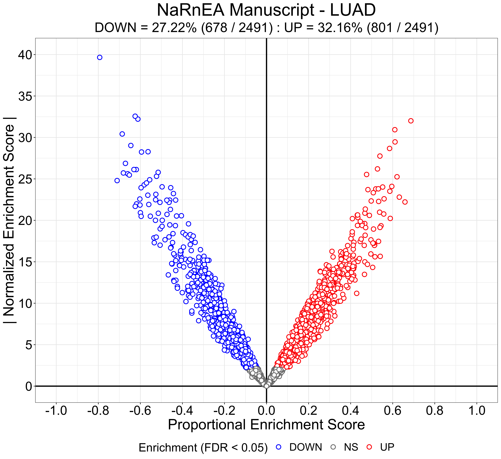{#id .class width=100% height=100%}

### Visualizing NaRnEA Proportional Enrichment Scores

Having verified that the `NaRnEA` NES values follow a standard normal distribution let's take a look at the `NaRnEA` PES values using a histogram. We'll compute the sample mean, sample standard deviation, and estimate a 95% confidence interval using the sample data. 

```{r, eval = FALSE}
plot.data <- data.frame(x.values = synthetic.enrichment.res[,"pes"])

boot.num <- 1000

x.step <- .2
x.max <- 1
x.min <- -1
x.breaks <- seq(from = x.min, to = x.max, by = x.step)

bin.prop <- .1
bin.breaks <- seq(from = x.min, to = x.max, by = (x.step*bin.prop))

y.step <- .5
y.min <- 0
y.max <- y.step*ceiling(max(hist(plot.data$x.values, breaks = bin.breaks, plot = FALSE)$density)/y.step)
y.breaks <- seq(from = y.min, to = y.max, by = y.step)

cur.title <- "Simulated Gene Set Analysis"
cur.subtitle <- paste("Samples = ", sample.num," : ", "Genes = ", gene.num," : ", "Gene Set Size = ", gene.set.size, "\n", "PES", " : ", "Mean = ", signif(mean(plot.data$x.values),sig.figs)," : ","SD = ", signif(sd(plot.data$x.values),sig.figs), " : ", " 95% CI = [",signif(as.numeric(quantile(plot.data$x.values,probs = c(.025))), sig.figs),",",signif(as.numeric(quantile(plot.data$x.values,probs = c(.975))), sig.figs),"]",sep = "")
cur.x.lab <- "Proportional Enrichment Score"
cur.y.lab <- "Probability Density"

ggplot(plot.data) + geom_vline(colour = "black", lwd = 1, xintercept = 0) + geom_histogram(aes(x = x.values, y = ..density..), colour = "red1", fill = "white", alpha = 1, lwd = 1, breaks = bin.breaks) + geom_hline(colour = "black", lwd = 1, yintercept = 0) + scale_x_continuous(limits = range(x.breaks), breaks = x.breaks) + scale_y_continuous(limits = range(y.breaks), breaks = y.breaks) + theme(plot.title = element_text(hjust = 0.5, colour = "black", size = 25), plot.subtitle = element_text(hjust = 0.5, colour = "black", size = 22), axis.title = element_text(hjust = 0.5, colour = "black", size = 20), axis.text.x = element_text(hjust = 0.5, colour = "black", size = 18), axis.text.y = element_text(hjust = 1, colour = "black", size = 18)) + labs(title = cur.title, subtitle = cur.subtitle, x = cur.x.lab, y = cur.y.lab)
```

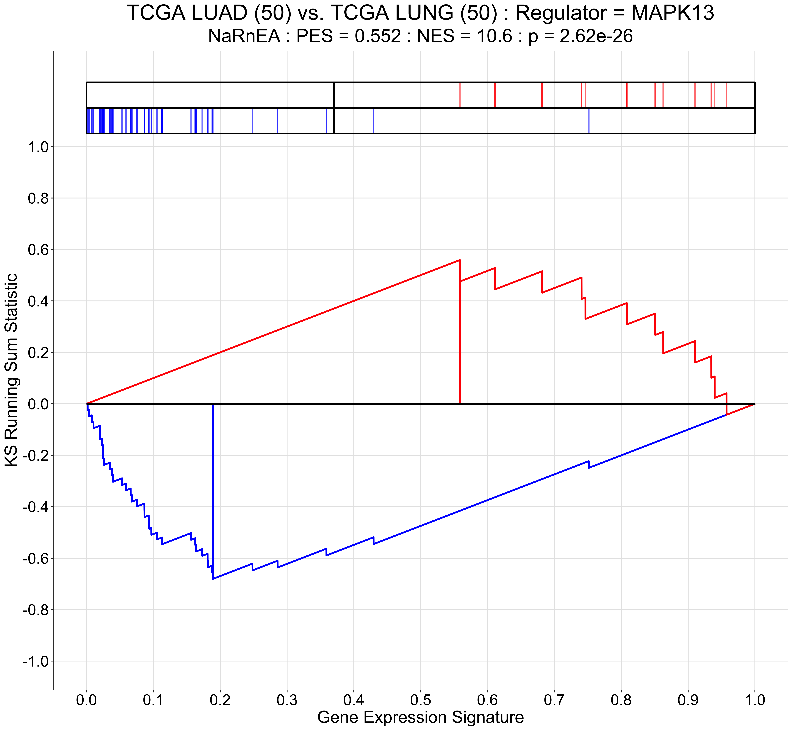{#id .class width=100% height=100%}

The `NaRnEA` PES mean is close to (0) and the values are nearly symmetric about sample mean, which is just what we would expect under the null hypothesis. 

### Visualizing NaRnEA Bootstrapped Proportional Enrichment Scores

The `NaRnEA` PES is a point estimate for the effect size of gene set enrichment; we can augment this point estimate by creating a confidence interval for the PES. In order to do this without making any parametric assumptions about the distribution of the gene set members in the gene expression signature, we'll create many boostrapped versions of the synthetic gene set by sampling the gene set members with replacement. We'll use `NaRnEA` to compute the enrichment of each of these bootstrapped versions of the synthetic gene set in the gene expression signature. Finally we'll visualize the distribution of these bootstrapped PES values and compute the sample mean, sample standard deviation, and estimate a 95% confidence interval using the sample data. 

```{r, eval = FALSE}
set.seed(sim.seed)

boot.num <- sample.num

synthetic.boot.idx.list <- lapply(1:boot.num,function(i){
	y <- sample(1:gene.set.size, size = gene.set.size, replace = TRUE)
	return(y)
})
names(synthetic.boot.idx.list) <- paste("b",1:length(synthetic.boot.idx.list),"",sep = "_")

synthetic.boot.enrichment.res <- t(sapply(synthetic.boot.idx.list,function(sub.idx, cur.ges){
	sub.gene.set <- list(tfmode = synthetic.gene.set$tfmode[sub.idx], likelihood = synthetic.gene.set$likelihood[sub.idx])
	y <- unlist(NaRnEA(ges = cur.ges, regulon = sub.gene.set))
	return(y)
}, cur.ges = synthetic.ges.mat[,1]))

plot.data <- data.frame(x.values = synthetic.boot.enrichment.res[,"pes"])

boot.num <- 1000

x.step <- .2
x.max <- 1
x.min <- -1
x.breaks <- seq(from = x.min, to = x.max, by = x.step)

bin.prop <- .1
bin.breaks <- seq(from = x.min, to = x.max, by = (x.step*bin.prop))

y.step <- 1
y.min <- 0
y.max <- y.step*ceiling(max(hist(plot.data$x.values, breaks = bin.breaks, plot = FALSE)$density)/y.step)
y.breaks <- seq(from = y.min, to = y.max, by = y.step)

cur.title <- "Simulated Gene Set Analysis"
cur.subtitle <- paste("Samples = ", sample.num," : ", "Genes = ", gene.num," : ", "Gene Set Size = ", gene.set.size, "\n", "PES", " : ", "Mean = ", signif(mean(plot.data$x.values),sig.figs)," : ","SD = ", signif(sd(plot.data$x.values),sig.figs), " : ", " 95% CI = [",signif(as.numeric(quantile(plot.data$x.values,probs = c(.025))), sig.figs),",",signif(as.numeric(quantile(plot.data$x.values,probs = c(.975))), sig.figs),"]",sep = "")
cur.x.lab <- "Proportional Enrichment Score"
cur.y.lab <- "Probability Density"

ggplot(plot.data) + geom_vline(colour = "black", lwd = 1, xintercept = 0) + geom_histogram(aes(x = x.values, y = ..density..), colour = "red1", fill = "white", alpha = 1, lwd = 1, breaks = bin.breaks) + geom_hline(colour = "black", lwd = 1, yintercept = 0) + scale_x_continuous(limits = range(x.breaks), breaks = x.breaks) + scale_y_continuous(limits = range(y.breaks), breaks = y.breaks) + theme(plot.title = element_text(hjust = 0.5, colour = "black", size = 25), plot.subtitle = element_text(hjust = 0.5, colour = "black", size = 22), axis.title = element_text(hjust = 0.5, colour = "black", size = 20), axis.text.x = element_text(hjust = 0.5, colour = "black", size = 18), axis.text.y = element_text(hjust = 1, colour = "black", size = 18)) + labs(title = cur.title, subtitle = cur.subtitle, x = cur.x.lab, y = cur.y.lab)
```

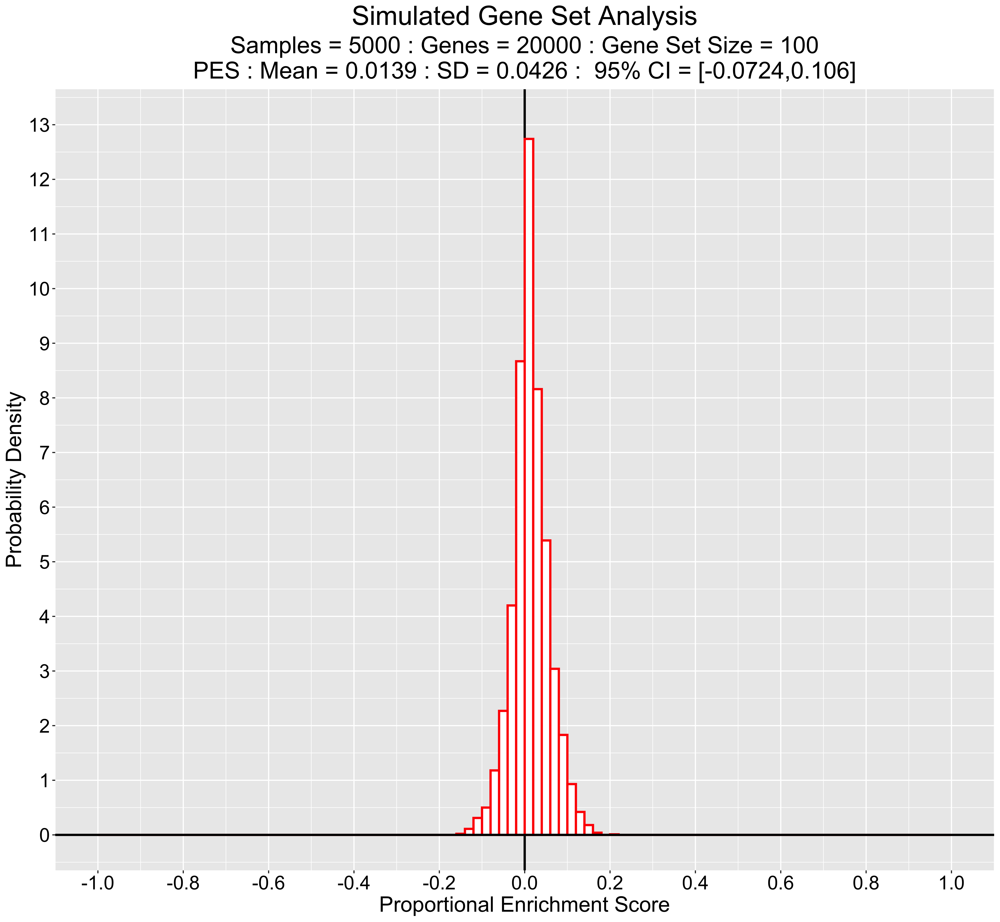{#id .class width=100% height=100%}

We see from this figure that the bootstrapped PES mean is close to (0), the bootstrapped PES standard deviation is close to the standard deviation of the PES values calculated from all 5,000 simulated gene expression signatures, and the approximate 95% confidence of the bootstrapped PES values includes (0). There are many ways to create approximate confidence intervals for effect sizes using the bootstrap with the percentile method being one of the simplest; other methods may offer better coverage probabilities for the approximate confidence interval, but are more computationally intensive (e.g. bias-corrected and accelerated bootstrap confidence interval).

### Gene Set Analysis Under the Alternative Hypothesis

Having explored the properties of `NaRnEA` under the null hypothesis of gene set analysis we'll turn our attention to testing the method when the alternative hypothesis of gene set analysis is true and the members of our synthetic gene set are enriched in the simulated gene expression signatutures. In order to do this we'll re-simulate the gene expression signature values of our gene set members uniformly on the interval [7,10], taking into account the sign of the gene set member Mode of Regulation. We expect to produce significant positive enrichment of the gene set in all of the simulated gene expression signatures as a result. 

```{r, eval = FALSE}
set.seed(sim.seed)

alt.ges.min <- 7
alt.ges.max <- 10

synthetic.ges.mat <- apply(synthetic.ges.mat,2,function(old.ges){
	new.ges <- old.ges
	new.ges[match(names(synthetic.gene.set$tfmode), names(old.ges))] <- runif(n = gene.set.size, min = alt.ges.min, max = alt.ges.max)*sign(synthetic.gene.set$tfmode)
	names(new.ges) <- names(old.ges)
	return(new.ges)
})
```

### Visualizing Gene Set Enrichment in a Single Gene Expression Signature 

Now that we've modulated the gene expression signature values for the members of our synthetic gene set, let's visualize the gene set enrichment with the `EnrichmentAnalysisPlot` function as we did earlier. 

```{r, eval = FALSE}
EnrichmentAnalysisPlot(cur.ges = synthetic.ges.mat[,2], cur.regul = synthetic.gene.set)
```

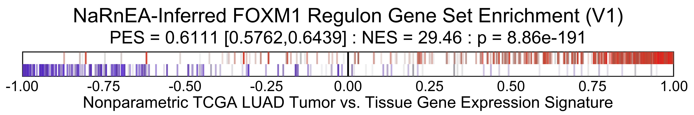{#id .class width=100% height=100%}

From this figure we see that our modulation worked; based on the `NaRnEA` two-sided p-value we reject the null hypothesis of gene set analysis (p < 0.05) and conclude that the synthetic gene set is positively enriched in the simulated gene expression signature (PES > 0).  

### Gene Set Analysis across Multiple Samples

Now let's compute the enrichment of the synthetic gene set in all of the simulated gene expression signatures with `NaRnEA`.

```{r, eval = FALSE}
synthetic.enrichment.res <- t(apply(synthetic.ges.mat,2,function(cur.ges,cur.gene.set){
	y <- unlist(NaRnEA(ges = cur.ges, regulon = cur.gene.set))
	return(y)
}, cur.gene.set = synthetic.gene.set))
```

We can compute the proportion of two-sided p-values which are statistically significant after no correction for multiple hypothesis testing, a correction to control the False Discovery Rate (via the Benjamini-Hochberg method), and a correction to control the Family Wise Error Rate (via the Bonferroni method).

```{r, eval = FALSE}
mean(p.adjust(p = (2*pnorm(q = abs(synthetic.enrichment.res[,"nes"]), lower.tail = FALSE)), method = "none") < .05)
```
```{r, eval = FALSE}
mean(p.adjust(p = (2*pnorm(q = abs(synthetic.enrichment.res[,"nes"]), lower.tail = FALSE)), method = "BH") < .05)
```
```{r, eval = FALSE}
mean(p.adjust(p = (2*pnorm(q = abs(synthetic.enrichment.res[,"nes"]), lower.tail = FALSE)), method = "bonferroni") < .05)
```

These results help give us a sense of how powerful `NaRnEA` is for the current level of gene set enrichment; even after correcting for multiple hypothesis testing in one of the most conservative ways possible (i.e. the Bonferroni method to control the Family Wise Error Rate) we reject the null hypothesis for our synthetic gene set in all gene expression signatures. 

Now we'll visualize the distribution of the `NaRnEA` PES values in all 5,000 of the simulated gene expression signatures.

```{r, eval = FALSE}
plot.data <- data.frame(x.values = synthetic.enrichment.res[,"pes"])

boot.num <- 1000

x.step <- .2
x.max <- 1
x.min <- -1
x.breaks <- seq(from = x.min, to = x.max, by = x.step)

bin.prop <- .1
bin.breaks <- seq(from = x.min, to = x.max, by = (x.step*bin.prop))

y.step <- 2
y.min <- 0
y.max <- y.step*ceiling(max(hist(plot.data$x.values, breaks = bin.breaks, plot = FALSE)$density)/y.step)
y.breaks <- seq(from = y.min, to = y.max, by = y.step)

cur.title <- "Simulated Gene Set Analysis"
cur.subtitle <- paste("Samples = ", sample.num," : ", "Genes = ", gene.num," : ", "Gene Set Size = ", gene.set.size, "\n", "PES", " : ", "Mean = ", signif(mean(plot.data$x.values),sig.figs)," : ","SD = ", signif(sd(plot.data$x.values),sig.figs), " : ", " 95% CI = [",signif(as.numeric(quantile(plot.data$x.values,probs = c(.025))), sig.figs),",",signif(as.numeric(quantile(plot.data$x.values,probs = c(.975))), sig.figs),"]",sep = "")
cur.x.lab <- "Proportional Enrichment Score"
cur.y.lab <- "Probability Density"

ggplot(plot.data) + geom_vline(colour = "black", lwd = 1, xintercept = 0) + geom_histogram(aes(x = x.values, y = ..density..), colour = "red1", fill = "white", alpha = 1, lwd = 1, breaks = bin.breaks) + geom_hline(colour = "black", lwd = 1, yintercept = 0) + scale_x_continuous(limits = range(x.breaks), breaks = x.breaks) + scale_y_continuous(limits = range(y.breaks), breaks = y.breaks) + theme(plot.title = element_text(hjust = 0.5, colour = "black", size = 25), plot.subtitle = element_text(hjust = 0.5, colour = "black", size = 22), axis.title = element_text(hjust = 0.5, colour = "black", size = 20), axis.text.x = element_text(hjust = 0.5, colour = "black", size = 18), axis.text.y = element_text(hjust = 1, colour = "black", size = 18)) + labs(title = cur.title, subtitle = cur.subtitle, x = cur.x.lab, y = cur.y.lab)
```

{#id .class width=100% height=100%}

Additionally we'll compute the enrichment of the bootstrapped gene set in a single gene expression signature and plot the bootstrapped PES values with a histogram. 

```{r, eval = FALSE}
set.seed(sim.seed)

boot.num <- sample.num

synthetic.boot.idx.list <- lapply(1:boot.num,function(i){
	y <- sample(1:gene.set.size, size = gene.set.size, replace = TRUE)
	return(y)
})
names(synthetic.boot.idx.list) <- paste("b",1:length(synthetic.boot.idx.list),"",sep = "_")

synthetic.boot.enrichment.res <- t(sapply(synthetic.boot.idx.list,function(sub.idx, cur.ges){
	sub.gene.set <- list(tfmode = synthetic.gene.set$tfmode[sub.idx], likelihood = synthetic.gene.set$likelihood[sub.idx])
	y <- unlist(NaRnEA(ges = cur.ges, regulon = sub.gene.set))
	return(y)
}, cur.ges = synthetic.ges.mat[,1]))

plot.data <- data.frame(x.values = synthetic.boot.enrichment.res[,"pes"])

boot.num <- 1000

x.step <- .2
x.max <- 1
x.min <- -1
x.breaks <- seq(from = x.min, to = x.max, by = x.step)

bin.prop <- .1
bin.breaks <- seq(from = x.min, to = x.max, by = (x.step*bin.prop))

y.step <- 2
y.min <- 0
y.max <- y.step*ceiling(max(hist(plot.data$x.values, breaks = bin.breaks, plot = FALSE)$density)/y.step)
y.breaks <- seq(from = y.min, to = y.max, by = y.step)

cur.title <- "Simulated Gene Set Analysis"
cur.subtitle <- paste("Samples = ", sample.num," : ", "Genes = ", gene.num," : ", "Gene Set Size = ", gene.set.size, "\n", "PES", " : ", "Mean = ", signif(mean(plot.data$x.values),sig.figs)," : ","SD = ", signif(sd(plot.data$x.values),sig.figs), " : ", " 95% CI = [",signif(as.numeric(quantile(plot.data$x.values,probs = c(.025))), sig.figs),",",signif(as.numeric(quantile(plot.data$x.values,probs = c(.975))), sig.figs),"]",sep = "")
cur.x.lab <- "Proportional Enrichment Score"
cur.y.lab <- "Probability Density"

ggplot(plot.data) + geom_vline(colour = "black", lwd = 1, xintercept = 0) + geom_histogram(aes(x = x.values, y = ..density..), colour = "red1", fill = "white", alpha = 1, lwd = 1, breaks = bin.breaks) + geom_hline(colour = "black", lwd = 1, yintercept = 0) + scale_x_continuous(limits = range(x.breaks), breaks = x.breaks) + scale_y_continuous(limits = range(y.breaks), breaks = y.breaks) + theme(plot.title = element_text(hjust = 0.5, colour = "black", size = 25), plot.subtitle = element_text(hjust = 0.5, colour = "black", size = 22), axis.title = element_text(hjust = 0.5, colour = "black", size = 20), axis.text.x = element_text(hjust = 0.5, colour = "black", size = 18), axis.text.y = element_text(hjust = 1, colour = "black", size = 18)) + labs(title = cur.title, subtitle = cur.subtitle, x = cur.x.lab, y = cur.y.lab)
``` 

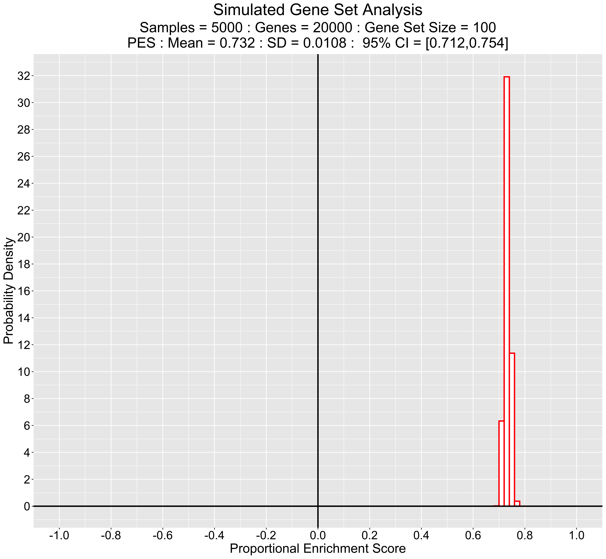{#id .class width=100% height=100%}

### Gene Set Analysis with Gene Sets of Different Sizes

`NaRnEA` is flexible enough to enable gene set analysis with gene sets that have very different sizes and parameterizations. Let's create 20 synthetic gene sets, each with a different number of targets.

```{r, eval = FALSE}
set.seed(sim.seed)

gene.set.size.vec <- seq(from = 50, to = 1000, by = 50)

gene.set.rc.min <- 0
gene.set.rc.max <- 1
gene.set.mor.min <- -1
gene.set.mor.max <- 1

synthetic.gene.set.list <- lapply(gene.set.size.vec,function(cur.size){
	y <- list(tfmode = sample(runif(n = cur.size, min = gene.set.mor.min, max = gene.set.mor.max)), likelihood = sample(runif(n = cur.size, min = gene.set.rc.min, max = gene.set.rc.max)))
	names(y$tfmode) <- sample(rownames(synthetic.ges.mat), size = cur.size, replace = FALSE)
	return(y)
})
names(synthetic.gene.set.list) <- paste("r",1:length(synthetic.gene.set.list),"",sep = "_")
```

For each of the gene sets let's simulate 250 gene expression signatures and modulate the expression of each gene set's targets in those gene expression signatures, simulating positive gene set enrichment. 

```{r, eval = FALSE}
set.seed(sim.seed)

sample.num <- 250
gene.num <- 20000

null.ges.min <- -10
null.ges.max <- 10

alt.ges.min <- 7
alt.ges.max <- 10

synthetic.ges.list <- lapply(names(synthetic.gene.set.list),function(cur.name){
	cur.gene.set <- synthetic.gene.set.list[[cur.name]]
	cur.ges.mat <- matrix(data = NA, nrow = gene.num, ncol = sample.num)
	colnames(cur.ges.mat) <- paste("s",1:sample.num,"",sep = "_")
	rownames(cur.ges.mat) <- paste("g",1:gene.num,"",sep = "_")
	cur.ges.mat <- apply(cur.ges.mat,2,function(cur.ges){
		cur.ges <- runif(n = gene.num, min = null.ges.min, max = null.ges.max)
		names(cur.ges) <- paste("g",1:gene.num,"",sep = "_")
		cur.ges[match(names(cur.gene.set$tfmode),names(cur.ges))] <- runif(n = length(cur.gene.set$tfmode), min = alt.ges.min, max = alt.ges.max)*sign(cur.gene.set$tfmode)
		names(cur.ges) <- paste("g",1:gene.num,"",sep = "_")
		return(cur.ges)
	})
	return(cur.ges.mat)
})
names(synthetic.ges.list) <- names(synthetic.gene.set.list)
```

Using `NaRnEA` let's now compute the enrichment of each gene set in its respective gene expression signatures.

```{r, eval = FALSE}
synthetic.enrichment.res.list <- lapply(names(synthetic.gene.set.list),function(cur.name){
	cur.gene.set <- synthetic.gene.set.list[[cur.name]]
	cur.ges.mat <- synthetic.ges.list[[cur.name]]
	cur.enrichment.res <- t(apply(cur.ges.mat,2,function(cur.ges){
		y <- unlist(NaRnEA(ges = cur.ges, regulon = cur.gene.set))
		return(y)
	}))
	return(cur.enrichment.res)
})
names(synthetic.enrichment.res.list) <- names(synthetic.gene.set.list)
```

Now we'll use boxplots to visualize the `NaRnEA` Normalized Enrichment Score values for each of the gene sets in their respective simulated gene expression signatures.

```{r, eval = FALSE}
plot.data <- data.frame(group.values = unlist(lapply(names(synthetic.enrichment.res.list),function(cur.name){return(rep(cur.name, times = nrow(synthetic.enrichment.res.list[[cur.name]])))})), size.values = unlist(lapply(names(synthetic.enrichment.res.list),function(cur.name){return(rep(length(synthetic.gene.set.list[[cur.name]]$tfmode), times = nrow(synthetic.enrichment.res.list[[cur.name]])))})), pes.values = as.numeric(unlist(lapply(synthetic.enrichment.res.list,function(x){return(x[,"pes"])}))), nes.values = as.numeric(unlist(lapply(synthetic.enrichment.res.list,function(x){return(x[,"nes"])}))))
plot.data$group.values <- factor(plot.data$group.values, levels = unique(as.character(plot.data$group.values)))
plot.data$size.values <- factor(plot.data$size.values, levels = sort(unique(as.numeric(plot.data$size.values))))

cur.title <- "Simulated Gene Set Analysis"
cur.subtitle <- paste("Samples Per Gene Set = ", sample.num," : ", "Genes = ", gene.num,"\n", "Null GES ~ U[",null.ges.min,",",null.ges.max,"]", " : ", "Alt GES ~ U[",alt.ges.min,",",alt.ges.max,"]",sep = "")
cur.x.lab <- "Gene Set Size"
cur.y.lab <- "Normalized Enrichment Score"

y.step <- 2
y.min <- 0
y.max <- y.step*ceiling(max(plot.data$nes.values)/y.step)
y.breaks <- seq(from = y.min, to = y.max, by = y.step)

ggplot(plot.data) + geom_hline(colour = "black", lwd = 1, yintercept = 0) + geom_boxplot(aes(x = size.values, y = nes.values), colour = "red1", fill = "white", lwd = .5, outlier.size = .5) + scale_y_continuous(limits = range(y.breaks), breaks = y.breaks) + theme(plot.title = element_text(hjust = 0.5, colour = "black", size = 25), plot.subtitle = element_text(hjust = 0.5, colour = "black", size = 22), axis.title = element_text(hjust = 0.5, colour = "black", size = 20), axis.text.x = element_text(hjust = 0.5, colour = "black", size = 18), axis.text.y = element_text(hjust = 1, colour = "black", size = 18)) + labs(title = cur.title, subtitle = cur.subtitle, x = cur.x.lab, y = cur.y.lab)
```

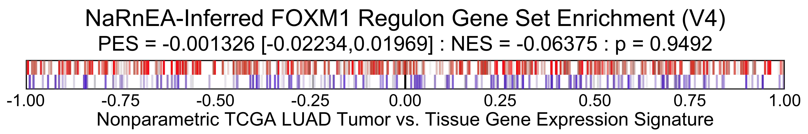{#id .class width=100% height=100%}

We see that the `NaRnEA` NES values for the synthetic gene sets are monotonically increasing with the number of synthetic gene set members; we can interpret this to mean that, all else being held equal, larger gene sets have a greater power to reject the null hypothesis, which is exactly what we would expect for a test statistic. 

Now we'll use boxplots to visualize the `NaRnEA` Proportional Enrichment Score values for each of the gene sets in their respective simulated gene expression signatures.

```{r, eval = FALSE}
cur.title <- "Simulated Gene Set Analysis"
cur.subtitle <- paste("Samples Per Gene Set = ", sample.num," : ", "Genes = ", gene.num,"\n", "Null GES ~ U[",null.ges.min,",",null.ges.max,"]", " : ", "Alt GES ~ U[",alt.ges.min,",",alt.ges.max,"]",sep = "")
cur.x.lab <- "Gene Set Size"
cur.y.lab <- "Proportional Enrichment Score"

y.step <- .1
y.min <- 0
y.max <- 1
y.breaks <- seq(from = y.min, to = y.max, by = y.step)

ggplot(plot.data) + geom_hline(colour = "black", lwd = 1, yintercept = 0) + geom_boxplot(aes(x = size.values, y = pes.values), colour = "red1", fill = "white", lwd = .5, outlier.size = .5) + scale_y_continuous(limits = range(y.breaks), breaks = y.breaks) + theme(plot.title = element_text(hjust = 0.5, colour = "black", size = 25), plot.subtitle = element_text(hjust = 0.5, colour = "black", size = 22), axis.title = element_text(hjust = 0.5, colour = "black", size = 20), axis.text.x = element_text(hjust = 0.5, colour = "black", size = 18), axis.text.y = element_text(hjust = 1, colour = "black", size = 18)) + labs(title = cur.title, subtitle = cur.subtitle, x = cur.x.lab, y = cur.y.lab)
```

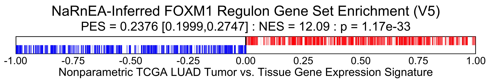{#id .class width=100% height=100%}

The `NaRnEA` PES values, on the other hand, remain consistent across the entire range of synthetic gene set sizes, which is what we expect from an effect size. The interquartile range of the `NaRnEA` PES boxplots decreases as the size of the synthetic gene sets increase, which is also what we expect from an effect size; with greater information about the enrichment of the gene set, our inference (i.e. the PES) becomes more precise. 

### NaRnEA Leading Edge Analysis

In 2005, Subramanian et al. created the idea of a gene set leading edge (i.e. the subset of the gene set which contributes most strongly to the enrichment of the gene set in a gene expression signature). `NaRnEA` is formulated so that it can perform leading edge analysis, returning a leading edge one-sided p-value for each gene set member if `leading.edge = TRUE`. Under the null hypothesis that a gene set member is not contributing to the enrichment of the gene set in the gene expression signature, the leading edge one-sided p-value will be uniformly distributed on the interval [0,1]. 

To demonstrate the utility of `NaRnEA` leading edge analysis we'll first simulate some gene expression signatures under the null hypothesis of gene set analysis.

```{r, eval = FALSE}
set.seed(sim.seed)

gene.num <- 20000
sample.num <- 500

null.ges.min <- -10
null.ges.max <- 10

synthetic.ges.mat <- matrix(data = NA, nrow = gene.num, ncol = sample.num)
synthetic.ges.mat <- apply(synthetic.ges.mat,2,function(x){
	y <- runif(n = length(x), min = null.ges.min, max = null.ges.max)
	return(y)
})
rownames(synthetic.ges.mat) <- paste("g",1:nrow(synthetic.ges.mat),"",sep = "_")
colnames(synthetic.ges.mat) <- paste("s",1:ncol(synthetic.ges.mat),"",sep = "_")
```

Next we'll create two synthetic gene sets which do not overlap.

```{r, eval = FALSE}
set.seed(sim.seed)

gene.set.a.size <- 50
gene.set.a.rc.min <- 0
gene.set.a.rc.max <- 1
gene.set.a.mor.min <- -1
gene.set.a.mor.max <- 1

gene.set.b.size <- 50
gene.set.b.rc.min <- 0
gene.set.b.rc.max <- 1
gene.set.b.mor.min <- -1
gene.set.b.mor.max <- 1

synthetic.gene.set.a <- list(tfmode = runif(n = gene.set.a.size, min = gene.set.a.mor.min, max = gene.set.a.mor.max), likelihood = runif(n = gene.set.a.size, min = gene.set.a.rc.min, max = gene.set.a.rc.max))
names(synthetic.gene.set.a$tfmode) <- sample(rownames(synthetic.ges.mat), size = gene.set.a.size, replace = FALSE)

synthetic.gene.set.b <- list(tfmode = runif(n = gene.set.b.size, min = gene.set.b.mor.min, max = gene.set.b.mor.max), likelihood = runif(n = gene.set.b.size, min = gene.set.b.rc.min, max = gene.set.b.rc.max))
names(synthetic.gene.set.b$tfmode) <- sample(setdiff(rownames(synthetic.ges.mat),names(synthetic.gene.set.a$tfmode)), size = gene.set.b.size, replace = FALSE)

intersect(names(synthetic.gene.set.a$tfmode),names(synthetic.gene.set.b$tfmode))
```

Then we'll modulate the gene expression signature values for the genes in Gene Set A in all of the gene expression signatures without changing the gene expression signature values for the genes in Gene Set B. 

```{r, eval = FALSE}
set.seed(sim.seed)

alt.ges.min <- 7
alt.ges.max <- 10

synthetic.ges.mat <- apply(synthetic.ges.mat,2,function(old.ges){
	new.ges <- old.ges
	new.ges[match(names(synthetic.gene.set.a$tfmode), names(old.ges))] <- sample(runif(n = gene.set.a.size, min = alt.ges.min, max = alt.ges.max))*sign(synthetic.gene.set.a$tfmode)
	names(new.ges) <- names(old.ges)
	return(new.ges)
})
```

Now we'll combine the gene sets to create a single Gene Set C. We now know the leading edge of Gene Set C should only include those genes that were originally in Gene Set A since those were the only genes whose gene expression signature values were modulated. 

```{r, eval = FALSE}
synthetic.gene.set.c <- list(tfmode = c(synthetic.gene.set.a$tfmode, synthetic.gene.set.b$tfmode), likelihood = c(synthetic.gene.set.a$likelihood, synthetic.gene.set.b$likelihood))
```

Let's visualize the enrichment of each of the gene sets in one of the modulated synthetic gene expression signatures.

```{r, eval = FALSE}
EnrichmentAnalysisPlot(cur.ges = synthetic.ges.mat[,1], cur.regul = synthetic.gene.set.a)
```

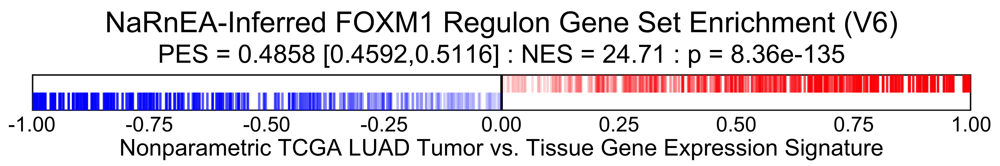{#id .class width=100% height=100%}

```{r, eval = FALSE}
EnrichmentAnalysisPlot(cur.ges = synthetic.ges.mat[,1], cur.regul = synthetic.gene.set.b)
```

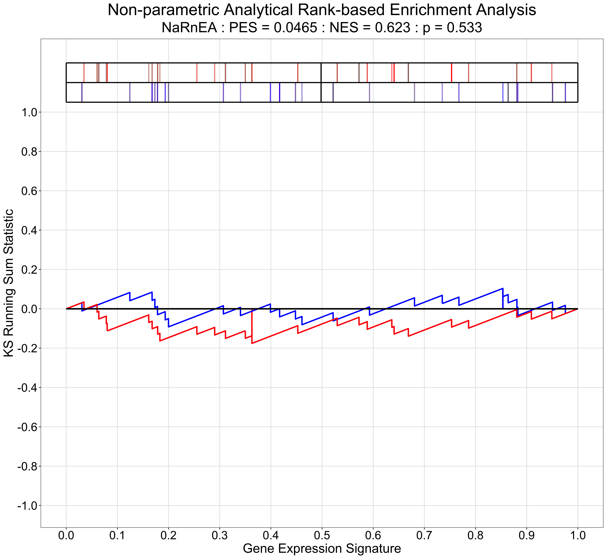{#id .class width=100% height=100%}

```{r, eval = FALSE}
EnrichmentAnalysisPlot(cur.ges = synthetic.ges.mat[,1], cur.regul = synthetic.gene.set.c)
```

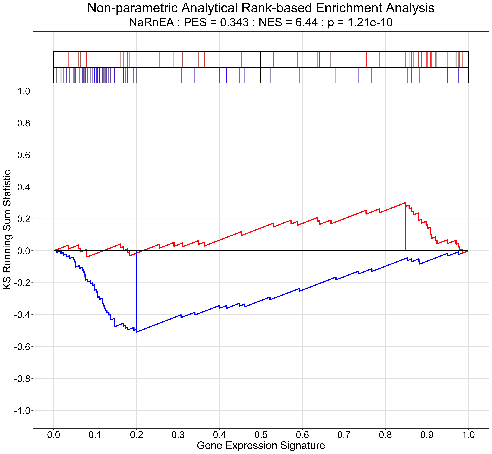{#id .class width=100% height=100%}

We see from these plots that Gene Set A and Gene Set C are both enriched in the gene expression signature while Gene Set B is not enriched

Now we'll compute the enrichment of synthetic gene set C in all gene expression signatures and extract the leading edge one-sided p-values.

```{r, eval = FALSE}
cur.ledge.c.res <- apply(synthetic.ges.mat,2,function(cur.ges, cur.gene.set){
	y <- NaRnEA(ges = cur.ges, regulon = cur.gene.set, leading.edge = TRUE)$ledge
	return(y)
}, cur.gene.set = synthetic.gene.set.c)
```

Since we know the leading edge of Gene Set C should only include the genes which are found in Gene Set A, the presence of genes from Gene Set B in the leading edge of Gene Set C represent false positives (i.e. Type I errors). Using these simulated data we can evaluate whether `NaRnEA` accurately controls the False Positive Rate of leading edge analysis (p < 0.05).

```{r, eval = FALSE}
cur.ledge.c.fpr <- binom.test(x = sum(cur.ledge.c.res[which(rownames(cur.ledge.c.res)%in%names(synthetic.gene.set.b$tfmode)),] < .05), n = sum(cur.ledge.c.res[which(rownames(cur.ledge.c.res)%in%names(synthetic.gene.set.b$tfmode)),] > 0), p = .05, alternative = "greater")
cur.ledge.c.fpr
```

We see that `NaRnEA` does indeed control the False Positive Rate of leading edge analysis. Now let's evaluate the statistical power (i.e. True Positive Rate) of the `NaRnEA` leading edge analysis based on the proportion of Gene Set A members which are present in the Gene Set C leading edge. The power of any frequentist statistical test will be dependent on the desired level of control for the Type I Error rate (p < 0.05 in our case), the effect size of the difference that we are trying to detect (i.e. the extent of the enrichment of Gene Set A in the simulated gene expression signatures), and the properties of the test itself. 

```{r, eval = FALSE}
cur.ledge.c.tpr <- binom.test(x = sum(cur.ledge.c.res[which(rownames(cur.ledge.c.res)%in%names(synthetic.gene.set.a$tfmode)),] < .05), n = sum(cur.ledge.c.res[which(rownames(cur.ledge.c.res)%in%names(synthetic.gene.set.a$tfmode)),] > 0), p = .05, alternative = "greater")
cur.ledge.c.tpr
```

We see that `NaRnEA` gene set analysis is not very powerful; for (p < 0.05) at the current level of enrichment for Gene Set A, ~30% of the genes present in Gene Set A are identified as part of the Gene Set C leading edge. Unlike `NaRnEA` gene set analysis, which is extremely powerful due to the integration of information across all members of a gene set, `NaRnEA` leading edge analysis is performed on a gene-by-gene basis and has only modest power. 

Our evaluation of the `NaRnEA` leading edge sensitivity and (1 - specificity) depend on the p-value threshold we selected (i.e. p < 0.05). If we let this threshold vary we can compute a Receiver Operator Characteristic for `NaRnEA` leading edge analysis and evaluate the tradeoff between sensitivity and specificity.

```{r, eval = FALSE}
cur.threshold.value.vec <- seq(from = 0, to = 1, by = .001)

cur.tpr.value.vec <- unlist(lapply(cur.threshold.value.vec,function(sub.value){

	sub.tpr.values <- colMeans(cur.ledge.c.res[which(rownames(cur.ledge.c.res)%in%names(synthetic.gene.set.a$tfmode)),] < sub.value)
	
	return(sub.tpr.values)
	
}))

cur.fpr.value.vec <- unlist(lapply(cur.threshold.value.vec,function(sub.value){

	sub.fpr.values <- colMeans(cur.ledge.c.res[which(rownames(cur.ledge.c.res)%in%names(synthetic.gene.set.b$tfmode)),] < sub.value)
	
	return(sub.fpr.values)
	
}))

cur.ledge.roc.agg <- data.frame(tpr.values = cur.tpr.value.vec, fpr.values = cur.fpr.value.vec)

cur.ledge.roc.data <- data.frame(x.values = sort(unique(cur.ledge.roc.agg$fpr.values), decreasing = FALSE))

cur.ledge.roc.data$y.lower.values <- sapply(cur.ledge.roc.data$x.values,function(x){return(as.numeric(quantile(cur.ledge.roc.agg[which(cur.ledge.roc.agg$fpr.values == x),"tpr.values"], probs = c(.025))))})

cur.ledge.roc.data$y.mid.values <- sapply(cur.ledge.roc.data$x.values,function(x){return(as.numeric(quantile(cur.ledge.roc.agg[which(cur.ledge.roc.agg$fpr.values == x),"tpr.values"], probs = c(.5))))})

cur.ledge.roc.data$y.upper.values <- sapply(cur.ledge.roc.data$x.values,function(x){return(as.numeric(quantile(cur.ledge.roc.agg[which(cur.ledge.roc.agg$fpr.values == x),"tpr.values"], probs = c(.975))))})

plot.data <- data.frame(x.values = seq(from = 0, to = 1, by = .00001))

plot.data$y.lower.values <- sapply(plot.data$x.values,function(x){return(max(cur.ledge.roc.data[which(cur.ledge.roc.data$x.values <= x),"y.lower.values"]))})
plot.data$y.mid.values <- sapply(plot.data$x.values,function(x){return(max(cur.ledge.roc.data[which(cur.ledge.roc.data$x.values <= x),"y.mid.values"]))})
plot.data$y.upper.values <- sapply(plot.data$x.values,function(x){return(max(cur.ledge.roc.data[which(cur.ledge.roc.data$x.values <= x),"y.upper.values"]))})

plot.data <- rbind(c("x.values" = 0, "y.lower.values" = 0, "y.mid.values" = 0, "y.upper.values" = 0), plot.data, c("x.values" = 1, "y.lower.values" = 1, "y.mid.values" = 1, "y.upper.values" = 1))

x.breaks <- seq(from = 0, to = 1, by = .1)
y.breaks <- x.breaks

cur.title <- "Simulated Gene Set Analysis"
cur.subtitle <- paste("NaRnEA Leading Edge Analysis","\n","Null GES ~ U[",null.ges.min,",",null.ges.max,"]"," : ","Alt GES ~ U[",alt.ges.min,",",alt.ges.max,"]","\n","AUROC"," : ","Median =  ",signif(sum(plot.data$y.mid.values*(plot.data$x.values[3] - plot.data$x.values[2])),sig.figs)," : ","95% CI = [",signif(sum(plot.data$y.lower.values*(plot.data$x.values[3] - plot.data$x.values[2])),sig.figs),",",signif(sum(plot.data$y.upper.values*(plot.data$x.values[3] - plot.data$x.values[2])),sig.figs),"]"," : "," MWU Test (p = ",signif(median(apply(cur.ledge.c.res,2,function(sub.ledge){return(wilcox.test(x = sub.ledge[which(rownames(cur.ledge.c.res)%in%names(synthetic.gene.set.a$tfmode))], y = sub.ledge[which(rownames(cur.ledge.c.res)%in%names(synthetic.gene.set.b$tfmode))], paired = FALSE, alternative = "less")$p.value)})),sig.figs),")",sep = "")
cur.x.lab <- "Leading Edge False Positive Rate"
cur.y.lab <- "Leading Edge True Positive Rate"

ggplot(plot.data) + geom_hline(colour = "black", lwd = 1, yintercept = range(y.breaks)) + geom_vline(colour = "black", lwd = 1, xintercept = range(x.breaks)) + geom_abline(colour = "black", linetype = "dashed", slope = 1, intercept = 0) + geom_ribbon(aes(x = x.values, ymin = y.lower.values, ymax = y.upper.values), colour = "blue1", fill = "blue1", lwd = 0, alpha = .25) + geom_line(aes(x = x.values, y = y.mid.values), colour = "blue1", lwd = 1.5) + scale_x_continuous(limits = range(x.breaks), breaks = x.breaks) + scale_y_continuous(limits = range(y.breaks), breaks = y.breaks) + theme(plot.title = element_text(hjust = 0.5, colour = "black", size = 25), plot.subtitle = element_text(hjust = 0.5, colour = "black", size = 22), axis.title = element_text(hjust = 0.5, colour = "black", size = 20), axis.text.x = element_text(hjust = 0.5, colour = "black", size = 18), axis.text.y = element_text(hjust = 1, colour = "black", size = 18), legend.title = element_text(hjust = 0.5, colour = "black", size = 20), legend.text = element_text(hjust = 0.5, colour = "black", size = 18), legend.position = "bottom") + labs(title = cur.title, subtitle = cur.subtitle, x = cur.x.lab, y = cur.y.lab)
```

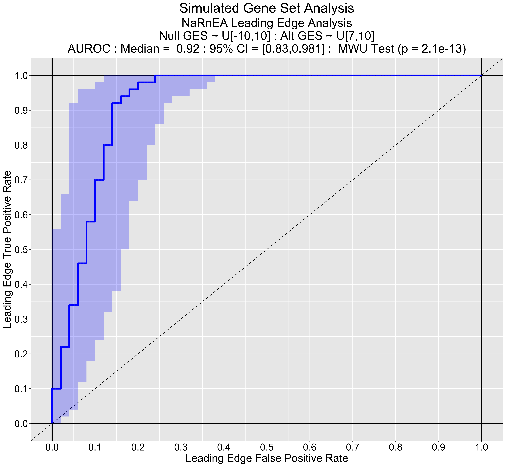{#id .class width=100% height=100%}

From this Receiver Operator Characteristic we see that the `NaRnEA` leading edge analysis is able to identify genes which are contributing to the enrichment of the synthetic gene set in the simulated gene expression signatures. The median area under the Receiver Operator Characteristic (AUROC) is 0.92 and the approximate 95% confidence spans the interval [0.83,0.981]. Using a one-sided Mann-Whitney-U test we can test the null hypothesis that the AUROC = 0.5. Based on the one-sided p-value we reject the null hypothesis in favor of the alternative hypothesis that the `NaRnEA` leading edge AUROC > 0.05. 

### Permutation Test for Equality of Gene Set Enrichment

When gene set analysis is performed on many gene sets in the same gene expression signature one may be interested in determining, as part of a post-hoc analysis, whether two gene sets differ significantly in their enrichment. For this we can calculate the absolute difference in the `NaRnEA` PES value for each of the gene sets, but how can we be sure that this difference isn't something we would see from random chance? 

Without making distributional assumptions about the behavior of each gene set's enrichment in the gene expression signature we can formulate a non-parametric approximate permutation test of equality for the enrichment of both gene sets. We take the null hypothesis that the gene sets are enriched in the gene expression signature equally. It follows then that, under the null hypothesis, the members of the two gene sets are exchangeable. Thus, we can approximate the null distribution of the absolute difference of the `NaRnEA` PES value for each gene set by permuting the gene set members and recomputing that absolute difference many times. 

Let's demonstrate the utility of this procedure with some simulated data. First we'll simulate some gene expression signatures under the gene set analysis null hypothesis. 

```{r, eval = FALSE}
set.seed(sim.seed)

gene.num <- 20000
sample.num <- 50

null.ges.min <- -10
null.ges.max <- 10

synthetic.ges.mat <- matrix(data = NA, nrow = gene.num, ncol = sample.num)
synthetic.ges.mat <- apply(synthetic.ges.mat,2,function(x){
	y <- runif(n = length(x), min = null.ges.min, max = null.ges.max)
	return(y)
})
rownames(synthetic.ges.mat) <- paste("g",1:nrow(synthetic.ges.mat),"",sep = "_")
colnames(synthetic.ges.mat) <- paste("s",1:ncol(synthetic.ges.mat),"",sep = "_")
```

Next we'll create two synthetic gene sets which do not overlap.

```{r, eval = FALSE}
set.seed(sim.seed)

gene.set.a.size <- 100
gene.set.a.rc.min <- 0
gene.set.a.rc.max <- 1
gene.set.a.mor.min <- -1
gene.set.a.mor.max <- 1

gene.set.b.size <- 100
gene.set.b.rc.min <- 0
gene.set.b.rc.max <- 1
gene.set.b.mor.min <- -1
gene.set.b.mor.max <- 1

synthetic.gene.set.a <- list(tfmode = runif(n = gene.set.a.size, min = gene.set.a.mor.min, max = gene.set.a.mor.max), likelihood = runif(n = gene.set.a.size, min = gene.set.a.rc.min, max = gene.set.a.rc.max))
names(synthetic.gene.set.a$tfmode) <- sample(rownames(synthetic.ges.mat), size = gene.set.a.size, replace = FALSE)

synthetic.gene.set.b <- list(tfmode = runif(n = gene.set.b.size, min = gene.set.b.mor.min, max = gene.set.b.mor.max), likelihood = runif(n = gene.set.b.size, min = gene.set.b.rc.min, max = gene.set.b.rc.max))
names(synthetic.gene.set.b$tfmode) <- sample(setdiff(rownames(synthetic.ges.mat),names(synthetic.gene.set.a$tfmode)), size = gene.set.b.size, replace = FALSE)

intersect(names(synthetic.gene.set.a$tfmode),names(synthetic.gene.set.b$tfmode))
```

We'll modulate the gene expression signature values of the Gene Set A members in the gene expression signatures.

```{r, eval = FALSE}
set.seed(sim.seed)

alt.ges.a.min <- 9
alt.ges.a.max <- 10

synthetic.ges.mat <- apply(synthetic.ges.mat,2,function(old.ges){
	new.ges <- old.ges
	new.ges[match(names(synthetic.gene.set.a$tfmode), names(old.ges))] <- sample(runif(n = gene.set.a.size, min = alt.ges.a.min, max = alt.ges.a.max))*sign(synthetic.gene.set.a$tfmode)
	names(new.ges) <- names(old.ges)
	return(new.ges)
})
```

We'll modulate the gene expression signature values of the Gene Set B members in the gene expression signatures.

```{r, eval = FALSE}
set.seed(sim.seed)

alt.ges.b.min <- -10
alt.ges.b.max <- -9

synthetic.ges.mat <- apply(synthetic.ges.mat,2,function(old.ges){
	new.ges <- old.ges
	new.ges[match(names(synthetic.gene.set.b$tfmode), names(old.ges))] <- sample(runif(n = gene.set.b.size, min = alt.ges.b.min, max = alt.ges.b.max))*sign(synthetic.gene.set.b$tfmode)
	names(new.ges) <- names(old.ges)
	return(new.ges)
})
```

Let's visualize the enrichment of each gene set in the same gene expression signature.

```{r, eval = FALSE}
EnrichmentAnalysisPlot(cur.ges = synthetic.ges.mat[,1], cur.regul = synthetic.gene.set.a)
```

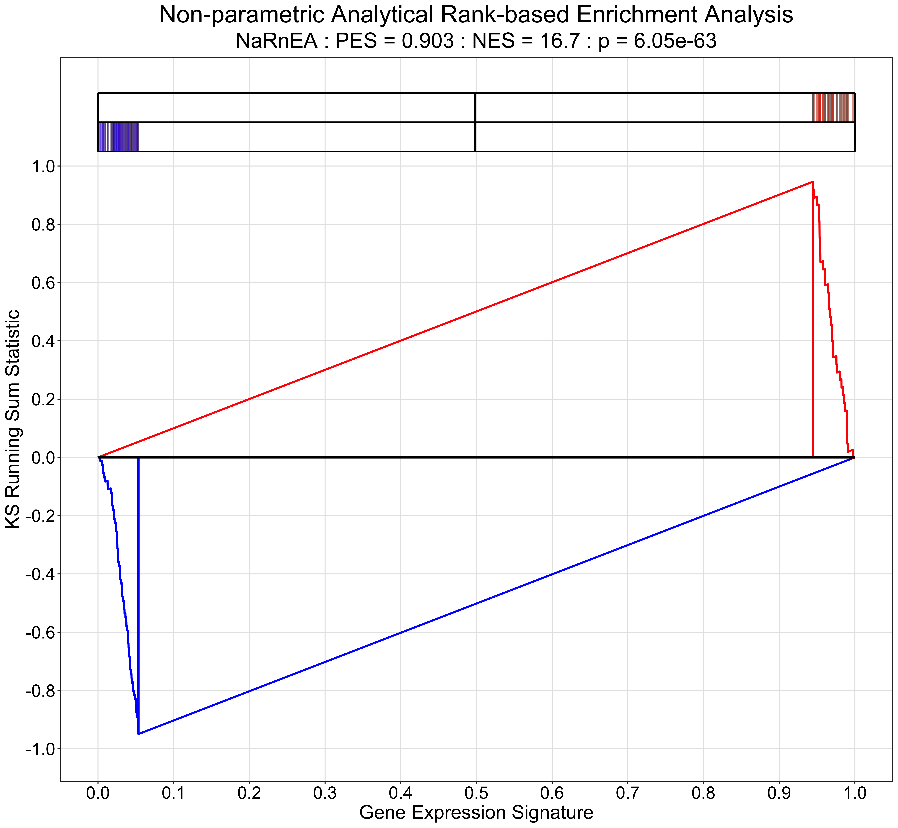{#id .class width=100% height=100%}

```{r, eval = FALSE}
EnrichmentAnalysisPlot(cur.ges = synthetic.ges.mat[,1], cur.regul = synthetic.gene.set.b)
```

{#id .class width=100% height=100%}

From these plots and the values we chose when modulating the gene expression signature values of each gene set's members we see that the enrichment of the two gene sets is significantly different. Now let's perform the approximate permutation test to see if it agrees. 

First we'll combine the gene sets to create a single gene set. 

```{r, eval = FALSE}
synthetic.gene.set.c <- list(tfmode = c(synthetic.gene.set.a$tfmode, synthetic.gene.set.b$tfmode), likelihood = c(synthetic.gene.set.a$likelihood, synthetic.gene.set.b$likelihood))
```

Next we'll create permutations of the synthetic gene sets under the null hypothesis. 

```{r, eval = FALSE}
set.seed(sim.seed)

gene.set.a.per <- 1000

synthetic.gene.set.a.null.idx.list <- lapply(1:gene.set.a.per,function(i){
	y <- sample(1:length(synthetic.gene.set.c$tfmode), size = gene.set.a.size, replace = FALSE)
	return(y)
})
names(synthetic.gene.set.a.null.idx.list) <- paste("na",1:length(synthetic.gene.set.a.null.idx.list),"",sep = "_")

synthetic.gene.set.b.null.idx.list <- lapply(1:gene.set.a.per,function(i){
	y <- setdiff(1:length(synthetic.gene.set.c$tfmode), synthetic.gene.set.a.null.idx.list[[i]])
	return(y)
})
names(synthetic.gene.set.b.null.idx.list) <- paste("nb",1:length(synthetic.gene.set.b.null.idx.list),"",sep = "_")
```

Finally we'll compute the enrichment of the original gene sets and the permuted gene sets in a single gene expression signatures and visualize the true absolute difference in `NaRnEA` PES values as well as its approximate null distribution.

```{r, eval = FALSE}
synthetic.gene.set.a.enrichment <- NaRnEA(ges = synthetic.ges.mat[,1], regulon = synthetic.gene.set.a)

synthetic.gene.set.a.null.enrichment <- t(sapply(synthetic.gene.set.a.null.idx.list,function(sub.idx){
	sub.gene.set <- list(tfmode = synthetic.gene.set.c$tfmode[sub.idx], likelihood = synthetic.gene.set.c$likelihood[sub.idx])
	sub.res <- unlist(NaRnEA(ges = synthetic.ges.mat[,1], regulon = sub.gene.set))
	return(sub.res)
}))

synthetic.gene.set.b.enrichment <- NaRnEA(ges = synthetic.ges.mat[,1], regulon = synthetic.gene.set.b)

synthetic.gene.set.b.null.enrichment <- t(sapply(synthetic.gene.set.b.null.idx.list,function(sub.idx){
	sub.gene.set <- list(tfmode = synthetic.gene.set.c$tfmode[sub.idx], likelihood = synthetic.gene.set.c$likelihood[sub.idx])
	sub.res <- unlist(NaRnEA(ges = synthetic.ges.mat[,1], regulon = sub.gene.set))
	return(sub.res)
}))

plot.data <- data.frame(x.values = abs(synthetic.gene.set.a.null.enrichment[,"pes"] - synthetic.gene.set.b.null.enrichment[,"pes"]))

x.min <- 0
x.max <- 2
x.step <- .2
x.breaks <- seq(from = x.min, to = x.max, by = x.step)

bin.prop <- .1
bin.breaks <- seq(from = x.min, to = x.max, by = (x.step*bin.prop))

y.step <- 2
y.min <- 0
y.max <- y.step*ceiling(max(density(plot.data$x.values, from = 0, to = 2)$y)/y.step)
y.breaks <- seq(from = y.min, to = y.max, by = y.step)

cur.title <- "Simulated Gene Set Analysis"
cur.subtitle <- paste("Genes = ", gene.num," : ", "Gene Set A Size = ", gene.set.a.size, " : ", "Gene Set B Size = ", gene.set.b.size,"\n","Null GES ~ U[",null.ges.min,",",null.ges.max,"]", " : ", "Alt GES A ~ U[",alt.ges.a.min,",",alt.ges.a.max,"]", " : ", "Alt GES B ~ U[",alt.ges.b.min,",",alt.ges.b.max,"]","\n","Gene Set A"," : ","PES = ",signif(synthetic.gene.set.a.enrichment$pes,sig.figs)," : ","NES = ", signif(synthetic.gene.set.a.enrichment$nes, sig.figs)," (p = ",signif((2*pnorm(q = abs(synthetic.gene.set.a.enrichment$nes), lower.tail = FALSE)),sig.figs),")","\n", "Gene Set B"," : ","PES = ",signif(synthetic.gene.set.b.enrichment$pes,sig.figs)," : ","NES = ", signif(synthetic.gene.set.b.enrichment$nes, sig.figs)," (p = ",signif((2*pnorm(q = abs(synthetic.gene.set.b.enrichment$nes), lower.tail = FALSE)),sig.figs),")", "\n", "Empirical Null Distribution Permutations = ", gene.set.a.per, "\n", "| PES_A - PES_B | = ", signif(abs(synthetic.gene.set.a.enrichment$pes - synthetic.gene.set.b.enrichment$pes), sig.figs), " (p = ",signif((sum(plot.data$x.values >= abs(synthetic.gene.set.a.enrichment$pes - synthetic.gene.set.b.enrichment$pes)) + 1)/(nrow(plot.data) + 1), sig.figs),")",sep = "")
cur.x.lab <- "| PES_A - PES_B |"
cur.y.lab <- "Probability Density"

ggplot(plot.data) + geom_vline(colour = "black", lwd = 1, xintercept = range(x.breaks)) + geom_density(aes(x = x.values, y = ..density..), colour = "red1", fill = "red1", alpha = .25, lwd = 1) + geom_vline(colour = "red1", lwd = 1.5, xintercept = abs(synthetic.gene.set.a.enrichment$pes - synthetic.gene.set.b.enrichment$pes), linetype = "dashed") + geom_hline(colour = "black", lwd = 1, yintercept = 0) + scale_x_continuous(limits = range(x.breaks), breaks = x.breaks) + scale_y_continuous(limits = range(y.breaks), breaks = y.breaks) + theme(plot.title = element_text(hjust = 0.5, colour = "black", size = 25), plot.subtitle = element_text(hjust = 0.5, colour = "black", size = 22), axis.title = element_text(hjust = 0.5, colour = "black", size = 20), axis.text.x = element_text(hjust = 0.5, colour = "black", size = 18), axis.text.y = element_text(hjust = 1, colour = "black", size = 18)) + labs(title = cur.title, subtitle = cur.subtitle, x = cur.x.lab, y = cur.y.lab)
```

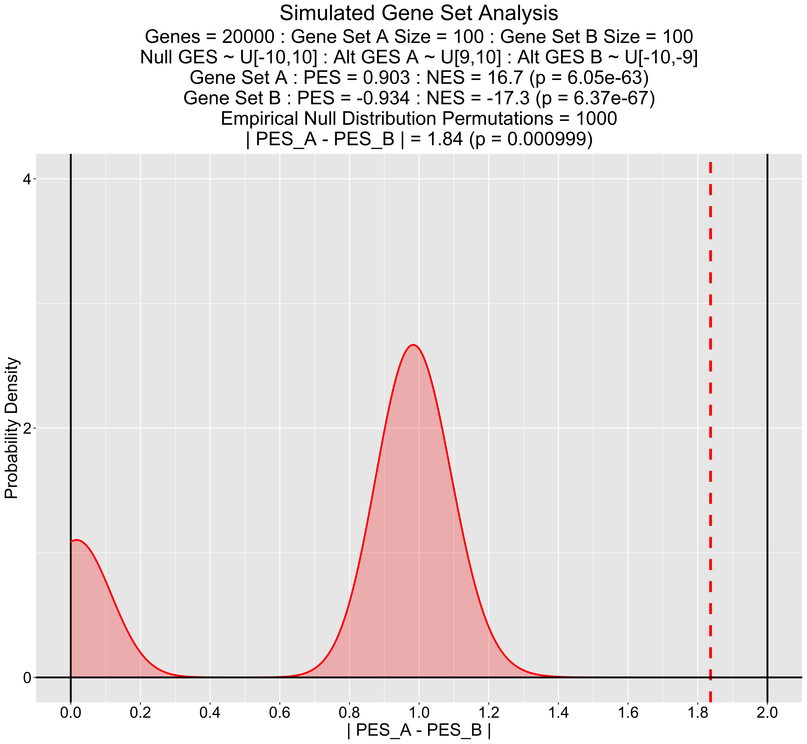{#id .class width=100% height=100%}

We see from this figure that the true absolute difference in the `NaRnEA` PES value for each gene set is 1.84 (i.e. the vertical red dashed line). We can use the approximate null distribution to estimate the right-tailed p-value of this true absolute difference and based on its value we reject the null hypothesis that the gene sets are equivalently enriched in the gene expression signature (p < 0.05).  

### Permutation Test for Gene Set Interaction

When gene set analysis is performed on many gene sets in the same gene expression signature one may be interested in determining, as part of a post-hoc analysis, whether two overlapping gene sets are interacting. By interacting, we mean that the the way in which the shared gene set members contribute to the enrichment of one or both gene sets is distinct from the way in which the members that are not shared between the two gene sets contribute to the enrichment of one or both gene sets.

Gene set interaction is relatively straightforward to evaluate with `NaRnEA` using an approximate permutation test. We'll explain the procedure as we go. First, let's simulate some gene expression signatures under the gene set analysis null hypothesis. 

```{r, eval = FALSE}
set.seed(sim.seed)

gene.num <- 20000
sample.num <- 50

null.ges.min <- -10
null.ges.max <- 10

synthetic.ges.mat <- matrix(data = NA, nrow = gene.num, ncol = sample.num)
synthetic.ges.mat <- apply(synthetic.ges.mat,2,function(x){
	y <- runif(n = length(x), min = null.ges.min, max = null.ges.max)
	return(y)
})
rownames(synthetic.ges.mat) <- paste("g",1:nrow(synthetic.ges.mat),"",sep = "_")
colnames(synthetic.ges.mat) <- paste("s",1:ncol(synthetic.ges.mat),"",sep = "_")
```

Now we'll create two synthetic gene sets which overlap.

```{r, eval = FALSE}
set.seed(sim.seed)

gene.set.c.size <- 100
gene.set.c.rc.min <- 0
gene.set.c.rc.max <- 1
gene.set.c.mor.min <- -1
gene.set.c.mor.max <- 1

gene.set.d.size <- 100
gene.set.d.rc.min <- 0
gene.set.d.rc.max <- 1
gene.set.d.mor.min <- -1
gene.set.d.mor.max <- 1

gene.set.ab.size <- 50
gene.set.ab.rc.min <- 0
gene.set.ab.rc.max <- 1
gene.set.ab.mor.min <- -1
gene.set.ab.mor.max <- 1

synthetic.gene.set.c <- list(tfmode = runif(n = gene.set.c.size, min = gene.set.c.mor.min, max = gene.set.c.mor.max), likelihood = runif(n = gene.set.c.size, min = gene.set.c.rc.min, max = gene.set.c.rc.max))
names(synthetic.gene.set.c$tfmode) <- sample(rownames(synthetic.ges.mat), size = gene.set.c.size, replace = FALSE)

synthetic.gene.set.d <- list(tfmode = runif(n = gene.set.d.size, min = gene.set.d.mor.min, max = gene.set.d.mor.max), likelihood = runif(n = gene.set.d.size, min = gene.set.d.rc.min, max = gene.set.d.rc.max))
names(synthetic.gene.set.d$tfmode) <- sample(setdiff(rownames(synthetic.ges.mat),names(synthetic.gene.set.c$tfmode)), size = gene.set.d.size, replace = FALSE)

synthetic.gene.set.ab <- list(tfmode = runif(n = gene.set.ab.size, min = gene.set.ab.mor.min, max = gene.set.ab.mor.max), likelihood = runif(n = gene.set.ab.size, min = gene.set.ab.rc.min, max = gene.set.ab.rc.max))
names(synthetic.gene.set.ab$tfmode) <- sample(setdiff(rownames(synthetic.ges.mat),c(names(synthetic.gene.set.c$tfmode),names(synthetic.gene.set.d$tfmode))), size = gene.set.ab.size, replace = FALSE)

intersect(names(synthetic.gene.set.d$tfmode), names(synthetic.gene.set.c$tfmode))
intersect(names(synthetic.gene.set.d$tfmode), names(synthetic.gene.set.ab$tfmode))
intersect(names(synthetic.gene.set.c$tfmode), names(synthetic.gene.set.ab$tfmode))

synthetic.gene.set.a <- list(tfmode = c(synthetic.gene.set.c$tfmode, synthetic.gene.set.ab$tfmode), likelihood = c(synthetic.gene.set.c$likelihood, synthetic.gene.set.ab$likelihood))

synthetic.gene.set.b <- list(tfmode = c(synthetic.gene.set.d$tfmode, synthetic.gene.set.ab$tfmode), likelihood = c(synthetic.gene.set.d$likelihood, synthetic.gene.set.ab$likelihood))

intersect(names(synthetic.gene.set.a$tfmode), names(synthetic.gene.set.b$tfmode))
```

We'll modulate the expression of gene set C members in the gene expression signature; these are the members of Gene Set A which are not present in Gene Set B.

```{r, eval = FALSE}
set.seed(sim.seed)

alt.ges.c.min <- 3
alt.ges.c.max <- 10

synthetic.ges.mat <- apply(synthetic.ges.mat,2,function(old.ges){
	new.ges <- old.ges
	new.ges[match(names(synthetic.gene.set.c$tfmode), names(old.ges))] <- sample(runif(n = gene.set.c.size, min = alt.ges.c.min, max = alt.ges.c.max))*sign(synthetic.gene.set.c$tfmode)
	names(new.ges) <- names(old.ges)
	return(new.ges)
})
```

Next we'll modulate the expression of Gene Set D members in the gene expression signature; these are the members of Gene Set B which are not present in Gene Set A. 

```{r, eval = FALSE}
set.seed(sim.seed)

alt.ges.d.min <- 7
alt.ges.d.max <- 10

synthetic.ges.mat <- apply(synthetic.ges.mat,2,function(old.ges){
	new.ges <- old.ges
	new.ges[match(names(synthetic.gene.set.d$tfmode), names(old.ges))] <- sample(runif(n = gene.set.d.size, min = alt.ges.d.min, max = alt.ges.d.max))*sign(synthetic.gene.set.d$tfmode)
	names(new.ges) <- names(old.ges)
	return(new.ges)
})
```

Then we'll modulate the expression of Gene Set AB members in the gene expression signature; these are the members which are present in both Gene Set A and Gene Set B.

```{r, eval = FALSE}
set.seed(sim.seed)

alt.ges.ab.min <- 7
alt.ges.ab.max <- 10

synthetic.ges.mat <- apply(synthetic.ges.mat,2,function(old.ges){
	new.ges <- old.ges
	new.ges[match(names(synthetic.gene.set.ab$tfmode), names(old.ges))] <- sample(runif(n = gene.set.ab.size, min = alt.ges.ab.min, max = alt.ges.ab.max))*sign(synthetic.gene.set.ab$tfmode)
	names(new.ges) <- names(old.ges)
	return(new.ges)
})
```

Now we'll visualize the enrichment of Gene Set A, Gene Set B, Gene Set C, and Gene Set D in a single gene expression signature.

```{r, eval = FALSE}
EnrichmentAnalysisPlot(cur.ges = synthetic.ges.mat[,1], cur.regul = synthetic.gene.set.a)
```

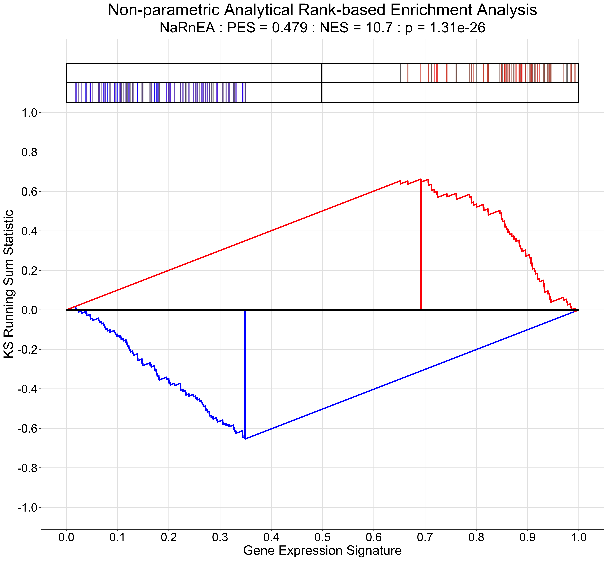{#id .class width=100% height=100%}

```{r, eval = FALSE}
EnrichmentAnalysisPlot(cur.ges = synthetic.ges.mat[,1], cur.regul = synthetic.gene.set.c)
```

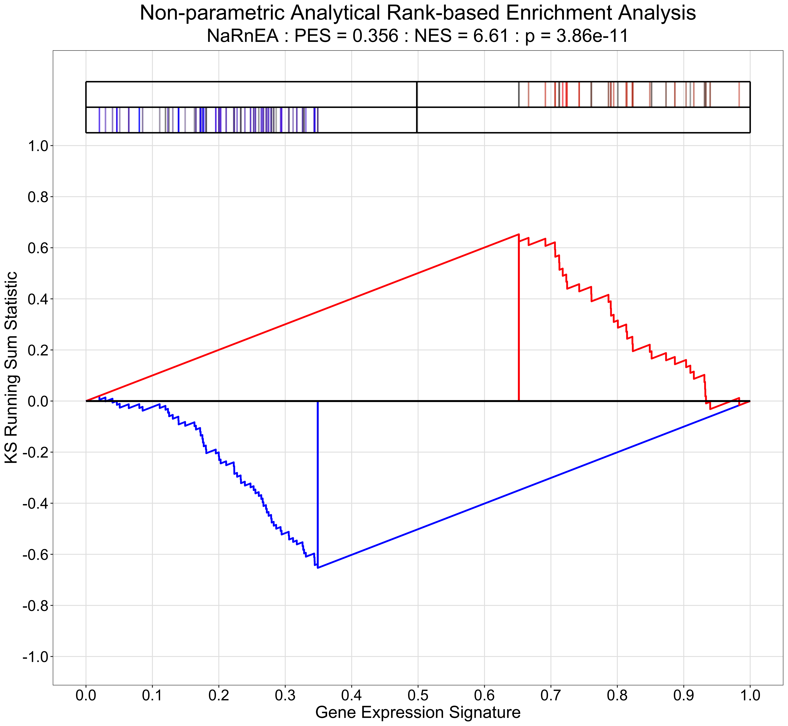{#id .class width=100% height=100%}

```{r, eval = FALSE}
EnrichmentAnalysisPlot(cur.ges = synthetic.ges.mat[,1], cur.regul = synthetic.gene.set.b)
```

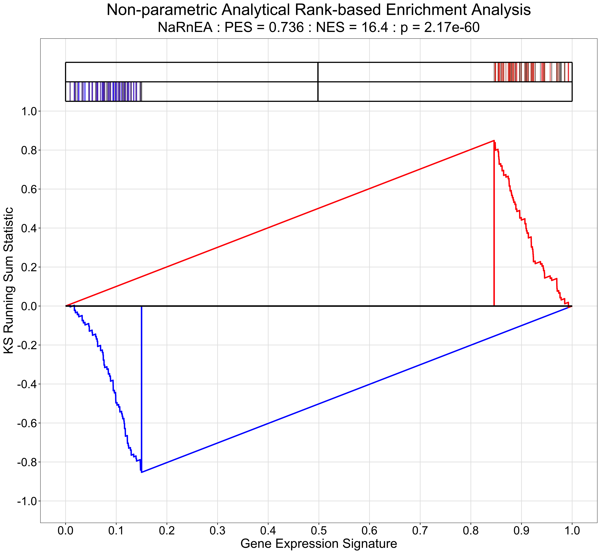{#id .class width=100% height=100%}

```{r, eval = FALSE}
EnrichmentAnalysisPlot(cur.ges = synthetic.ges.mat[,1], cur.regul = synthetic.gene.set.d)
```

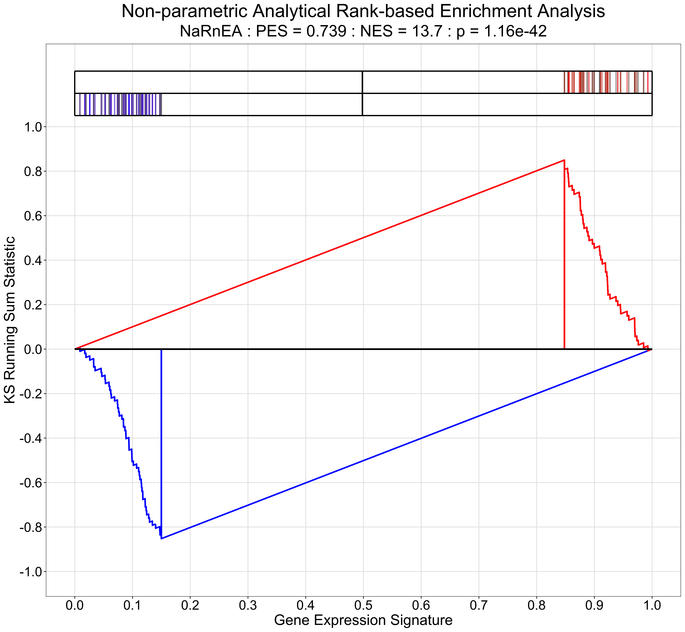{#id .class width=100% height=100%}

We see from these plots and from our parameters that Gene Set A is more strongly enriched in the gene expression signature than Gene Set C while Gene Set B and Gene Set D are nearly equally enriched; this follows from the fact that the members of Gene Set AB and members of Gene Set D have an equivalent distribution in the gene expression signature while the members of Gene Set C are more weakly enriched. 

While this is visually satisfying, let's make the inference quantitatively. Under the null hypothesis that the members of Gene Set AB and the members of Gene Set C contribute to the enrichment of Gene Set A in an equivalent manner they should be exchangeable; thus, we can approximate the null distribution of the `NaRnEA` PES for Gene Set C by permuting the members of Gene Set AB and Gene Set C and computing the enrichment of the permuted Gene Set C in the gene expression signature. 

```{r, eval = FALSE}
set.seed(sim.seed)

gene.set.c.per <- 5000

synthetic.gene.set.c.null.idx.list <- lapply(1:gene.set.c.per,function(i){
	y <- sample(1:length(synthetic.gene.set.a$tfmode), size = gene.set.c.size, replace = FALSE)
	return(y)
})
names(synthetic.gene.set.c.null.idx.list) <- paste("nc",1:length(synthetic.gene.set.c.null.idx.list),"",sep = "_")

synthetic.gene.set.c.null.enrichment <- t(sapply(synthetic.gene.set.c.null.idx.list,function(sub.idx){
	sub.gene.set <- list(tfmode = synthetic.gene.set.a$tfmode[sub.idx], likelihood = synthetic.gene.set.a$likelihood[sub.idx])
	sub.res <- unlist(NaRnEA(ges = synthetic.ges.mat[,1], regulon = sub.gene.set))
	return(sub.res)
}))

synthetic.gene.set.a.enrichment <- NaRnEA(ges = synthetic.ges.mat[,1], regulon = synthetic.gene.set.a)

synthetic.gene.set.c.enrichment <- NaRnEA(ges = synthetic.ges.mat[,1], regulon = synthetic.gene.set.c)

synthetic.gene.set.c.q.value <- (sum(synthetic.gene.set.c.null.enrichment[,"pes"] < synthetic.gene.set.c.enrichment$pes) + 1)/(gene.set.c.per + 2)
synthetic.gene.set.c.z.value <- qnorm(p = synthetic.gene.set.c.q.value, lower.tail = TRUE)
synthetic.gene.set.c.p.value <- 2*pnorm(q = abs(synthetic.gene.set.c.z.value), lower.tail = FALSE)
```

Similarly, under the null hypothesis that the members of Gene Set AB and the members of Gene Set D contribute to the enrichment of Gene Set B in an equivalent manner they should be exchangeable; thus, we can approximate the null distribution of the `NaRnEA` PES for Gene Set D by permuting the members of Gene Set AB and Gene Set D and computing the enrichment of the permuted Gene Set D in the gene expression signature. 

```{r, eval = FALSE}
set.seed(sim.seed)

gene.set.d.per <- gene.set.c.per

synthetic.gene.set.d.null.idx.list <- lapply(1:gene.set.d.per,function(i){
	y <- sample(1:length(synthetic.gene.set.b$tfmode), size = gene.set.d.size, replace = FALSE)
	return(y)
})
names(synthetic.gene.set.d.null.idx.list) <- paste("nc",1:length(synthetic.gene.set.d.null.idx.list),"",sep = "_")

synthetic.gene.set.d.null.enrichment <- t(sapply(synthetic.gene.set.d.null.idx.list,function(sub.idx){
	sub.gene.set <- list(tfmode = synthetic.gene.set.b$tfmode[sub.idx], likelihood = synthetic.gene.set.b$likelihood[sub.idx])
	sub.res <- unlist(NaRnEA(ges = synthetic.ges.mat[,1], regulon = sub.gene.set))
	return(sub.res)
}))

synthetic.gene.set.b.enrichment <- NaRnEA(ges = synthetic.ges.mat[,1], regulon = synthetic.gene.set.b)

synthetic.gene.set.d.enrichment <- NaRnEA(ges = synthetic.ges.mat[,1], regulon = synthetic.gene.set.d)

synthetic.gene.set.d.q.value <- (sum(synthetic.gene.set.d.null.enrichment[,"pes"] < synthetic.gene.set.d.enrichment$pes) + 1)/(gene.set.d.per + 2)
synthetic.gene.set.d.z.value <- qnorm(p = synthetic.gene.set.d.q.value, lower.tail = TRUE)
synthetic.gene.set.d.p.value <- 2*pnorm(q = abs(synthetic.gene.set.d.z.value), lower.tail = FALSE)
```

Finally let's visualize the approximate null distributions obtained through the permutations and compare them with the true `NaRnEA` PES values for Gene Set C and Gene Set D. 

```{r, eval = FALSE}
plot.data <- data.frame(x.values = c(synthetic.gene.set.c.null.enrichment[,"pes"], synthetic.gene.set.d.null.enrichment[,"pes"]), group.values = c(rep("A Diff", times = gene.set.c.per), rep("B Diff", times = gene.set.d.per)))

plot.data$group.values <- factor(plot.data$group.values, levels = c("A Diff","B Diff"))

colour.value.vec <- c("A Diff" = "red1", "B Diff" = "blue1")
fill.value.vec <- colour.value.vec

x.min <- -1
x.max <- 1
x.step <- .2
x.breaks <- seq(from = x.min, to = x.max, by = x.step)

y.step <- 3
y.min <- 0
y.max <- y.step*ceiling(max(c(max(density(plot.data[which(plot.data$group.values == "A Diff"),"x.values"], from = -1, to = 1)$y),max(density(plot.data[which(plot.data$group.values == "B Diff"),"x.values"], from = -1, to = 1)$y)))/y.step)
y.breaks <- seq(from = y.min, to = y.max, by = y.step)

cur.title <- "Simulated Gene Set Analysis"
cur.subtitle <- paste("Genes = ", gene.num, " : ", "Null GES ~ U[",null.ges.min,",",null.ges.max,"]", "\n", "Gene Set C Size = ", (gene.set.c.size), " : ", "Gene Set D Size = ", (gene.set.d.size)," : ","Gene Set AB Size = ", (gene.set.ab.size), "\n", "Alt GES C ~ U[",alt.ges.c.min,",",alt.ges.c.max,"]", " : ", "Alt GES D ~ U[",alt.ges.d.min,",",alt.ges.d.max,"]", " : ", "Alt GES AB ~ U[",alt.ges.ab.min,",",alt.ges.ab.max,"]", "\n", "Gene Set A = AB & C", " : ", "Gene Set B = AB & D", "\n", "Gene Set A"," : ","PES = ", signif(synthetic.gene.set.a.enrichment$pes,sig.figs), " : ", "NES = ", signif(synthetic.gene.set.a.enrichment$nes, sig.figs), " (p = ",signif((2*pnorm(q = abs(synthetic.gene.set.a.enrichment$nes), lower.tail = FALSE)),sig.figs),")", "\n", "Gene Set A Diff"," : ","PES = ", signif(synthetic.gene.set.c.enrichment$pes,sig.figs), " : ", "Q = ", signif(synthetic.gene.set.c.q.value, sig.figs), " : ", "Z = ", signif(synthetic.gene.set.c.z.value,sig.figs), " (p = ",signif(synthetic.gene.set.c.p.value,sig.figs),")", "\n", "Gene Set B"," : ","PES = ", signif(synthetic.gene.set.b.enrichment$pes,sig.figs), " : ", "NES = ", signif(synthetic.gene.set.b.enrichment$nes, sig.figs), " (p = ",signif((2*pnorm(q = abs(synthetic.gene.set.b.enrichment$nes), lower.tail = FALSE)),sig.figs),")", "\n", "Gene Set B Diff"," : ","PES = ", signif(synthetic.gene.set.d.enrichment$pes,sig.figs), " : ", "Q = ", signif(synthetic.gene.set.d.q.value, sig.figs), " : ", "Z = ", signif(synthetic.gene.set.d.z.value,sig.figs), " (p = ",signif(synthetic.gene.set.d.p.value,sig.figs),")",sep = "")
cur.x.lab <- "Proportional Enrichment Score"
cur.y.lab <- "Probability Density"
cur.colour.lab <- "Gene Set"
cur.fill.lab <- cur.colour.lab

ggplot(plot.data) + geom_vline(colour = "black", lwd = 1, xintercept = 0) + geom_density(aes(x = x.values, y = ..density.., colour = group.values, fill = group.values), alpha = .25, lwd = 1) + geom_hline(colour = "black", lwd = 1, yintercept = 0) + scale_x_continuous(limits = range(x.breaks), breaks = x.breaks) + scale_y_continuous(limits = range(y.breaks), breaks = y.breaks) + theme(plot.title = element_text(hjust = 0.5, colour = "black", size = 25), plot.subtitle = element_text(hjust = 0.5, colour = "black", size = 22), axis.title = element_text(hjust = 0.5, colour = "black", size = 20), axis.text.x = element_text(hjust = 0.5, colour = "black", size = 18), axis.text.y = element_text(hjust = 1, colour = "black", size = 18), legend.title = element_text(hjust = 0, colour = "black", size = 20), legend.text = element_text(hjust = 0, colour = "black", size = 18), legend.position = "bottom") + labs(title = cur.title, subtitle = cur.subtitle, x = cur.x.lab, y = cur.y.lab, colour = cur.colour.lab, fill = cur.fill.lab) + scale_colour_manual(values = colour.value.vec) + scale_fill_manual(values = fill.value.vec) + geom_vline(colour = "red1", lwd = 1, linetype = "dashed", xintercept = synthetic.gene.set.c.enrichment$pes) + geom_vline(colour = "blue1", lwd = 1, linetype = "dashed", xintercept = synthetic.gene.set.d.enrichment$pes)
```

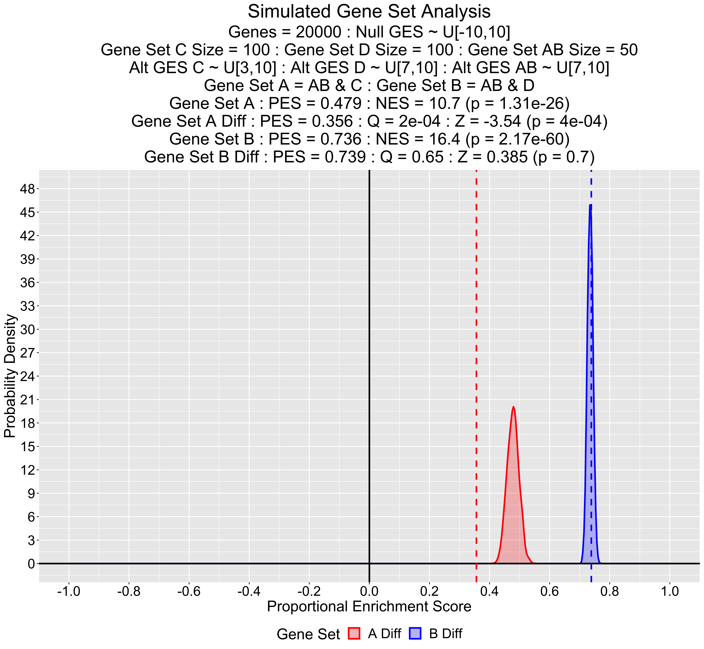{#id .class width=100% height=100%}

We see exactly what we expect based on the parameters of the simulation. The `NaRnEA` PES value for Gene Set C (i.e. Gene Set A Diff, the vertical red dashed line) falls far to the left of its approximate null distribution (i.e. the Gene Set A Diff red density plot). In fact, all `NaRnEA` PES values for the permuted version of Gene Set C are greater than the true `NaRnEA` PES value for Gene Set C; as a result we calculate the approximate two-sided p-value from the empirical sample quantile and reject the null hypothesis for Gene Set A (p < 0.05). 

Importantly, we come to a much different conclusion for Gene Set B. The `NaRnEA` PES value for Gene Set D (i.e. Gene Set B Diff, the vertical blue dashed line) falls right in the middle of its approximate null distribution (i.e. the Gene Set B Diff blue density plot). Approximately 65% of the `NaRnEA` PES values for the permuted version of Gene Set D are less than the true `NaRnEA` PES value for Gene Set D; as a result we calculate the approximate two-sided p-value from the empirical sample quantile and do not reject the null hypothesis for Gene Set B (p > 0.05). 

### The Limitations of Gene Set Analysis with NaRnEA

`NaRnEA` is able to accurately control the Type I error rate of gene set analysis as a result of the Lindeberg Central Limit Theorem, which guarantees that the `NaRnEA` Normalized Enrichment Score is asymptotically a standard normal random variable when the null hypothesis is true. However, the gene set must be of a sufficient size and parameterization for the Lindeberg Central Limit Theorem to apply. 

In order to demonstrate how insufficient gene set size can be an issue, we'll perform gene set analysis with `NaRnEA` on a small gene set. First, we'll simulate some gene expression signatures under the null hypothesis of gene set analysis. 

```{r, eval = FALSE}
set.seed(sim.seed)
gene.num <- 20000
sample.num <- 5000

null.ges.min <- -10
null.ges.max <- 10

synthetic.ges.mat <- matrix(data = NA, nrow = gene.num, ncol = sample.num)
synthetic.ges.mat <- apply(synthetic.ges.mat,2,function(x){
	y <- runif(n = length(x), min = null.ges.min, max = null.ges.max)
	return(y)
})
rownames(synthetic.ges.mat) <- paste("g",1:nrow(synthetic.ges.mat),"",sep = "_")
colnames(synthetic.ges.mat) <- paste("s",1:ncol(synthetic.ges.mat),"",sep = "_")
```

Next we'll create our synthetic gene set and deliberately make it too small for `NaRnEA`. 

```{r, eval = FALSE}
set.seed(sim.seed)

gene.set.size <- 5
gene.set.rc.min <- 0
gene.set.rc.max <- 1
gene.set.mor.min <- -1
gene.set.mor.max <- 1

synthetic.gene.set <- list(tfmode = runif(n = gene.set.size, min = gene.set.mor.min, max = gene.set.mor.max), likelihood = runif(n = gene.set.size, min = gene.set.rc.min, max = gene.set.rc.max))
names(synthetic.gene.set$tfmode) <- sample(rownames(synthetic.ges.mat), size = gene.set.size, replace = FALSE)
```

Now we'll compute the enrichment of the synthetic gene set in all gene expression signatures; for this we'll need to modify the `NaRnEA` parameter `minsize` which is set to (30) by default. Then we'll visualize the distribution of `NaRnEA` NES values as a histogram and compare them with the analytical standard normal probability density function. 

```{r, eval = FALSE}
synthetic.enrichment.res <- t(apply(synthetic.ges.mat,2,function(cur.ges,cur.gene.set){
	y <- unlist(NaRnEA(ges = cur.ges, regulon = cur.gene.set, minsize = 2))
	return(y)
}, cur.gene.set = synthetic.gene.set))

plot.data <- data.frame(x.values = synthetic.enrichment.res[,"nes"])
plot.data$y.values <- dnorm(x = plot.data$x.values, mean = 0, sd = 1)

boot.num <- 1000

nes.boot.mean.values <- sapply(1:boot.num,function(i){return(mean(sample(plot.data$x.values, size = nrow(plot.data), replace = TRUE)))})

nes.boot.sd.values <- sapply(1:boot.num,function(i){return(sd(sample(plot.data$x.values, size = nrow(plot.data), replace = TRUE)))})

x.step <- 1
x.max <- x.step*ceiling(max(abs(plot.data$x.values))/x.step)
x.min <- -1*x.max
x.breaks <- seq(from = x.min, to = x.max, by = x.step)

bin.prop <- .1
bin.breaks <- seq(from = x.min, to = x.max, by = (x.step*bin.prop))

y.step <- .1
y.min <- 0
y.max <- y.step*ceiling(max(c(max(plot.data$y.values), max(hist(plot.data$x.values, breaks = bin.breaks, plot = FALSE)$density)))/y.step)
y.breaks <- seq(from = y.min, to = y.max, by = y.step)

cur.title <- "Simulated Gene Set Analysis"
cur.subtitle <- paste("Samples = ", sample.num," : ", "Genes = ", gene.num," : ", "Gene Set Size = ", gene.set.size, "\n", "NES", " : ", "Mean = ", signif(mean(plot.data$x.values),sig.figs), " [",signif(as.numeric(quantile(nes.boot.mean.values,probs = c(.025))),sig.figs),",",signif(as.numeric(quantile(nes.boot.mean.values,probs = c(.975))),sig.figs),"]"," : ","SD = ", signif(sd(plot.data$x.values),sig.figs), " [",signif(as.numeric(quantile(nes.boot.sd.values,probs = c(.025))),sig.figs),",",signif(as.numeric(quantile(nes.boot.sd.values,probs = c(.975))),sig.figs),"]","\n","Shapiro-Wilkes Test of Normality (p = ",signif(shapiro.test(plot.data$x.values)$p.value, sig.figs),")", "\n", "KS Test of Standard Normality (p = ",signif(ks.test(x = plot.data$x.values, y = "pnorm", alternative = "two.sided")$p.value,sig.figs),")",sep = "")
cur.x.lab <- "Normalized Enrichment Score"
cur.y.lab <- "Probability Density"

ggplot(plot.data) + geom_vline(colour = "black", lwd = 1, xintercept = 0) + geom_histogram(aes(x = x.values, y = ..density..), colour = "red1", fill = "white", alpha = 1, lwd = 1, breaks = bin.breaks) + geom_hline(colour = "black", lwd = 1, yintercept = 0) + geom_line(aes(x = x.values, y = y.values), colour = "blue1", lwd = 2) + scale_x_continuous(limits = range(x.breaks), breaks = x.breaks) + scale_y_continuous(limits = range(y.breaks), breaks = y.breaks) + theme(plot.title = element_text(hjust = 0.5, colour = "black", size = 25), plot.subtitle = element_text(hjust = 0.5, colour = "black", size = 22), axis.title = element_text(hjust = 0.5, colour = "black", size = 20), axis.text.x = element_text(hjust = 0.5, colour = "black", size = 18), axis.text.y = element_text(hjust = 1, colour = "black", size = 18)) + labs(title = cur.title, subtitle = cur.subtitle, x = cur.x.lab, y = cur.y.lab)
```

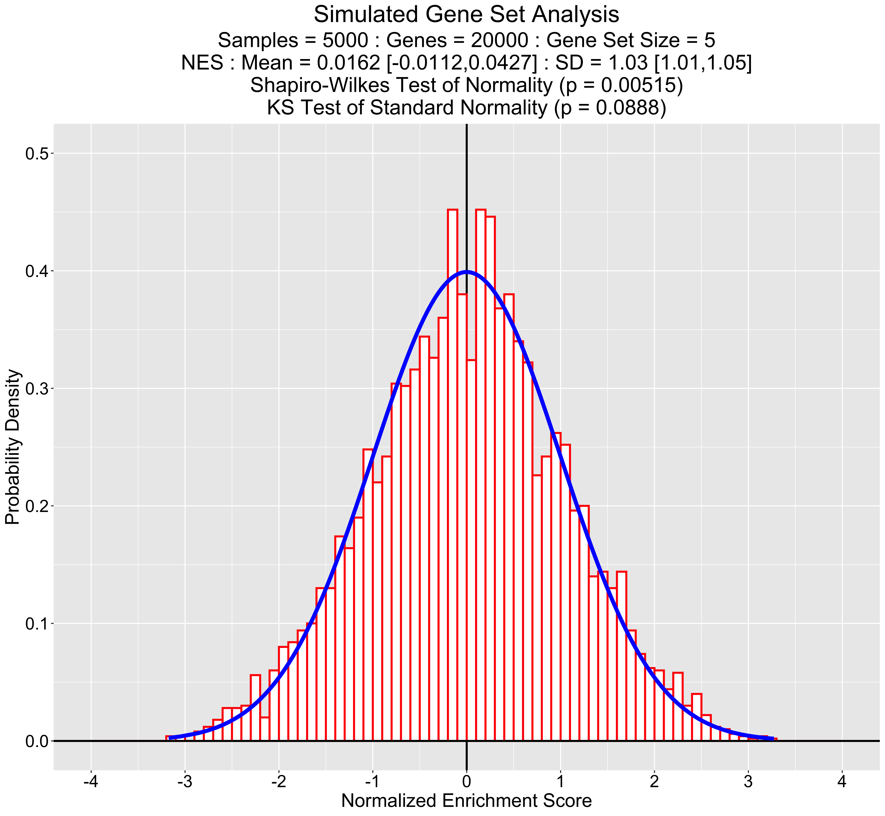{#id .class width=100% height=100%}

While visually the `NaRnEA` NES value histogram may not differ extremely from the analytical standard normal probability density function, its standard deviation is too large and we reject the normality of the NES values based on the output of the Shapiro-Wilk test. As a result, we would not expect the two-sided p-values computed from these `NaRnEA` NES values to accurately control the Type I error rate of gene set analysis.

For gene sets whose parameters are well-balanced and which have at least 30 targets, the Lindeberg Central Limit Theorem converges well enough to guarantee excellent control of the `NaRnEA` gene set analysis Type I error rate. However, if some of the gene set members receive much more weight than the other gene set members (i.e. the gene is significantly imbalanced), the Lindeberg Central Limit Theorem may not converge and accurate control of the Type I error rate is not guaranteed.

To demonstrate this we'll simulate some gene expression signatures under the null hypothesis of gene set analysis. 

```{r, eval = FALSE}
set.seed(sim.seed)
gene.num <- 20000
sample.num <- 5000

null.ges.min <- -10
null.ges.max <- 10

synthetic.ges.mat <- matrix(data = NA, nrow = gene.num, ncol = sample.num)
synthetic.ges.mat <- apply(synthetic.ges.mat,2,function(x){
	y <- runif(n = length(x), min = null.ges.min, max = null.ges.max)
	return(y)
})
rownames(synthetic.ges.mat) <- paste("g",1:nrow(synthetic.ges.mat),"",sep = "_")
colnames(synthetic.ges.mat) <- paste("s",1:ncol(synthetic.ges.mat),"",sep = "_")
```

Next we'll create a synthetic gene set that is too imbalanced for `NaRnEA`. 

```{r, eval = FALSE}
set.seed(sim.seed)

gene.set.size <- 30
gene.set.rc.min <- 0
gene.set.rc.max <- 1
gene.set.mor.min <- -1
gene.set.mor.max <- 1

synthetic.gene.set <- list(tfmode = runif(n = gene.set.size, min = gene.set.mor.min, max = gene.set.mor.max), likelihood = runif(n = gene.set.size, min = gene.set.rc.min, max = gene.set.rc.max))
names(synthetic.gene.set$tfmode) <- sample(rownames(synthetic.ges.mat), size = gene.set.size, replace = FALSE)

synthetic.gene.set$likelihood <- exp(synthetic.gene.set$likelihood*100)
synthetic.gene.set$likelihood <- synthetic.gene.set$likelihood/max(synthetic.gene.set$likelihood)
```

Now we'll compute the enrichment of the synthetic gene set in all gene expression signatures and visualize the distribution of the `NaRnEA` NES values using a histogram, once again comparing them with the analytical standard normal probability density function. 

```{r, eval = FALSE}
synthetic.enrichment.res <- t(apply(synthetic.ges.mat,2,function(cur.ges,cur.gene.set){
	y <- unlist(NaRnEA(ges = cur.ges, regulon = cur.gene.set, minsize = 2))
	return(y)
}, cur.gene.set = synthetic.gene.set))

plot.data <- data.frame(x.values = synthetic.enrichment.res[,"nes"])
plot.data$y.values <- dnorm(x = plot.data$x.values, mean = 0, sd = 1)

boot.num <- 1000

nes.boot.mean.values <- sapply(1:boot.num,function(i){return(mean(sample(plot.data$x.values, size = nrow(plot.data), replace = TRUE)))})

nes.boot.sd.values <- sapply(1:boot.num,function(i){return(sd(sample(plot.data$x.values, size = nrow(plot.data), replace = TRUE)))})

x.step <- 1
x.max <- x.step*ceiling(max(abs(plot.data$x.values))/x.step)
x.min <- -1*x.max
x.breaks <- seq(from = x.min, to = x.max, by = x.step)

bin.prop <- .1
bin.breaks <- seq(from = x.min, to = x.max, by = (x.step*bin.prop))

y.step <- .1
y.min <- 0
y.max <- y.step*ceiling(max(c(max(plot.data$y.values), max(hist(plot.data$x.values, breaks = bin.breaks, plot = FALSE)$density)))/y.step)
y.breaks <- seq(from = y.min, to = y.max, by = y.step)

cur.title <- "Simulated Gene Set Analysis"
cur.subtitle <- paste("Samples = ", sample.num," : ", "Genes = ", gene.num," : ", "Gene Set Size = ", gene.set.size, "\n", "NES", " : ", "Mean = ", signif(mean(plot.data$x.values),sig.figs), " [",signif(as.numeric(quantile(nes.boot.mean.values,probs = c(.025))),sig.figs),",",signif(as.numeric(quantile(nes.boot.mean.values,probs = c(.975))),sig.figs),"]"," : ","SD = ", signif(sd(plot.data$x.values),sig.figs), " [",signif(as.numeric(quantile(nes.boot.sd.values,probs = c(.025))),sig.figs),",",signif(as.numeric(quantile(nes.boot.sd.values,probs = c(.975))),sig.figs),"]","\n","Shapiro-Wilkes Test of Normality (p = ",signif(shapiro.test(plot.data$x.values)$p.value, sig.figs),")", "\n", "KS Test of Standard Normality (p = ",signif(ks.test(x = plot.data$x.values, y = "pnorm", alternative = "two.sided")$p.value,sig.figs),")",sep = "")
cur.x.lab <- "Normalized Enrichment Score"
cur.y.lab <- "Probability Density"

ggplot(plot.data) + geom_vline(colour = "black", lwd = 1, xintercept = 0) + geom_histogram(aes(x = x.values, y = ..density..), colour = "red1", fill = "white", alpha = 1, lwd = 1, breaks = bin.breaks) + geom_hline(colour = "black", lwd = 1, yintercept = 0) + geom_line(aes(x = x.values, y = y.values), colour = "blue1", lwd = 2) + scale_x_continuous(limits = range(x.breaks), breaks = x.breaks) + scale_y_continuous(limits = range(y.breaks), breaks = y.breaks) + theme(plot.title = element_text(hjust = 0.5, colour = "black", size = 25), plot.subtitle = element_text(hjust = 0.5, colour = "black", size = 22), axis.title = element_text(hjust = 0.5, colour = "black", size = 20), axis.text.x = element_text(hjust = 0.5, colour = "black", size = 18), axis.text.y = element_text(hjust = 1, colour = "black", size = 18)) + labs(title = cur.title, subtitle = cur.subtitle, x = cur.x.lab, y = cur.y.lab)
```

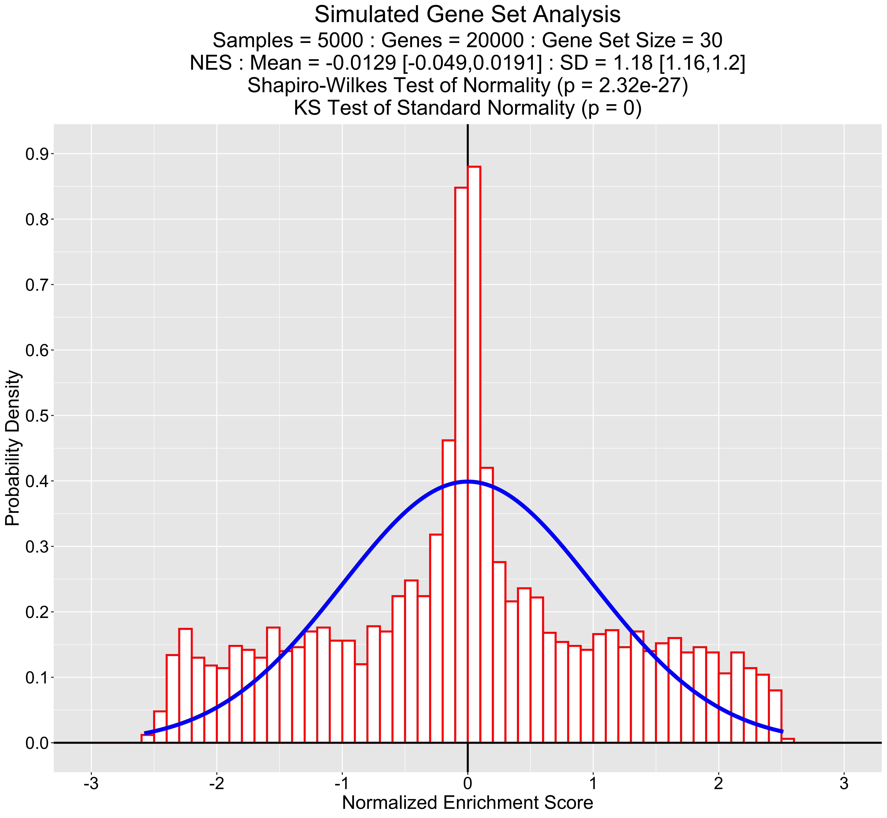{#id .class width=100% height=100%}

Visually it's clear that these `NaRnEA` NES values are nowhere close to standard normal; the standard deviation is much too large, the Shapiro-Wilk test leads us to reject normality (p < 0.05), and the one-sample KS test leads us to reject standard normality (p < 0.05). Such a gene set would need to be reparameterized before analysis with `NaRnEA`; fortunately testing whether a gene set is of sufficient size and parameterization for `NaRnEA` is straightforward with simulated gene expression signatures such as these. 


