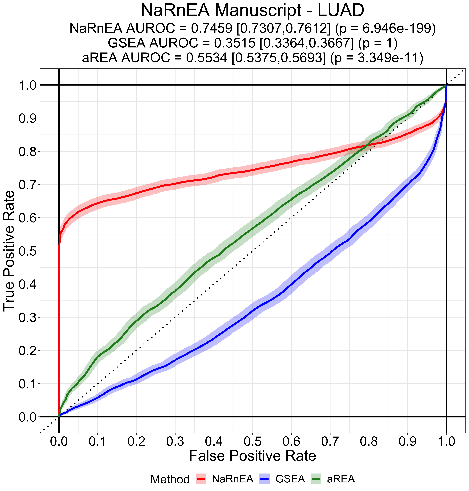
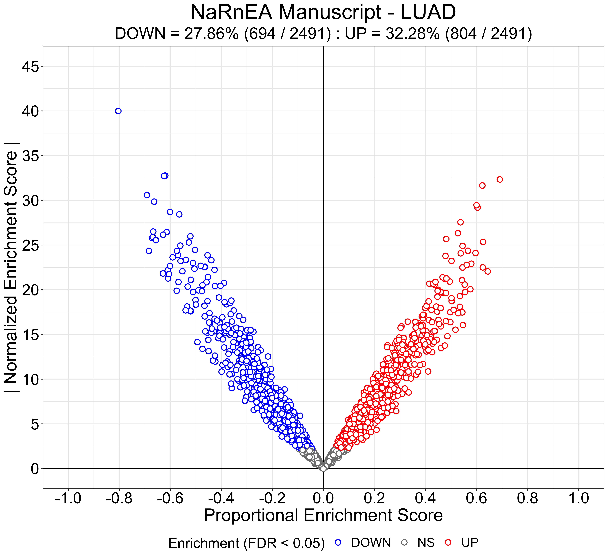
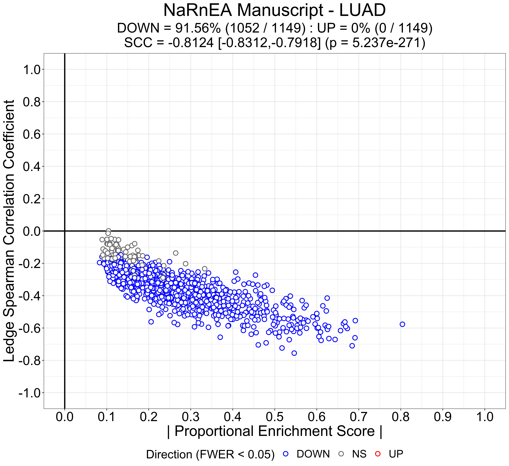

```{r, include = FALSE}
library(knitr)
opts_chunk$set(collapse = TRUE, comment = "#>", tidy = TRUE, tidy.opts=list(width.cutoff=70))
```

## Introduction

Non-parametric analytical Rank-based Enrichment Analysis (NaRnEA) is a novel statistical method created by Griffin et al. in 2020 for the purpose of performing powerful and accurate gene set analysis. To read more about the theory behind NaRnEA and how it compares with Gene Set Enrichment Analysis (GSEA), which was created by Subramanian et al. in 2005, check out the NaRnEA manuscript preprint on bioRxiv ([link](https://www.biorxiv.org/search/NaRnEA)).

## Simulated Gene Set Analysis

Simulated data offers the perfect way to familiarize ourselves with NaRnEA and gene set analysis. The statistician George Box popularized the idea that "all models are wrong, but some are useful." While transcriptomic data from eukaryotic systems is undoubtedly more complex than the simulated data we will be using, our level of control over the simulated data, and by extension our knowledge of the true state of the data, is far greater than anything we can ever achieve in the real world.

## Installing NaRnEA

For these analyses we'll need to install and load several R packages, including `NaRnEA`. For all of our visualization we'll be using the fabulous `ggplot2` package ([link](https://ggplot2.tidyverse.org/)), created by Hadley Wickham as part of the tidyverse. 

```{r, eval = FALSE}
install.packages("BiocManager")
library(BiocManager)

install("ggplot2")
library(ggplot2)

install("devtools")
library(devtools)

install_github(repo = "califano-lab/NaRnEA", force = TRUE, build_vignettes = TRUE)
library(NaRnEA)
```

## Simulated Gene Expression Signatures

In order to simulate a gene expression signature, we'll need to determine how many genes we want in our signature and the background sampling distribution for these of the genes. For the sake of simplicity we'll use 20,000 genes, which is approximately the number of protein-coding genes in the human genome. We'll simulate the gene expression signature value for each gene independently and identically from a uniform distribution on the interval [-10,10]. We'll repeat this process 5,000 times in order to create 5,000 gene expression signatures and store all of them in a single matrix. For these simulations we've set the seed for the random number generator for the sake of reproducibility, but feel free to change the seed to verify that these results are consistent.

```{r, eval = FALSE}
sim.seed <- 11
sig.figs <- 3

set.seed(sim.seed)

gene.num <- 20000
sample.num <- 5000

null.ges.min <- -10
null.ges.max <- 10

synthetic.ges.mat <- matrix(data = NA, nrow = gene.num, ncol = sample.num)
synthetic.ges.mat <- apply(synthetic.ges.mat,2,function(x){
	y <- runif(n = length(x), min = null.ges.min, max = null.ges.max)
	return(y)
})
rownames(synthetic.ges.mat) <- paste("g",1:nrow(synthetic.ges.mat),"",sep = "_")
colnames(synthetic.ges.mat) <- paste("s",1:ncol(synthetic.ges.mat),"",sep = "_")
```

## Synthetic Gene Set

Now let's create a synthetic gene set. NaRnEA expects each gene in a gene set to be parameterized with a Regulation Confidence (`likelihood`) and a Mode of Regulation (`tfmode`). The Regulation Confidence parameter is used as a weight when determining the extent to which each of the gene set members contributes to the overall enrichment of the gene set. The Mode of Regulation parameter is used to determine whether upregulation or downregulation of each gene set member in a gene expression signature contributes positively or negatively to the enrichment of the gene set. NaRnEA expects each gene set to be structured as `list` object. For our gene set we'll use 100 targets (NaRnEA expects a minimum of 30). We'll randomly simulate our Regulation Confidence values independently and identically with a uniform distribution on the interval [0,1] and we'll randomly simulate our Mode of Regulation values independently and identically with a uniform distribution on the interval [-1,1].

```{r, eval = FALSE}
set.seed(sim.seed)

gene.set.size <- 100
gene.set.rc.min <- 0
gene.set.rc.max <- 1
gene.set.mor.min <- -1
gene.set.mor.max <- 1

synthetic.gene.set <- list(tfmode = runif(n = gene.set.size, min = gene.set.mor.min, max = gene.set.mor.max), likelihood = runif(n = gene.set.size, min = gene.set.rc.min, max = gene.set.rc.max))
names(synthetic.gene.set$tfmode) <- sample(rownames(synthetic.ges.mat), size = gene.set.size, replace = FALSE)
```

## Gene Set Analysis under the Null Hypothesis

Since the genes in the synthetic gene set were selected at random, the null hypothesis of gene set analysis is true for our synthetic gene set in all 5,000 of our simulated gene expression signatures. Let's visualize the enrichment of our synthetic gene set in a single gene expression signature using the `EnrichmentAnalysisPlot` function included in the `NaRnEA` package. 

```{r, eval = FALSE}
EnrichmentAnalysisPlot(cur.ges = synthetic.ges.mat[,2], cur.regul = synthetic.gene.set)
```

{#id .class width=100% height=100%}

At the very top of the plot we can see the quantitative output of NaRnEA: the Proportional Enrichment Score (PES), the Normalized Enrichment Score (NES), and the statistical significance (two-sided p-value). The NaRnEA PES is the effect size of gene set enrichment that functions like a correlation coefficient (it's actually inspired by the rank-biserial correlation effect size of the Mann-Whitney-U test). The NaRnEA PES ranges between (-1) and (1) and has an expected value of (0) when the null hypothesis of gene set analysis is true. The NaRnEA NES is the test statistic of gene set enrichment; when the null hypothesis of gene set analysis is true the NaRnEA NES is a standard normal random variable with an expected value of (0) and a standard deviation of (1). NaRnEA makes use of this to calculate the statistical significance of gene set enrichment without relying on permutations or approximations via the standard normal cumulative distribution function.

The position of each gene set member in the order gene expression signature is visualized at the top of the plot with a vertical bar. The color of these vertical bars depends on the Mode of Regulation for the target; by default genes with a positive Mode of Regulation are more red, genes with a negative Mode of Regulation are more blue, and genes with a Mode of Regulation close to zero are more gray. The opacity of the vertical bars depends on the Regulation Confidence for the target so genes which have a larger Regulation Confidence are more opaque. 

The main window of the plot shows how a Kolmogorov-Smirnov running sum statistic would be computed for the enrichment of our synthetic gene set in this gene expression signature. This KS running sum statistic is not used by NaRnEA, but is reminiscent of prior gene set analysis visualization methods and is offered for historical reasons. A vertical red line shows the supremum of the positively regulated gene set members' KS running sum statistic and a vertical blue line shows the supremum of the negatively regulated gene set members' KS running sum statistic.


Compute the enrichment of the synthetic gene set in all gene expression signatures

```{r, eval = FALSE}
synthetic.enrichment.res <- t(apply(synthetic.ges.mat,2,function(cur.ges,cur.gene.set){
	y <- unlist(NaRnEA(ges = cur.ges, regulon = cur.gene.set))
	return(y)
}, cur.gene.set = synthetic.gene.set))
```

Visualize the distribution of normalized enrichment scores and compare with an analytical standard normal distribution

```{r, eval = FALSE}
plot.data <- data.frame(x.values = synthetic.enrichment.res[,"nes"])
plot.data$y.values <- dnorm(x = plot.data$x.values, mean = 0, sd = 1)

boot.num <- 1000

nes.boot.mean.values <- sapply(1:boot.num,function(i){return(mean(sample(plot.data$x.values, size = nrow(plot.data), replace = TRUE)))})

nes.boot.sd.values <- sapply(1:boot.num,function(i){return(sd(sample(plot.data$x.values, size = nrow(plot.data), replace = TRUE)))})

x.step <- 1
x.max <- x.step*ceiling(max(abs(plot.data$x.values))/x.step)
x.min <- -1*x.max
x.breaks <- seq(from = x.min, to = x.max, by = x.step)

bin.prop <- .1
bin.breaks <- seq(from = x.min, to = x.max, by = (x.step*bin.prop))

y.step <- .1
y.min <- 0
y.max <- y.step*ceiling(max(c(max(plot.data$y.values), max(hist(plot.data$x.values, breaks = bin.breaks, plot = FALSE)$density)))/y.step)
y.breaks <- seq(from = y.min, to = y.max, by = y.step)

cur.title <- "Simulated Gene Set Analysis"
cur.subtitle <- paste("Samples = ", sample.num," : ", "Genes = ", gene.num," : ", "Gene Set Size = ", gene.set.size, "\n", "NES", " : ", "Mean = ", signif(mean(plot.data$x.values),sig.figs), " [",signif(as.numeric(quantile(nes.boot.mean.values,probs = c(.025))),sig.figs),",",signif(as.numeric(quantile(nes.boot.mean.values,probs = c(.975))),sig.figs),"]"," : ","SD = ", signif(sd(plot.data$x.values),sig.figs), " [",signif(as.numeric(quantile(nes.boot.sd.values,probs = c(.025))),sig.figs),",",signif(as.numeric(quantile(nes.boot.sd.values,probs = c(.975))),sig.figs),"]","\n","Shapiro-Wilkes Test of Normality (p = ",signif(shapiro.test(plot.data$x.values)$p.value, sig.figs),")", "\n", "KS Test of Standard Normality (p = ",signif(ks.test(x = plot.data$x.values, y = "pnorm", alternative = "two.sided")$p.value,sig.figs),")",sep = "")
cur.x.lab <- "Normalized Enrichment Score"
cur.y.lab <- "Probability Density"

ggplot(plot.data) + geom_vline(colour = "black", lwd = 1, xintercept = 0) + geom_histogram(aes(x = x.values, y = ..density..), colour = "red1", fill = "white", alpha = 1, lwd = 1, breaks = bin.breaks) + geom_hline(colour = "black", lwd = 1, yintercept = 0) + geom_line(aes(x = x.values, y = y.values), colour = "blue1", lwd = 2) + scale_x_continuous(limits = range(x.breaks), breaks = x.breaks) + scale_y_continuous(limits = range(y.breaks), breaks = y.breaks) + theme(plot.title = element_text(hjust = 0.5, colour = "black", size = 25), plot.subtitle = element_text(hjust = 0.5, colour = "black", size = 22), axis.title = element_text(hjust = 0.5, colour = "black", size = 20), axis.text.x = element_text(hjust = 0.5, colour = "black", size = 18), axis.text.y = element_text(hjust = 1, colour = "black", size = 18)) + labs(title = cur.title, subtitle = cur.subtitle, x = cur.x.lab, y = cur.y.lab)
```

{#id .class width=100% height=100%}

Visualize the distribution of proportional enrichment scores

```{r, eval = FALSE}
plot.data <- data.frame(x.values = synthetic.enrichment.res[,"pes"])

boot.num <- 1000

x.step <- .2
x.max <- 1
x.min <- -1
x.breaks <- seq(from = x.min, to = x.max, by = x.step)

bin.prop <- .1
bin.breaks <- seq(from = x.min, to = x.max, by = (x.step*bin.prop))

y.step <- .5
y.min <- 0
y.max <- y.step*ceiling(max(hist(plot.data$x.values, breaks = bin.breaks, plot = FALSE)$density)/y.step)
y.breaks <- seq(from = y.min, to = y.max, by = y.step)

cur.title <- "Simulated Gene Set Analysis"
cur.subtitle <- paste("Samples = ", sample.num," : ", "Genes = ", gene.num," : ", "Gene Set Size = ", gene.set.size, "\n", "PES", " : ", "Mean = ", signif(mean(plot.data$x.values),sig.figs)," : ","SD = ", signif(sd(plot.data$x.values),sig.figs), " : ", " 95% CI = [",signif(as.numeric(quantile(plot.data$x.values,probs = c(.025))), sig.figs),",",signif(as.numeric(quantile(plot.data$x.values,probs = c(.975))), sig.figs),"]",sep = "")
cur.x.lab <- "Proportional Enrichment Score"
cur.y.lab <- "Probability Density"

ggplot(plot.data) + geom_vline(colour = "black", lwd = 1, xintercept = 0) + geom_histogram(aes(x = x.values, y = ..density..), colour = "red1", fill = "white", alpha = 1, lwd = 1, breaks = bin.breaks) + geom_hline(colour = "black", lwd = 1, yintercept = 0) + scale_x_continuous(limits = range(x.breaks), breaks = x.breaks) + scale_y_continuous(limits = range(y.breaks), breaks = y.breaks) + theme(plot.title = element_text(hjust = 0.5, colour = "black", size = 25), plot.subtitle = element_text(hjust = 0.5, colour = "black", size = 22), axis.title = element_text(hjust = 0.5, colour = "black", size = 20), axis.text.x = element_text(hjust = 0.5, colour = "black", size = 18), axis.text.y = element_text(hjust = 1, colour = "black", size = 18)) + labs(title = cur.title, subtitle = cur.subtitle, x = cur.x.lab, y = cur.y.lab)
```

{#id .class width=100% height=100%}

Compute the enrichment of the bootstrapped gene set in a single gene expression signature

```{r, eval = FALSE}
set.seed(sim.seed)

boot.num <- sample.num

synthetic.boot.idx.list <- lapply(1:boot.num,function(i){
	y <- sample(1:gene.set.size, size = gene.set.size, replace = TRUE)
	return(y)
})
names(synthetic.boot.idx.list) <- paste("b",1:length(synthetic.boot.idx.list),"",sep = "_")

synthetic.boot.enrichment.res <- t(sapply(synthetic.boot.idx.list,function(sub.idx, cur.ges){
	sub.gene.set <- list(tfmode = synthetic.gene.set$tfmode[sub.idx], likelihood = synthetic.gene.set$likelihood[sub.idx])
	y <- unlist(NaRnEA(ges = cur.ges, regulon = sub.gene.set))
	return(y)
}, cur.ges = synthetic.ges.mat[,1]))
```

Visualize the distribution of bootstrapped proportional enrichment scores

```{r, eval = FALSE}
plot.data <- data.frame(x.values = synthetic.boot.enrichment.res[,"pes"])

boot.num <- 1000

x.step <- .2
x.max <- 1
x.min <- -1
x.breaks <- seq(from = x.min, to = x.max, by = x.step)

bin.prop <- .1
bin.breaks <- seq(from = x.min, to = x.max, by = (x.step*bin.prop))

y.step <- 1
y.min <- 0
y.max <- y.step*ceiling(max(hist(plot.data$x.values, breaks = bin.breaks, plot = FALSE)$density)/y.step)
y.breaks <- seq(from = y.min, to = y.max, by = y.step)

cur.title <- "Simulated Gene Set Analysis"
cur.subtitle <- paste("Samples = ", sample.num," : ", "Genes = ", gene.num," : ", "Gene Set Size = ", gene.set.size, "\n", "PES", " : ", "Mean = ", signif(mean(plot.data$x.values),sig.figs)," : ","SD = ", signif(sd(plot.data$x.values),sig.figs), " : ", " 95% CI = [",signif(as.numeric(quantile(plot.data$x.values,probs = c(.025))), sig.figs),",",signif(as.numeric(quantile(plot.data$x.values,probs = c(.975))), sig.figs),"]",sep = "")
cur.x.lab <- "Proportional Enrichment Score"
cur.y.lab <- "Probability Density"

ggplot(plot.data) + geom_vline(colour = "black", lwd = 1, xintercept = 0) + geom_histogram(aes(x = x.values, y = ..density..), colour = "red1", fill = "white", alpha = 1, lwd = 1, breaks = bin.breaks) + geom_hline(colour = "black", lwd = 1, yintercept = 0) + scale_x_continuous(limits = range(x.breaks), breaks = x.breaks) + scale_y_continuous(limits = range(y.breaks), breaks = y.breaks) + theme(plot.title = element_text(hjust = 0.5, colour = "black", size = 25), plot.subtitle = element_text(hjust = 0.5, colour = "black", size = 22), axis.title = element_text(hjust = 0.5, colour = "black", size = 20), axis.text.x = element_text(hjust = 0.5, colour = "black", size = 18), axis.text.y = element_text(hjust = 1, colour = "black", size = 18)) + labs(title = cur.title, subtitle = cur.subtitle, x = cur.x.lab, y = cur.y.lab)
```

{#id .class width=100% height=100%}

Simulate gene set enrichment for the gene set members in all gene expression signatures

```{r, eval = FALSE}
set.seed(sim.seed)

alt.ges.min <- 7
alt.ges.max <- 10

synthetic.ges.mat <- apply(synthetic.ges.mat,2,function(old.ges){
	new.ges <- old.ges
	new.ges[match(names(synthetic.gene.set$tfmode), names(old.ges))] <- runif(n = gene.set.size, min = alt.ges.min, max = alt.ges.max)*sign(synthetic.gene.set$tfmode)
	names(new.ges) <- names(old.ges)
	return(new.ges)
})
```

Visualize the enrichment of the synthetic gene set in a single gene expression signature

```{r, eval = FALSE}
EnrichmentAnalysisPlot(cur.ges = synthetic.ges.mat[,2], cur.regul = synthetic.gene.set)
```

{#id .class width=100% height=100%}

```{r, eval = FALSE}
synthetic.enrichment.res <- t(apply(synthetic.ges.mat,2,function(cur.ges,cur.gene.set){
	y <- unlist(NaRnEA(ges = cur.ges, regulon = cur.gene.set))
	return(y)
}, cur.gene.set = synthetic.gene.set))
```

Compute the proportion of two-sided p-values which are statistically significant after no correction for multiple hypothesis testing, correction to control the false discovery rate, and correction to control the family wise error rate

```{r, eval = FALSE}
mean(p.adjust(p = (2*pnorm(q = abs(synthetic.enrichment.res[,"nes"]), lower.tail = FALSE)), method = "none") < .05)
```
```{r, eval = FALSE}
mean(p.adjust(p = (2*pnorm(q = abs(synthetic.enrichment.res[,"nes"]), lower.tail = FALSE)), method = "BH") < .05)
```
```{r, eval = FALSE}
mean(p.adjust(p = (2*pnorm(q = abs(synthetic.enrichment.res[,"nes"]), lower.tail = FALSE)), method = "bonferroni") < .05)
```

Visualize the distribution of proportional enrichment scores

```{r, eval = FALSE}
plot.data <- data.frame(x.values = synthetic.enrichment.res[,"pes"])

boot.num <- 1000

x.step <- .2
x.max <- 1
x.min <- -1
x.breaks <- seq(from = x.min, to = x.max, by = x.step)

bin.prop <- .1
bin.breaks <- seq(from = x.min, to = x.max, by = (x.step*bin.prop))

y.step <- 2
y.min <- 0
y.max <- y.step*ceiling(max(hist(plot.data$x.values, breaks = bin.breaks, plot = FALSE)$density)/y.step)
y.breaks <- seq(from = y.min, to = y.max, by = y.step)

cur.title <- "Simulated Gene Set Analysis"
cur.subtitle <- paste("Samples = ", sample.num," : ", "Genes = ", gene.num," : ", "Gene Set Size = ", gene.set.size, "\n", "PES", " : ", "Mean = ", signif(mean(plot.data$x.values),sig.figs)," : ","SD = ", signif(sd(plot.data$x.values),sig.figs), " : ", " 95% CI = [",signif(as.numeric(quantile(plot.data$x.values,probs = c(.025))), sig.figs),",",signif(as.numeric(quantile(plot.data$x.values,probs = c(.975))), sig.figs),"]",sep = "")
cur.x.lab <- "Proportional Enrichment Score"
cur.y.lab <- "Probability Density"

ggplot(plot.data) + geom_vline(colour = "black", lwd = 1, xintercept = 0) + geom_histogram(aes(x = x.values, y = ..density..), colour = "red1", fill = "white", alpha = 1, lwd = 1, breaks = bin.breaks) + geom_hline(colour = "black", lwd = 1, yintercept = 0) + scale_x_continuous(limits = range(x.breaks), breaks = x.breaks) + scale_y_continuous(limits = range(y.breaks), breaks = y.breaks) + theme(plot.title = element_text(hjust = 0.5, colour = "black", size = 25), plot.subtitle = element_text(hjust = 0.5, colour = "black", size = 22), axis.title = element_text(hjust = 0.5, colour = "black", size = 20), axis.text.x = element_text(hjust = 0.5, colour = "black", size = 18), axis.text.y = element_text(hjust = 1, colour = "black", size = 18)) + labs(title = cur.title, subtitle = cur.subtitle, x = cur.x.lab, y = cur.y.lab)
```

{#id .class width=100% height=100%}

Compute the enrichment of the bootstrapped gene set in a single gene expression signature

```{r, eval = FALSE}
set.seed(sim.seed)

boot.num <- sample.num

synthetic.boot.idx.list <- lapply(1:boot.num,function(i){
	y <- sample(1:gene.set.size, size = gene.set.size, replace = TRUE)
	return(y)
})
names(synthetic.boot.idx.list) <- paste("b",1:length(synthetic.boot.idx.list),"",sep = "_")

synthetic.boot.enrichment.res <- t(sapply(synthetic.boot.idx.list,function(sub.idx, cur.ges){
	sub.gene.set <- list(tfmode = synthetic.gene.set$tfmode[sub.idx], likelihood = synthetic.gene.set$likelihood[sub.idx])
	y <- unlist(NaRnEA(ges = cur.ges, regulon = sub.gene.set))
	return(y)
}, cur.ges = synthetic.ges.mat[,1]))
```

Visualize the distribution of bootstrapped proportional enrichment scores

```{r, eval = FALSE}
plot.data <- data.frame(x.values = synthetic.boot.enrichment.res[,"pes"])

boot.num <- 1000

x.step <- .2
x.max <- 1
x.min <- -1
x.breaks <- seq(from = x.min, to = x.max, by = x.step)

bin.prop <- .1
bin.breaks <- seq(from = x.min, to = x.max, by = (x.step*bin.prop))

y.step <- 2
y.min <- 0
y.max <- y.step*ceiling(max(hist(plot.data$x.values, breaks = bin.breaks, plot = FALSE)$density)/y.step)
y.breaks <- seq(from = y.min, to = y.max, by = y.step)

cur.title <- "Simulated Gene Set Analysis"
cur.subtitle <- paste("Samples = ", sample.num," : ", "Genes = ", gene.num," : ", "Gene Set Size = ", gene.set.size, "\n", "PES", " : ", "Mean = ", signif(mean(plot.data$x.values),sig.figs)," : ","SD = ", signif(sd(plot.data$x.values),sig.figs), " : ", " 95% CI = [",signif(as.numeric(quantile(plot.data$x.values,probs = c(.025))), sig.figs),",",signif(as.numeric(quantile(plot.data$x.values,probs = c(.975))), sig.figs),"]",sep = "")
cur.x.lab <- "Proportional Enrichment Score"
cur.y.lab <- "Probability Density"

ggplot(plot.data) + geom_vline(colour = "black", lwd = 1, xintercept = 0) + geom_histogram(aes(x = x.values, y = ..density..), colour = "red1", fill = "white", alpha = 1, lwd = 1, breaks = bin.breaks) + geom_hline(colour = "black", lwd = 1, yintercept = 0) + scale_x_continuous(limits = range(x.breaks), breaks = x.breaks) + scale_y_continuous(limits = range(y.breaks), breaks = y.breaks) + theme(plot.title = element_text(hjust = 0.5, colour = "black", size = 25), plot.subtitle = element_text(hjust = 0.5, colour = "black", size = 22), axis.title = element_text(hjust = 0.5, colour = "black", size = 20), axis.text.x = element_text(hjust = 0.5, colour = "black", size = 18), axis.text.y = element_text(hjust = 1, colour = "black", size = 18)) + labs(title = cur.title, subtitle = cur.subtitle, x = cur.x.lab, y = cur.y.lab)
```

{#id .class width=100% height=100%}

Create some gene sets of different sizes

```{r, eval = FALSE}
set.seed(sim.seed)

gene.set.size.vec <- seq(from = 50, to = 1000, by = 50)

gene.set.rc.min <- 0
gene.set.rc.max <- 1
gene.set.mor.min <- -1
gene.set.mor.max <- 1

synthetic.gene.set.list <- lapply(gene.set.size.vec,function(cur.size){
	y <- list(tfmode = sample(runif(n = cur.size, min = gene.set.mor.min, max = gene.set.mor.max)), likelihood = sample(runif(n = cur.size, min = gene.set.rc.min, max = gene.set.rc.max)))
	names(y$tfmode) <- sample(rownames(synthetic.ges.mat), size = cur.size, replace = FALSE)
	return(y)
})
names(synthetic.gene.set.list) <- paste("r",1:length(synthetic.gene.set.list),"",sep = "_")
```

For each of the gene sets simulate a certain number of gene expression signatures and modulate the expression of the gene set's targets in those gene expression signatures

```{r, eval = FALSE}
set.seed(sim.seed)

sample.num <- 250
gene.num <- 20000

null.ges.min <- -10
null.ges.max <- 10

alt.ges.min <- 7
alt.ges.max <- 10

synthetic.ges.list <- lapply(names(synthetic.gene.set.list),function(cur.name){
	cur.gene.set <- synthetic.gene.set.list[[cur.name]]
	cur.ges.mat <- matrix(data = NA, nrow = gene.num, ncol = sample.num)
	colnames(cur.ges.mat) <- paste("s",1:sample.num,"",sep = "_")
	rownames(cur.ges.mat) <- paste("g",1:gene.num,"",sep = "_")
	cur.ges.mat <- apply(cur.ges.mat,2,function(cur.ges){
		cur.ges <- runif(n = gene.num, min = null.ges.min, max = null.ges.max)
		names(cur.ges) <- paste("g",1:gene.num,"",sep = "_")
		cur.ges[match(names(cur.gene.set$tfmode),names(cur.ges))] <- runif(n = length(cur.gene.set$tfmode), min = alt.ges.min, max = alt.ges.max)*sign(cur.gene.set$tfmode)
		names(cur.ges) <- paste("g",1:gene.num,"",sep = "_")
		return(cur.ges)
	})
	return(cur.ges.mat)
})
names(synthetic.ges.list) <- names(synthetic.gene.set.list)
```

Compute the enrichment of each gene set in its respective gene expression signatures 

```{r, eval = FALSE}
synthetic.enrichment.res.list <- lapply(names(synthetic.gene.set.list),function(cur.name){
	cur.gene.set <- synthetic.gene.set.list[[cur.name]]
	cur.ges.mat <- synthetic.ges.list[[cur.name]]
	cur.enrichment.res <- t(apply(cur.ges.mat,2,function(cur.ges){
		y <- unlist(NaRnEA(ges = cur.ges, regulon = cur.gene.set))
		return(y)
	}))
	return(cur.enrichment.res)
})
names(synthetic.enrichment.res.list) <- names(synthetic.gene.set.list)
```

Visualize the proportional enrichment scores with boxplots

```{r, eval = FALSE}
plot.data <- data.frame(group.values = unlist(lapply(names(synthetic.enrichment.res.list),function(cur.name){return(rep(cur.name, times = nrow(synthetic.enrichment.res.list[[cur.name]])))})), size.values = unlist(lapply(names(synthetic.enrichment.res.list),function(cur.name){return(rep(length(synthetic.gene.set.list[[cur.name]]$tfmode), times = nrow(synthetic.enrichment.res.list[[cur.name]])))})), pes.values = as.numeric(unlist(lapply(synthetic.enrichment.res.list,function(x){return(x[,"pes"])}))), nes.values = as.numeric(unlist(lapply(synthetic.enrichment.res.list,function(x){return(x[,"nes"])}))))
plot.data$group.values <- factor(plot.data$group.values, levels = unique(as.character(plot.data$group.values)))
plot.data$size.values <- factor(plot.data$size.values, levels = sort(unique(as.numeric(plot.data$size.values))))

cur.title <- "Simulated Gene Set Analysis"
cur.subtitle <- paste("Samples Per Gene Set = ", sample.num," : ", "Genes = ", gene.num,"\n", "Null GES ~ U[",null.ges.min,",",null.ges.max,"]", " : ", "Alt GES ~ U[",alt.ges.min,",",alt.ges.max,"]",sep = "")
cur.x.lab <- "Gene Set Size"
cur.y.lab <- "Normalized Enrichment Score"

y.step <- 2
y.min <- 0
y.max <- y.step*ceiling(max(plot.data$nes.values)/y.step)
y.breaks <- seq(from = y.min, to = y.max, by = y.step)

ggplot(plot.data) + geom_hline(colour = "black", lwd = 1, yintercept = 0) + geom_boxplot(aes(x = size.values, y = nes.values), colour = "red1", fill = "white", lwd = .5, outlier.size = .5) + scale_y_continuous(limits = range(y.breaks), breaks = y.breaks) + theme(plot.title = element_text(hjust = 0.5, colour = "black", size = 25), plot.subtitle = element_text(hjust = 0.5, colour = "black", size = 22), axis.title = element_text(hjust = 0.5, colour = "black", size = 20), axis.text.x = element_text(hjust = 0.5, colour = "black", size = 18), axis.text.y = element_text(hjust = 1, colour = "black", size = 18)) + labs(title = cur.title, subtitle = cur.subtitle, x = cur.x.lab, y = cur.y.lab)
```

{#id .class width=100% height=100%}

```{r, eval = FALSE}
cur.title <- "Simulated Gene Set Analysis"
cur.subtitle <- paste("Samples Per Gene Set = ", sample.num," : ", "Genes = ", gene.num,"\n", "Null GES ~ U[",null.ges.min,",",null.ges.max,"]", " : ", "Alt GES ~ U[",alt.ges.min,",",alt.ges.max,"]",sep = "")
cur.x.lab <- "Gene Set Size"
cur.y.lab <- "Proportional Enrichment Score"

y.step <- .1
y.min <- 0
y.max <- 1
y.breaks <- seq(from = y.min, to = y.max, by = y.step)

ggplot(plot.data) + geom_hline(colour = "black", lwd = 1, yintercept = 0) + geom_boxplot(aes(x = size.values, y = pes.values), colour = "red1", fill = "white", lwd = .5, outlier.size = .5) + scale_y_continuous(limits = range(y.breaks), breaks = y.breaks) + theme(plot.title = element_text(hjust = 0.5, colour = "black", size = 25), plot.subtitle = element_text(hjust = 0.5, colour = "black", size = 22), axis.title = element_text(hjust = 0.5, colour = "black", size = 20), axis.text.x = element_text(hjust = 0.5, colour = "black", size = 18), axis.text.y = element_text(hjust = 1, colour = "black", size = 18)) + labs(title = cur.title, subtitle = cur.subtitle, x = cur.x.lab, y = cur.y.lab)
```

{#id .class width=100% height=100%}

Leading Edge Analysis

Simulate some gene expression signatures

```{r, eval = FALSE}
set.seed(sim.seed)

gene.num <- 20000
sample.num <- 500

null.ges.min <- -10
null.ges.max <- 10

synthetic.ges.mat <- matrix(data = NA, nrow = gene.num, ncol = sample.num)
synthetic.ges.mat <- apply(synthetic.ges.mat,2,function(x){
	y <- runif(n = length(x), min = null.ges.min, max = null.ges.max)
	return(y)
})
rownames(synthetic.ges.mat) <- paste("g",1:nrow(synthetic.ges.mat),"",sep = "_")
colnames(synthetic.ges.mat) <- paste("s",1:ncol(synthetic.ges.mat),"",sep = "_")
```

Create two synthetic gene sets which do not overlap

```{r, eval = FALSE}
set.seed(sim.seed)

gene.set.a.size <- 50
gene.set.a.rc.min <- 0
gene.set.a.rc.max <- 1
gene.set.a.mor.min <- -1
gene.set.a.mor.max <- 1

gene.set.b.size <- 50
gene.set.b.rc.min <- 0
gene.set.b.rc.max <- 1
gene.set.b.mor.min <- -1
gene.set.b.mor.max <- 1

synthetic.gene.set.a <- list(tfmode = runif(n = gene.set.a.size, min = gene.set.a.mor.min, max = gene.set.a.mor.max), likelihood = runif(n = gene.set.a.size, min = gene.set.a.rc.min, max = gene.set.a.rc.max))
names(synthetic.gene.set.a$tfmode) <- sample(rownames(synthetic.ges.mat), size = gene.set.a.size, replace = FALSE)

synthetic.gene.set.b <- list(tfmode = runif(n = gene.set.b.size, min = gene.set.b.mor.min, max = gene.set.b.mor.max), likelihood = runif(n = gene.set.b.size, min = gene.set.b.rc.min, max = gene.set.b.rc.max))
names(synthetic.gene.set.b$tfmode) <- sample(setdiff(rownames(synthetic.ges.mat),names(synthetic.gene.set.a$tfmode)), size = gene.set.b.size, replace = FALSE)

intersect(names(synthetic.gene.set.a$tfmode),names(synthetic.gene.set.b$tfmode))
```

Modulate the expression of gene set a members in the gene expression signatures

```{r, eval = FALSE}
set.seed(sim.seed)

alt.ges.min <- 7
alt.ges.max <- 10

synthetic.ges.mat <- apply(synthetic.ges.mat,2,function(old.ges){
	new.ges <- old.ges
	new.ges[match(names(synthetic.gene.set.a$tfmode), names(old.ges))] <- sample(runif(n = gene.set.a.size, min = alt.ges.min, max = alt.ges.max))*sign(synthetic.gene.set.a$tfmode)
	names(new.ges) <- names(old.ges)
	return(new.ges)
})
```

Combine the gene sets to create a single gene set

```{r, eval = FALSE}
synthetic.gene.set.c <- list(tfmode = c(synthetic.gene.set.a$tfmode, synthetic.gene.set.b$tfmode), likelihood = c(synthetic.gene.set.a$likelihood, synthetic.gene.set.b$likelihood))
```

Visualize the enrichment of each gene set in a gene expression signature

```{r, eval = FALSE}
EnrichmentAnalysisPlot(cur.ges = synthetic.ges.mat[,1], cur.regul = synthetic.gene.set.a)
```

{#id .class width=100% height=100%}

```{r, eval = FALSE}
EnrichmentAnalysisPlot(cur.ges = synthetic.ges.mat[,1], cur.regul = synthetic.gene.set.b)
```

{#id .class width=100% height=100%}

```{r, eval = FALSE}
EnrichmentAnalysisPlot(cur.ges = synthetic.ges.mat[,1], cur.regul = synthetic.gene.set.c)
```

{#id .class width=100% height=100%}

Compute the enrichment of synthetic gene set C in all gene expression signatures with leading edge analysis

```{r, eval = FALSE}
cur.ledge.c.res <- apply(synthetic.ges.mat,2,function(cur.ges, cur.gene.set){
	y <- NaRnEA(ges = cur.ges, regulon = cur.gene.set, leading.edge = TRUE)$ledge
	return(y)
}, cur.gene.set = synthetic.gene.set.c)
```

Compute the Type I error rate for the leading edge analysis for a p-value of 0.05

```{r, eval = FALSE}
cur.ledge.c.fpr <- binom.test(x = sum(cur.ledge.c.res[which(rownames(cur.ledge.c.res)%in%names(synthetic.gene.set.b$tfmode)),] < .05), n = sum(cur.ledge.c.res[which(rownames(cur.ledge.c.res)%in%names(synthetic.gene.set.b$tfmode)),] > 0), p = .05, alternative = "greater")
cur.ledge.c.fpr
```

Compute the statistical power of the leading edge analysi for a p-value of 0.05

```{r, eval = FALSE}
cur.ledge.c.tpr <- binom.test(x = sum(cur.ledge.c.res[which(rownames(cur.ledge.c.res)%in%names(synthetic.gene.set.a$tfmode)),] < .05), n = sum(cur.ledge.c.res[which(rownames(cur.ledge.c.res)%in%names(synthetic.gene.set.a$tfmode)),] > 0), p = .05, alternative = "greater")
cur.ledge.c.tpr
```

For various p-value thresholds, compute the 95% confidence interval for true positive rates and form a receiver operator characteristic curve for leading edge analysis with a 95% confidence interval

```{r, eval = FALSE}
cur.threshold.value.vec <- seq(from = 0, to = 1, by = .001)

cur.tpr.value.vec <- unlist(lapply(cur.threshold.value.vec,function(sub.value){

	sub.tpr.values <- colMeans(cur.ledge.c.res[which(rownames(cur.ledge.c.res)%in%names(synthetic.gene.set.a$tfmode)),] < sub.value)
	
	return(sub.tpr.values)
	
}))

cur.fpr.value.vec <- unlist(lapply(cur.threshold.value.vec,function(sub.value){

	sub.fpr.values <- colMeans(cur.ledge.c.res[which(rownames(cur.ledge.c.res)%in%names(synthetic.gene.set.b$tfmode)),] < sub.value)
	
	return(sub.fpr.values)
	
}))

cur.ledge.roc.agg <- data.frame(tpr.values = cur.tpr.value.vec, fpr.values = cur.fpr.value.vec)

cur.ledge.roc.data <- data.frame(x.values = sort(unique(cur.ledge.roc.agg$fpr.values), decreasing = FALSE))

cur.ledge.roc.data$y.lower.values <- sapply(cur.ledge.roc.data$x.values,function(x){return(as.numeric(quantile(cur.ledge.roc.agg[which(cur.ledge.roc.agg$fpr.values == x),"tpr.values"], probs = c(.025))))})

cur.ledge.roc.data$y.mid.values <- sapply(cur.ledge.roc.data$x.values,function(x){return(as.numeric(quantile(cur.ledge.roc.agg[which(cur.ledge.roc.agg$fpr.values == x),"tpr.values"], probs = c(.5))))})

cur.ledge.roc.data$y.upper.values <- sapply(cur.ledge.roc.data$x.values,function(x){return(as.numeric(quantile(cur.ledge.roc.agg[which(cur.ledge.roc.agg$fpr.values == x),"tpr.values"], probs = c(.975))))})

plot.data <- data.frame(x.values = seq(from = 0, to = 1, by = .00001))

plot.data$y.lower.values <- sapply(plot.data$x.values,function(x){return(max(cur.ledge.roc.data[which(cur.ledge.roc.data$x.values <= x),"y.lower.values"]))})
plot.data$y.mid.values <- sapply(plot.data$x.values,function(x){return(max(cur.ledge.roc.data[which(cur.ledge.roc.data$x.values <= x),"y.mid.values"]))})
plot.data$y.upper.values <- sapply(plot.data$x.values,function(x){return(max(cur.ledge.roc.data[which(cur.ledge.roc.data$x.values <= x),"y.upper.values"]))})

plot.data <- rbind(c("x.values" = 0, "y.lower.values" = 0, "y.mid.values" = 0, "y.upper.values" = 0), plot.data, c("x.values" = 1, "y.lower.values" = 1, "y.mid.values" = 1, "y.upper.values" = 1))

x.breaks <- seq(from = 0, to = 1, by = .1)
y.breaks <- x.breaks

cur.title <- "Simulated Gene Set Analysis"
cur.subtitle <- paste("NaRnEA Leading Edge Analysis","\n","Null GES ~ U[",null.ges.min,",",null.ges.max,"]"," : ","Alt GES ~ U[",alt.ges.min,",",alt.ges.max,"]","\n","AUROC"," : ","Median =  ",signif(sum(plot.data$y.mid.values*(plot.data$x.values[3] - plot.data$x.values[2])),sig.figs)," : ","95% CI = [",signif(sum(plot.data$y.lower.values*(plot.data$x.values[3] - plot.data$x.values[2])),sig.figs),",",signif(sum(plot.data$y.upper.values*(plot.data$x.values[3] - plot.data$x.values[2])),sig.figs),"]"," : "," MWU Test (p = ",signif(median(apply(cur.ledge.c.res,2,function(sub.ledge){return(wilcox.test(x = sub.ledge[which(rownames(cur.ledge.c.res)%in%names(synthetic.gene.set.a$tfmode))], y = sub.ledge[which(rownames(cur.ledge.c.res)%in%names(synthetic.gene.set.b$tfmode))], paired = FALSE, alternative = "less")$p.value)})),sig.figs),")",sep = "")
cur.x.lab <- "Leading Edge False Positive Rate"
cur.y.lab <- "Leading Edge True Positive Rate"

ggplot(plot.data) + geom_hline(colour = "black", lwd = 1, yintercept = range(y.breaks)) + geom_vline(colour = "black", lwd = 1, xintercept = range(x.breaks)) + geom_abline(colour = "black", linetype = "dashed", slope = 1, intercept = 0) + geom_ribbon(aes(x = x.values, ymin = y.lower.values, ymax = y.upper.values), colour = "blue1", fill = "blue1", lwd = 0, alpha = .25) + geom_line(aes(x = x.values, y = y.mid.values), colour = "blue1", lwd = 1.5) + scale_x_continuous(limits = range(x.breaks), breaks = x.breaks) + scale_y_continuous(limits = range(y.breaks), breaks = y.breaks) + theme(plot.title = element_text(hjust = 0.5, colour = "black", size = 25), plot.subtitle = element_text(hjust = 0.5, colour = "black", size = 22), axis.title = element_text(hjust = 0.5, colour = "black", size = 20), axis.text.x = element_text(hjust = 0.5, colour = "black", size = 18), axis.text.y = element_text(hjust = 1, colour = "black", size = 18), legend.title = element_text(hjust = 0.5, colour = "black", size = 20), legend.text = element_text(hjust = 0.5, colour = "black", size = 18), legend.position = "bottom") + labs(title = cur.title, subtitle = cur.subtitle, x = cur.x.lab, y = cur.y.lab)
```

{#id .class width=100% height=100%}


Permutation Test for Equality of Gene Set Enrichment

Simulate some gene expression signatures

```{r, eval = FALSE}
set.seed(sim.seed)

gene.num <- 20000
sample.num <- 50

null.ges.min <- -10
null.ges.max <- 10

synthetic.ges.mat <- matrix(data = NA, nrow = gene.num, ncol = sample.num)
synthetic.ges.mat <- apply(synthetic.ges.mat,2,function(x){
	y <- runif(n = length(x), min = null.ges.min, max = null.ges.max)
	return(y)
})
rownames(synthetic.ges.mat) <- paste("g",1:nrow(synthetic.ges.mat),"",sep = "_")
colnames(synthetic.ges.mat) <- paste("s",1:ncol(synthetic.ges.mat),"",sep = "_")
```

Create two synthetic gene sets which do not overlap

```{r, eval = FALSE}
set.seed(sim.seed)

gene.set.a.size <- 100
gene.set.a.rc.min <- 0
gene.set.a.rc.max <- 1
gene.set.a.mor.min <- -1
gene.set.a.mor.max <- 1

gene.set.b.size <- 100
gene.set.b.rc.min <- 0
gene.set.b.rc.max <- 1
gene.set.b.mor.min <- -1
gene.set.b.mor.max <- 1

synthetic.gene.set.a <- list(tfmode = runif(n = gene.set.a.size, min = gene.set.a.mor.min, max = gene.set.a.mor.max), likelihood = runif(n = gene.set.a.size, min = gene.set.a.rc.min, max = gene.set.a.rc.max))
names(synthetic.gene.set.a$tfmode) <- sample(rownames(synthetic.ges.mat), size = gene.set.a.size, replace = FALSE)

synthetic.gene.set.b <- list(tfmode = runif(n = gene.set.b.size, min = gene.set.b.mor.min, max = gene.set.b.mor.max), likelihood = runif(n = gene.set.b.size, min = gene.set.b.rc.min, max = gene.set.b.rc.max))
names(synthetic.gene.set.b$tfmode) <- sample(setdiff(rownames(synthetic.ges.mat),names(synthetic.gene.set.a$tfmode)), size = gene.set.b.size, replace = FALSE)

intersect(names(synthetic.gene.set.a$tfmode),names(synthetic.gene.set.b$tfmode))
```

Modulate the expression of gene set a members in the gene expression signatures

```{r, eval = FALSE}
set.seed(sim.seed)

alt.ges.a.min <- 9
alt.ges.a.max <- 10

synthetic.ges.mat <- apply(synthetic.ges.mat,2,function(old.ges){
	new.ges <- old.ges
	new.ges[match(names(synthetic.gene.set.a$tfmode), names(old.ges))] <- sample(runif(n = gene.set.a.size, min = alt.ges.a.min, max = alt.ges.a.max))*sign(synthetic.gene.set.a$tfmode)
	names(new.ges) <- names(old.ges)
	return(new.ges)
})
```

Modulate the expression of gene set b members in the gene expression signatures

```{r, eval = FALSE}
set.seed(sim.seed)

alt.ges.b.min <- -10
alt.ges.b.max <- -9

synthetic.ges.mat <- apply(synthetic.ges.mat,2,function(old.ges){
	new.ges <- old.ges
	new.ges[match(names(synthetic.gene.set.b$tfmode), names(old.ges))] <- sample(runif(n = gene.set.b.size, min = alt.ges.b.min, max = alt.ges.b.max))*sign(synthetic.gene.set.b$tfmode)
	names(new.ges) <- names(old.ges)
	return(new.ges)
})
```

Visualize the enrichment of each gene set in a gene expression signature

```{r, eval = FALSE}
EnrichmentAnalysisPlot(cur.ges = synthetic.ges.mat[,1], cur.regul = synthetic.gene.set.a)
```

{#id .class width=100% height=100%}

```{r, eval = FALSE}
EnrichmentAnalysisPlot(cur.ges = synthetic.ges.mat[,1], cur.regul = synthetic.gene.set.b)
```

{#id .class width=100% height=100%}

Combine the gene sets to create a single gene set

```{r, eval = FALSE}
synthetic.gene.set.c <- list(tfmode = c(synthetic.gene.set.a$tfmode, synthetic.gene.set.b$tfmode), likelihood = c(synthetic.gene.set.a$likelihood, synthetic.gene.set.b$likelihood))
```

Create permutations of the synthetic gene sets

```{r, eval = FALSE}
set.seed(sim.seed)

gene.set.a.per <- 1000

synthetic.gene.set.a.null.idx.list <- lapply(1:gene.set.a.per,function(i){
	y <- sample(1:length(synthetic.gene.set.c$tfmode), size = gene.set.a.size, replace = FALSE)
	return(y)
})
names(synthetic.gene.set.a.null.idx.list) <- paste("na",1:length(synthetic.gene.set.a.null.idx.list),"",sep = "_")

synthetic.gene.set.b.null.idx.list <- lapply(1:gene.set.a.per,function(i){
	y <- setdiff(1:length(synthetic.gene.set.c$tfmode), synthetic.gene.set.a.null.idx.list[[i]])
	return(y)
})
names(synthetic.gene.set.b.null.idx.list) <- paste("nb",1:length(synthetic.gene.set.b.null.idx.list),"",sep = "_")
```

Compute the enrichment of the original gene sets and the permuted gene sets in a single gene expression signatures

```{r, eval = FALSE}
synthetic.gene.set.a.enrichment <- NaRnEA(ges = synthetic.ges.mat[,1], regulon = synthetic.gene.set.a)

synthetic.gene.set.a.null.enrichment <- t(sapply(synthetic.gene.set.a.null.idx.list,function(sub.idx){
	sub.gene.set <- list(tfmode = synthetic.gene.set.c$tfmode[sub.idx], likelihood = synthetic.gene.set.c$likelihood[sub.idx])
	sub.res <- unlist(NaRnEA(ges = synthetic.ges.mat[,1], regulon = sub.gene.set))
	return(sub.res)
}))

synthetic.gene.set.b.enrichment <- NaRnEA(ges = synthetic.ges.mat[,1], regulon = synthetic.gene.set.b)

synthetic.gene.set.b.null.enrichment <- t(sapply(synthetic.gene.set.b.null.idx.list,function(sub.idx){
	sub.gene.set <- list(tfmode = synthetic.gene.set.c$tfmode[sub.idx], likelihood = synthetic.gene.set.c$likelihood[sub.idx])
	sub.res <- unlist(NaRnEA(ges = synthetic.ges.mat[,1], regulon = sub.gene.set))
	return(sub.res)
}))
```

Visualize the results

```{r, eval = FALSE}
plot.data <- data.frame(x.values = abs(synthetic.gene.set.a.null.enrichment[,"pes"] - synthetic.gene.set.b.null.enrichment[,"pes"]))

x.min <- 0
x.max <- 2
x.step <- .2
x.breaks <- seq(from = x.min, to = x.max, by = x.step)

bin.prop <- .1
bin.breaks <- seq(from = x.min, to = x.max, by = (x.step*bin.prop))

y.step <- 2
y.min <- 0
y.max <- y.step*ceiling(max(density(plot.data$x.values, from = 0, to = 2)$y)/y.step)
y.breaks <- seq(from = y.min, to = y.max, by = y.step)

cur.title <- "Simulated Gene Set Analysis"
cur.subtitle <- paste("Genes = ", gene.num," : ", "Gene Set A Size = ", gene.set.a.size, " : ", "Gene Set B Size = ", gene.set.b.size,"\n","Null GES ~ U[",null.ges.min,",",null.ges.max,"]", " : ", "Alt GES A ~ U[",alt.ges.a.min,",",alt.ges.a.max,"]", " : ", "Alt GES B ~ U[",alt.ges.b.min,",",alt.ges.b.max,"]","\n","Gene Set A"," : ","PES = ",signif(synthetic.gene.set.a.enrichment$pes,sig.figs)," : ","NES = ", signif(synthetic.gene.set.a.enrichment$nes, sig.figs)," (p = ",signif((2*pnorm(q = abs(synthetic.gene.set.a.enrichment$nes), lower.tail = FALSE)),sig.figs),")","\n", "Gene Set B"," : ","PES = ",signif(synthetic.gene.set.b.enrichment$pes,sig.figs)," : ","NES = ", signif(synthetic.gene.set.b.enrichment$nes, sig.figs)," (p = ",signif((2*pnorm(q = abs(synthetic.gene.set.b.enrichment$nes), lower.tail = FALSE)),sig.figs),")", "\n", "Empirical Null Distribution Permutations = ", gene.set.a.per, "\n", "| PES_A - PES_B | = ", signif(abs(synthetic.gene.set.a.enrichment$pes - synthetic.gene.set.b.enrichment$pes), sig.figs), " (p = ",signif((sum(plot.data$x.values >= abs(synthetic.gene.set.a.enrichment$pes - synthetic.gene.set.b.enrichment$pes)) + 1)/(nrow(plot.data) + 1), sig.figs),")",sep = "")
cur.x.lab <- "| PES_A - PES_B |"
cur.y.lab <- "Probability Density"

ggplot(plot.data) + geom_vline(colour = "black", lwd = 1, xintercept = range(x.breaks)) + geom_density(aes(x = x.values, y = ..density..), colour = "red1", fill = "red1", alpha = .25, lwd = 1) + geom_vline(colour = "red1", lwd = 1.5, xintercept = abs(synthetic.gene.set.a.enrichment$pes - synthetic.gene.set.b.enrichment$pes), linetype = "dashed") + geom_hline(colour = "black", lwd = 1, yintercept = 0) + scale_x_continuous(limits = range(x.breaks), breaks = x.breaks) + scale_y_continuous(limits = range(y.breaks), breaks = y.breaks) + theme(plot.title = element_text(hjust = 0.5, colour = "black", size = 25), plot.subtitle = element_text(hjust = 0.5, colour = "black", size = 22), axis.title = element_text(hjust = 0.5, colour = "black", size = 20), axis.text.x = element_text(hjust = 0.5, colour = "black", size = 18), axis.text.y = element_text(hjust = 1, colour = "black", size = 18)) + labs(title = cur.title, subtitle = cur.subtitle, x = cur.x.lab, y = cur.y.lab)
```

{#id .class width=100% height=100%}

Permutation Test for Gene Set Interaction

Simulate some gene expression signatures

```{r, eval = FALSE}
set.seed(sim.seed)

gene.num <- 20000
sample.num <- 50

null.ges.min <- -10
null.ges.max <- 10

synthetic.ges.mat <- matrix(data = NA, nrow = gene.num, ncol = sample.num)
synthetic.ges.mat <- apply(synthetic.ges.mat,2,function(x){
	y <- runif(n = length(x), min = null.ges.min, max = null.ges.max)
	return(y)
})
rownames(synthetic.ges.mat) <- paste("g",1:nrow(synthetic.ges.mat),"",sep = "_")
colnames(synthetic.ges.mat) <- paste("s",1:ncol(synthetic.ges.mat),"",sep = "_")
```

Create two synthetic gene sets which overlap

```{r, eval = FALSE}
set.seed(sim.seed)

gene.set.c.size <- 100
gene.set.c.rc.min <- 0
gene.set.c.rc.max <- 1
gene.set.c.mor.min <- -1
gene.set.c.mor.max <- 1

gene.set.d.size <- 100
gene.set.d.rc.min <- 0
gene.set.d.rc.max <- 1
gene.set.d.mor.min <- -1
gene.set.d.mor.max <- 1

gene.set.ab.size <- 50
gene.set.ab.rc.min <- 0
gene.set.ab.rc.max <- 1
gene.set.ab.mor.min <- -1
gene.set.ab.mor.max <- 1

synthetic.gene.set.c <- list(tfmode = runif(n = gene.set.c.size, min = gene.set.c.mor.min, max = gene.set.c.mor.max), likelihood = runif(n = gene.set.c.size, min = gene.set.c.rc.min, max = gene.set.c.rc.max))
names(synthetic.gene.set.c$tfmode) <- sample(rownames(synthetic.ges.mat), size = gene.set.c.size, replace = FALSE)

synthetic.gene.set.d <- list(tfmode = runif(n = gene.set.d.size, min = gene.set.d.mor.min, max = gene.set.d.mor.max), likelihood = runif(n = gene.set.d.size, min = gene.set.d.rc.min, max = gene.set.d.rc.max))
names(synthetic.gene.set.d$tfmode) <- sample(setdiff(rownames(synthetic.ges.mat),names(synthetic.gene.set.c$tfmode)), size = gene.set.d.size, replace = FALSE)

synthetic.gene.set.ab <- list(tfmode = runif(n = gene.set.ab.size, min = gene.set.ab.mor.min, max = gene.set.ab.mor.max), likelihood = runif(n = gene.set.ab.size, min = gene.set.ab.rc.min, max = gene.set.ab.rc.max))
names(synthetic.gene.set.ab$tfmode) <- sample(setdiff(rownames(synthetic.ges.mat),c(names(synthetic.gene.set.c$tfmode),names(synthetic.gene.set.d$tfmode))), size = gene.set.ab.size, replace = FALSE)

intersect(names(synthetic.gene.set.d$tfmode), names(synthetic.gene.set.c$tfmode))
intersect(names(synthetic.gene.set.d$tfmode), names(synthetic.gene.set.ab$tfmode))
intersect(names(synthetic.gene.set.c$tfmode), names(synthetic.gene.set.ab$tfmode))

synthetic.gene.set.a <- list(tfmode = c(synthetic.gene.set.c$tfmode, synthetic.gene.set.ab$tfmode), likelihood = c(synthetic.gene.set.c$likelihood, synthetic.gene.set.ab$likelihood))

synthetic.gene.set.b <- list(tfmode = c(synthetic.gene.set.d$tfmode, synthetic.gene.set.ab$tfmode), likelihood = c(synthetic.gene.set.d$likelihood, synthetic.gene.set.ab$likelihood))

intersect(names(synthetic.gene.set.a$tfmode), names(synthetic.gene.set.b$tfmode))
```

Modulate the expression of gene set c members in the gene expression signature

```{r, eval = FALSE}
set.seed(sim.seed)

alt.ges.c.min <- 3
alt.ges.c.max <- 10

synthetic.ges.mat <- apply(synthetic.ges.mat,2,function(old.ges){
	new.ges <- old.ges
	new.ges[match(names(synthetic.gene.set.c$tfmode), names(old.ges))] <- sample(runif(n = gene.set.c.size, min = alt.ges.c.min, max = alt.ges.c.max))*sign(synthetic.gene.set.c$tfmode)
	names(new.ges) <- names(old.ges)
	return(new.ges)
})
```

Modulate the expression of gene set d members in the gene expression signature

```{r, eval = FALSE}
set.seed(sim.seed)

alt.ges.d.min <- 7
alt.ges.d.max <- 10

synthetic.ges.mat <- apply(synthetic.ges.mat,2,function(old.ges){
	new.ges <- old.ges
	new.ges[match(names(synthetic.gene.set.d$tfmode), names(old.ges))] <- sample(runif(n = gene.set.d.size, min = alt.ges.d.min, max = alt.ges.d.max))*sign(synthetic.gene.set.d$tfmode)
	names(new.ges) <- names(old.ges)
	return(new.ges)
})
```

Modulate the expression of gene set ab members in the gene expression signature

```{r, eval = FALSE}
set.seed(sim.seed)

alt.ges.ab.min <- 7
alt.ges.ab.max <- 10

synthetic.ges.mat <- apply(synthetic.ges.mat,2,function(old.ges){
	new.ges <- old.ges
	new.ges[match(names(synthetic.gene.set.ab$tfmode), names(old.ges))] <- sample(runif(n = gene.set.ab.size, min = alt.ges.ab.min, max = alt.ges.ab.max))*sign(synthetic.gene.set.ab$tfmode)
	names(new.ges) <- names(old.ges)
	return(new.ges)
})
```

Visualize the enrichment of each gene set in a gene expression signature

```{r, eval = FALSE}
EnrichmentAnalysisPlot(cur.ges = synthetic.ges.mat[,1], cur.regul = synthetic.gene.set.a)
```

{#id .class width=100% height=100%}

```{r, eval = FALSE}
EnrichmentAnalysisPlot(cur.ges = synthetic.ges.mat[,1], cur.regul = synthetic.gene.set.c)
```

{#id .class width=100% height=100%}

```{r, eval = FALSE}
EnrichmentAnalysisPlot(cur.ges = synthetic.ges.mat[,1], cur.regul = synthetic.gene.set.b)
```

{#id .class width=100% height=100%}

```{r, eval = FALSE}
EnrichmentAnalysisPlot(cur.ges = synthetic.ges.mat[,1], cur.regul = synthetic.gene.set.d)
```

{#id .class width=100% height=100%}

Compute the empirical null distribution for the enrichment of gene set c in the gene expression signature using permutations

```{r, eval = FALSE}
set.seed(sim.seed)

gene.set.c.per <- 5000

synthetic.gene.set.c.null.idx.list <- lapply(1:gene.set.c.per,function(i){
	y <- sample(1:length(synthetic.gene.set.a$tfmode), size = gene.set.c.size, replace = FALSE)
	return(y)
})
names(synthetic.gene.set.c.null.idx.list) <- paste("nc",1:length(synthetic.gene.set.c.null.idx.list),"",sep = "_")

synthetic.gene.set.c.null.enrichment <- t(sapply(synthetic.gene.set.c.null.idx.list,function(sub.idx){
	sub.gene.set <- list(tfmode = synthetic.gene.set.a$tfmode[sub.idx], likelihood = synthetic.gene.set.a$likelihood[sub.idx])
	sub.res <- unlist(NaRnEA(ges = synthetic.ges.mat[,1], regulon = sub.gene.set))
	return(sub.res)
}))

synthetic.gene.set.a.enrichment <- NaRnEA(ges = synthetic.ges.mat[,1], regulon = synthetic.gene.set.a)

synthetic.gene.set.c.enrichment <- NaRnEA(ges = synthetic.ges.mat[,1], regulon = synthetic.gene.set.c)

synthetic.gene.set.c.q.value <- (sum(synthetic.gene.set.c.null.enrichment[,"pes"] < synthetic.gene.set.c.enrichment$pes) + 1)/(gene.set.c.per + 2)
synthetic.gene.set.c.z.value <- qnorm(p = synthetic.gene.set.c.q.value, lower.tail = TRUE)
synthetic.gene.set.c.p.value <- 2*pnorm(q = abs(synthetic.gene.set.c.z.value), lower.tail = FALSE)
```

Compute the empirical null distribution for the enrichment of gene set d in the gene expression signature using permutations

```{r, eval = FALSE}
set.seed(sim.seed)

gene.set.d.per <- gene.set.c.per

synthetic.gene.set.d.null.idx.list <- lapply(1:gene.set.d.per,function(i){
	y <- sample(1:length(synthetic.gene.set.b$tfmode), size = gene.set.d.size, replace = FALSE)
	return(y)
})
names(synthetic.gene.set.d.null.idx.list) <- paste("nc",1:length(synthetic.gene.set.d.null.idx.list),"",sep = "_")

synthetic.gene.set.d.null.enrichment <- t(sapply(synthetic.gene.set.d.null.idx.list,function(sub.idx){
	sub.gene.set <- list(tfmode = synthetic.gene.set.b$tfmode[sub.idx], likelihood = synthetic.gene.set.b$likelihood[sub.idx])
	sub.res <- unlist(NaRnEA(ges = synthetic.ges.mat[,1], regulon = sub.gene.set))
	return(sub.res)
}))

synthetic.gene.set.b.enrichment <- NaRnEA(ges = synthetic.ges.mat[,1], regulon = synthetic.gene.set.b)

synthetic.gene.set.d.enrichment <- NaRnEA(ges = synthetic.ges.mat[,1], regulon = synthetic.gene.set.d)

synthetic.gene.set.d.q.value <- (sum(synthetic.gene.set.d.null.enrichment[,"pes"] < synthetic.gene.set.d.enrichment$pes) + 1)/(gene.set.d.per + 2)
synthetic.gene.set.d.z.value <- qnorm(p = synthetic.gene.set.d.q.value, lower.tail = TRUE)
synthetic.gene.set.d.p.value <- 2*pnorm(q = abs(synthetic.gene.set.d.z.value), lower.tail = FALSE)
```

Visualize the results

```{r, eval = FALSE}
plot.data <- data.frame(x.values = c(synthetic.gene.set.c.null.enrichment[,"pes"], synthetic.gene.set.d.null.enrichment[,"pes"]), group.values = c(rep("A Diff", times = gene.set.c.per), rep("B Diff", times = gene.set.d.per)))

plot.data$group.values <- factor(plot.data$group.values, levels = c("A Diff","B Diff"))

colour.value.vec <- c("A Diff" = "red1", "B Diff" = "blue1")
fill.value.vec <- colour.value.vec

x.min <- -1
x.max <- 1
x.step <- .2
x.breaks <- seq(from = x.min, to = x.max, by = x.step)

y.step <- 3
y.min <- 0
y.max <- y.step*ceiling(max(c(max(density(plot.data[which(plot.data$group.values == "A Diff"),"x.values"], from = -1, to = 1)$y),max(density(plot.data[which(plot.data$group.values == "B Diff"),"x.values"], from = -1, to = 1)$y)))/y.step)
y.breaks <- seq(from = y.min, to = y.max, by = y.step)

cur.title <- "Simulated Gene Set Analysis"
cur.subtitle <- paste("Genes = ", gene.num, " : ", "Null GES ~ U[",null.ges.min,",",null.ges.max,"]", "\n", "Gene Set C Size = ", (gene.set.c.size), " : ", "Gene Set D Size = ", (gene.set.d.size)," : ","Gene Set AB Size = ", (gene.set.ab.size), "\n", "Alt GES C ~ U[",alt.ges.c.min,",",alt.ges.c.max,"]", " : ", "Alt GES D ~ U[",alt.ges.d.min,",",alt.ges.d.max,"]", " : ", "Alt GES AB ~ U[",alt.ges.ab.min,",",alt.ges.ab.max,"]", "\n", "Gene Set A = AB & C", " : ", "Gene Set B = AB & D", "\n", "Gene Set A"," : ","PES = ", signif(synthetic.gene.set.a.enrichment$pes,sig.figs), " : ", "NES = ", signif(synthetic.gene.set.a.enrichment$nes, sig.figs), " (p = ",signif((2*pnorm(q = abs(synthetic.gene.set.a.enrichment$nes), lower.tail = FALSE)),sig.figs),")", "\n", "Gene Set A Diff"," : ","PES = ", signif(synthetic.gene.set.c.enrichment$pes,sig.figs), " : ", "Q = ", signif(synthetic.gene.set.c.q.value, sig.figs), " : ", "Z = ", signif(synthetic.gene.set.c.z.value,sig.figs), " (p = ",signif(synthetic.gene.set.c.p.value,sig.figs),")", "\n", "Gene Set B"," : ","PES = ", signif(synthetic.gene.set.b.enrichment$pes,sig.figs), " : ", "NES = ", signif(synthetic.gene.set.b.enrichment$nes, sig.figs), " (p = ",signif((2*pnorm(q = abs(synthetic.gene.set.b.enrichment$nes), lower.tail = FALSE)),sig.figs),")", "\n", "Gene Set B Diff"," : ","PES = ", signif(synthetic.gene.set.d.enrichment$pes,sig.figs), " : ", "Q = ", signif(synthetic.gene.set.d.q.value, sig.figs), " : ", "Z = ", signif(synthetic.gene.set.d.z.value,sig.figs), " (p = ",signif(synthetic.gene.set.d.p.value,sig.figs),")",sep = "")
cur.x.lab <- "Proportional Enrichment Score"
cur.y.lab <- "Probability Density"
cur.colour.lab <- "Gene Set"
cur.fill.lab <- cur.colour.lab

ggplot(plot.data) + geom_vline(colour = "black", lwd = 1, xintercept = 0) + geom_density(aes(x = x.values, y = ..density.., colour = group.values, fill = group.values), alpha = .25, lwd = 1) + geom_hline(colour = "black", lwd = 1, yintercept = 0) + scale_x_continuous(limits = range(x.breaks), breaks = x.breaks) + scale_y_continuous(limits = range(y.breaks), breaks = y.breaks) + theme(plot.title = element_text(hjust = 0.5, colour = "black", size = 25), plot.subtitle = element_text(hjust = 0.5, colour = "black", size = 22), axis.title = element_text(hjust = 0.5, colour = "black", size = 20), axis.text.x = element_text(hjust = 0.5, colour = "black", size = 18), axis.text.y = element_text(hjust = 1, colour = "black", size = 18), legend.title = element_text(hjust = 0, colour = "black", size = 20), legend.text = element_text(hjust = 0, colour = "black", size = 18), legend.position = "bottom") + labs(title = cur.title, subtitle = cur.subtitle, x = cur.x.lab, y = cur.y.lab, colour = cur.colour.lab, fill = cur.fill.lab) + scale_colour_manual(values = colour.value.vec) + scale_fill_manual(values = fill.value.vec) + geom_vline(colour = "red1", lwd = 1, linetype = "dashed", xintercept = synthetic.gene.set.c.enrichment$pes) + geom_vline(colour = "blue1", lwd = 1, linetype = "dashed", xintercept = synthetic.gene.set.d.enrichment$pes)
```

{#id .class width=100% height=100%}

Gene Set Enrichment with a gene set that is too small

Simulate some gene expression signatures

```{r, eval = FALSE}
set.seed(sim.seed)
gene.num <- 20000
sample.num <- 5000

null.ges.min <- -10
null.ges.max <- 10

synthetic.ges.mat <- matrix(data = NA, nrow = gene.num, ncol = sample.num)
synthetic.ges.mat <- apply(synthetic.ges.mat,2,function(x){
	y <- runif(n = length(x), min = null.ges.min, max = null.ges.max)
	return(y)
})
rownames(synthetic.ges.mat) <- paste("g",1:nrow(synthetic.ges.mat),"",sep = "_")
colnames(synthetic.ges.mat) <- paste("s",1:ncol(synthetic.ges.mat),"",sep = "_")
```

Create a synthetic gene set that is too small for NaRnEA

```{r, eval = FALSE}
set.seed(sim.seed)

gene.set.size <- 5
gene.set.rc.min <- 0
gene.set.rc.max <- 1
gene.set.mor.min <- -1
gene.set.mor.max <- 1

synthetic.gene.set <- list(tfmode = runif(n = gene.set.size, min = gene.set.mor.min, max = gene.set.mor.max), likelihood = runif(n = gene.set.size, min = gene.set.rc.min, max = gene.set.rc.max))
names(synthetic.gene.set$tfmode) <- sample(rownames(synthetic.ges.mat), size = gene.set.size, replace = FALSE)
```

Compute the enrichment of the synthetic gene set in all gene expression signatures

```{r, eval = FALSE}
synthetic.enrichment.res <- t(apply(synthetic.ges.mat,2,function(cur.ges,cur.gene.set){
	y <- unlist(NaRnEA(ges = cur.ges, regulon = cur.gene.set, minsize = 2))
	return(y)
}, cur.gene.set = synthetic.gene.set))
```

Visualize the distribution of normalized enrichment scores and compare with an analytical standard normal distribution

```{r, eval = FALSE}
plot.data <- data.frame(x.values = synthetic.enrichment.res[,"nes"])
plot.data$y.values <- dnorm(x = plot.data$x.values, mean = 0, sd = 1)

boot.num <- 1000

nes.boot.mean.values <- sapply(1:boot.num,function(i){return(mean(sample(plot.data$x.values, size = nrow(plot.data), replace = TRUE)))})

nes.boot.sd.values <- sapply(1:boot.num,function(i){return(sd(sample(plot.data$x.values, size = nrow(plot.data), replace = TRUE)))})

x.step <- 1
x.max <- x.step*ceiling(max(abs(plot.data$x.values))/x.step)
x.min <- -1*x.max
x.breaks <- seq(from = x.min, to = x.max, by = x.step)

bin.prop <- .1
bin.breaks <- seq(from = x.min, to = x.max, by = (x.step*bin.prop))

y.step <- .1
y.min <- 0
y.max <- y.step*ceiling(max(c(max(plot.data$y.values), max(hist(plot.data$x.values, breaks = bin.breaks, plot = FALSE)$density)))/y.step)
y.breaks <- seq(from = y.min, to = y.max, by = y.step)

cur.title <- "Simulated Gene Set Analysis"
cur.subtitle <- paste("Samples = ", sample.num," : ", "Genes = ", gene.num," : ", "Gene Set Size = ", gene.set.size, "\n", "NES", " : ", "Mean = ", signif(mean(plot.data$x.values),sig.figs), " [",signif(as.numeric(quantile(nes.boot.mean.values,probs = c(.025))),sig.figs),",",signif(as.numeric(quantile(nes.boot.mean.values,probs = c(.975))),sig.figs),"]"," : ","SD = ", signif(sd(plot.data$x.values),sig.figs), " [",signif(as.numeric(quantile(nes.boot.sd.values,probs = c(.025))),sig.figs),",",signif(as.numeric(quantile(nes.boot.sd.values,probs = c(.975))),sig.figs),"]","\n","Shapiro-Wilkes Test of Normality (p = ",signif(shapiro.test(plot.data$x.values)$p.value, sig.figs),")", "\n", "KS Test of Standard Normality (p = ",signif(ks.test(x = plot.data$x.values, y = "pnorm", alternative = "two.sided")$p.value,sig.figs),")",sep = "")
cur.x.lab <- "Normalized Enrichment Score"
cur.y.lab <- "Probability Density"

ggplot(plot.data) + geom_vline(colour = "black", lwd = 1, xintercept = 0) + geom_histogram(aes(x = x.values, y = ..density..), colour = "red1", fill = "white", alpha = 1, lwd = 1, breaks = bin.breaks) + geom_hline(colour = "black", lwd = 1, yintercept = 0) + geom_line(aes(x = x.values, y = y.values), colour = "blue1", lwd = 2) + scale_x_continuous(limits = range(x.breaks), breaks = x.breaks) + scale_y_continuous(limits = range(y.breaks), breaks = y.breaks) + theme(plot.title = element_text(hjust = 0.5, colour = "black", size = 25), plot.subtitle = element_text(hjust = 0.5, colour = "black", size = 22), axis.title = element_text(hjust = 0.5, colour = "black", size = 20), axis.text.x = element_text(hjust = 0.5, colour = "black", size = 18), axis.text.y = element_text(hjust = 1, colour = "black", size = 18)) + labs(title = cur.title, subtitle = cur.subtitle, x = cur.x.lab, y = cur.y.lab)
```

{#id .class width=100% height=100%}

Gene Set Enrichment with a gene set that is too imbalanced

Simulate some gene expression signatures

```{r, eval = FALSE}
set.seed(sim.seed)
gene.num <- 20000
sample.num <- 5000

null.ges.min <- -10
null.ges.max <- 10

synthetic.ges.mat <- matrix(data = NA, nrow = gene.num, ncol = sample.num)
synthetic.ges.mat <- apply(synthetic.ges.mat,2,function(x){
	y <- runif(n = length(x), min = null.ges.min, max = null.ges.max)
	return(y)
})
rownames(synthetic.ges.mat) <- paste("g",1:nrow(synthetic.ges.mat),"",sep = "_")
colnames(synthetic.ges.mat) <- paste("s",1:ncol(synthetic.ges.mat),"",sep = "_")
```

Create a synthetic gene set that is too imbalanced for NaRnEA

```{r, eval = FALSE}
set.seed(sim.seed)

gene.set.size <- 30
gene.set.rc.min <- 0
gene.set.rc.max <- 1
gene.set.mor.min <- -1
gene.set.mor.max <- 1

synthetic.gene.set <- list(tfmode = runif(n = gene.set.size, min = gene.set.mor.min, max = gene.set.mor.max), likelihood = runif(n = gene.set.size, min = gene.set.rc.min, max = gene.set.rc.max))
names(synthetic.gene.set$tfmode) <- sample(rownames(synthetic.ges.mat), size = gene.set.size, replace = FALSE)

synthetic.gene.set$likelihood <- exp(synthetic.gene.set$likelihood*100)
synthetic.gene.set$likelihood <- synthetic.gene.set$likelihood/max(synthetic.gene.set$likelihood)
```

Compute the enrichment of the synthetic gene set in all gene expression signatures

```{r, eval = FALSE}
synthetic.enrichment.res <- t(apply(synthetic.ges.mat,2,function(cur.ges,cur.gene.set){
	y <- unlist(NaRnEA(ges = cur.ges, regulon = cur.gene.set, minsize = 2))
	return(y)
}, cur.gene.set = synthetic.gene.set))
```

Visualize the distribution of normalized enrichment scores and compare with an analytical standard normal distribution

```{r, eval = FALSE}
plot.data <- data.frame(x.values = synthetic.enrichment.res[,"nes"])
plot.data$y.values <- dnorm(x = plot.data$x.values, mean = 0, sd = 1)

boot.num <- 1000

nes.boot.mean.values <- sapply(1:boot.num,function(i){return(mean(sample(plot.data$x.values, size = nrow(plot.data), replace = TRUE)))})

nes.boot.sd.values <- sapply(1:boot.num,function(i){return(sd(sample(plot.data$x.values, size = nrow(plot.data), replace = TRUE)))})

x.step <- 1
x.max <- x.step*ceiling(max(abs(plot.data$x.values))/x.step)
x.min <- -1*x.max
x.breaks <- seq(from = x.min, to = x.max, by = x.step)

bin.prop <- .1
bin.breaks <- seq(from = x.min, to = x.max, by = (x.step*bin.prop))

y.step <- .1
y.min <- 0
y.max <- y.step*ceiling(max(c(max(plot.data$y.values), max(hist(plot.data$x.values, breaks = bin.breaks, plot = FALSE)$density)))/y.step)
y.breaks <- seq(from = y.min, to = y.max, by = y.step)

cur.title <- "Simulated Gene Set Analysis"
cur.subtitle <- paste("Samples = ", sample.num," : ", "Genes = ", gene.num," : ", "Gene Set Size = ", gene.set.size, "\n", "NES", " : ", "Mean = ", signif(mean(plot.data$x.values),sig.figs), " [",signif(as.numeric(quantile(nes.boot.mean.values,probs = c(.025))),sig.figs),",",signif(as.numeric(quantile(nes.boot.mean.values,probs = c(.975))),sig.figs),"]"," : ","SD = ", signif(sd(plot.data$x.values),sig.figs), " [",signif(as.numeric(quantile(nes.boot.sd.values,probs = c(.025))),sig.figs),",",signif(as.numeric(quantile(nes.boot.sd.values,probs = c(.975))),sig.figs),"]","\n","Shapiro-Wilkes Test of Normality (p = ",signif(shapiro.test(plot.data$x.values)$p.value, sig.figs),")", "\n", "KS Test of Standard Normality (p = ",signif(ks.test(x = plot.data$x.values, y = "pnorm", alternative = "two.sided")$p.value,sig.figs),")",sep = "")
cur.x.lab <- "Normalized Enrichment Score"
cur.y.lab <- "Probability Density"

ggplot(plot.data) + geom_vline(colour = "black", lwd = 1, xintercept = 0) + geom_histogram(aes(x = x.values, y = ..density..), colour = "red1", fill = "white", alpha = 1, lwd = 1, breaks = bin.breaks) + geom_hline(colour = "black", lwd = 1, yintercept = 0) + geom_line(aes(x = x.values, y = y.values), colour = "blue1", lwd = 2) + scale_x_continuous(limits = range(x.breaks), breaks = x.breaks) + scale_y_continuous(limits = range(y.breaks), breaks = y.breaks) + theme(plot.title = element_text(hjust = 0.5, colour = "black", size = 25), plot.subtitle = element_text(hjust = 0.5, colour = "black", size = 22), axis.title = element_text(hjust = 0.5, colour = "black", size = 20), axis.text.x = element_text(hjust = 0.5, colour = "black", size = 18), axis.text.y = element_text(hjust = 1, colour = "black", size = 18)) + labs(title = cur.title, subtitle = cur.subtitle, x = cur.x.lab, y = cur.y.lab)
```

{#id .class width=100% height=100%}


