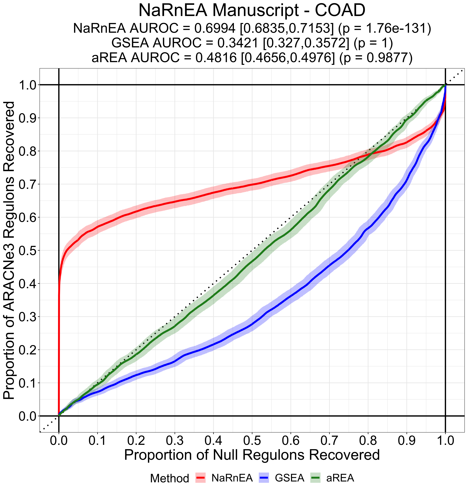
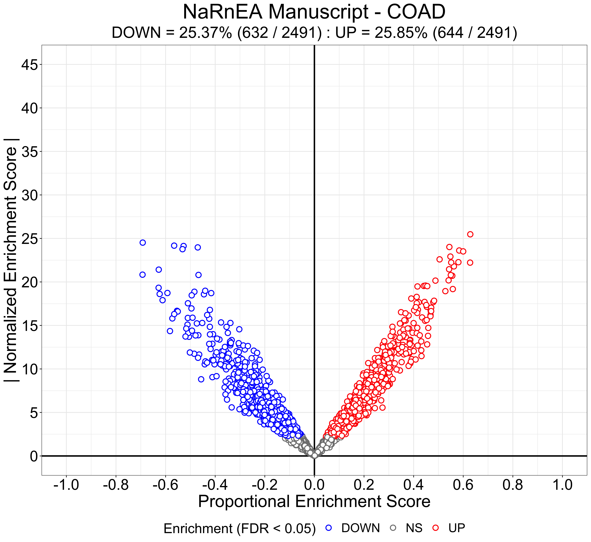

```{r, include = FALSE}
library(knitr)
opts_chunk$set(collapse = TRUE, comment = "#>", tidy = TRUE, tidy.opts=list(width.cutoff=70))
```

# Identifying Master Regulators of Lung Adenocarcinoma

## Introduction

Non-parametric analytical Rank-based Enrichment Analysis (`NaRnEA`) is a novel statistical method created by Griffin et al. in 2020 for the purpose of performing powerful and accurate gene set analysis. To read more about the theory behind `NaRnEA` and how it compares with Gene Set Enrichment Analysis (GSEA), which was created by Subramanian et al. in 2005, check out the preprint of the `NaRnEA` manuscript on bioRxiv ([link](https://www.biorxiv.org/search/NaRnEA)).

### Installing NaRnEA

For these analyses we'll need to install and load several R packages, including `NaRnEA`. For all of our visualization we'll be using the `ggplot2` package ([link](https://ggplot2.tidyverse.org/)), created by Hadley Wickham as part of the tidyverse. 

```{r, eval = FALSE}
install.packages("BiocManager")
library(BiocManager)

install("DESeq2")
library(DESeq2)

install("cluster")
library(cluster)

install("ggplot2")
library(ggplot2)

install("devtools")
library(devtools)

install_github(repo = "califano-lab/NaRnEA", force = TRUE, build_vignettes = TRUE)
library(NaRnEA)
```

## Real World Gene Expression Data

In Part 1 of the `NaRnEA` User Guide we demonstrated how to perform powerful and accurate gene set analysis in a non-parametric manner with `NaRnEA` using simulated data; now we'll turn our attention to leveraging `NaRnEA` for a unique type of gene set analysis; identifying Master Regulators of lung cancer using a systems biology approach.

### Lung Adenocarcinoma 

Some background; lung adenocarcinoma (LUAD) is the most common histological subtype of lung cancer (a heterogeneous disease which accounts for the highest number of cancer-related mortalities in the world each year). When The Cancer Genome Atlas (TCGA) was created, more than 500 patients diagnosed with LUAD tumors volunteered their biological data, producing a remarkable repository of high quality LUAD primary tumor RNA sequencing data. Over 50 of these patients also volunteered biopsies from benign lung tissue, producing age-matched and sex-matched control samples.

We'll start by loading in the gene expression profiles (rawcounts) for all samples from the TCGA LUAD project. These gene expression profiles were quantified from RNA sequencing FASTQ files with `kallisto` using the GRCh38 reference transcriptome. We'll also load in a dataframe that will allow us to conver the entrez id gene names to hugo gene symbols, which can aid in our interpretation of the data. 

```{r, eval = FALSE}
sim.seed <- 11
sig.figs <- 3

set.seed(sim.seed)

data("entrez.to.hugo.data", package = "NaRnEA")

data("luad.counts", package = "NaRnEA")
```

Next we'll extract 50 LUAD tumor gene expression profiles and 50 LUNG tissue gene expression profiles from the total set of TCGA LUAD gene expression profiles. This can be done based on the sample names; those samples with `-01` are primary tumor while those samples with '-11' are matched normal tissue. We'll make sure that the 50 LUAD gene expression profiles and 50 LUNG gene expression profiles come from the same 50 patients.

```{r, eval = FALSE}
tumor.counts <- luad.counts[,which(substr(colnames(luad.counts),13,15) == "-01")]
tissue.counts <- luad.counts[,which(substr(colnames(luad.counts),13,15) == "-11")]

common.patients <- intersect(substr(colnames(tumor.counts),1,12),substr(colnames(tissue.counts),1,12))

tumor.counts <- tumor.counts[,match(common.patients[1:50],substr(colnames(tumor.counts),1,12))]
tissue.counts <- tissue.counts[,match(common.patients[1:50],substr(colnames(tissue.counts),1,12))]
```

### Exploratory Data Analysis

As a sanity check, we'll start by performing some exploratory data analysis with these gene expression profiles. First, we'll normalize the samples for sequencing depth (i.e. counts per million). 

```{r, eval = FALSE}
tumor.cpm <- apply(tumor.counts,2,function(x){
	y <- 1E6*x/sum(x)
	return(y)
})

tissue.cpm <- apply(tissue.counts,2,function(x){
	y <- 1E6*x/sum(x)
	return(y)
})
```

Next we'll combine the LUAD and LUNG samples and compute a non-parametric internal gene expression signature for each sample. This can be done by copula-transforming each gene across all of the samples and then applying an inverse standard normal transformation so he each gene has a standard normal marginal distribution.

```{r, eval = FALSE}
total.cpm <- cbind(tumor.cpm,tissue.cpm)

total.ges <- t(apply(total.cpm,1,function(x){
	y <- rank(x, ties.method = "random")/(1 + length(x))
	z <- qnorm(y)
	return(z)
}))
```

For unsupervised clustering and dimensionality reduction we'll need a distance matrix which quantifies the degree of dissimilarity bewteen each sample. We can compute this from the Pearson Correlation between each non-parametric internal gene expression signature with the following code.

```{r, eval = FALSE}
total.ges.dist <- sqrt((1 - cor(total.ges, method = "pearson")))
total.ges.dist <- as.dist(total.ges.dist)
```

Now we'll perform non-linear dimensionality reduction with this distance matrix using multidimensional scaling; this method attemps to structure the samples in two-dimensional space such that the distance between each point is approximately equal to the distance from the original high dimensional distance matrix. We'll use a scatterplot to visualize the samples after dimensionality reduction. 

```{r, eval = FALSE}
set.seed(sim.seed)

plot.data <- cmdscale(d = total.ges.dist, k = 2)[,1:2]
plot.data <- as.data.frame(plot.data)
colnames(plot.data) <- c("x.values","y.values")
plot.data$group.values <- c(rep("LUAD", times = 50), rep("LUNG", times = 50))
plot.data$group.values <- factor(plot.data$group.values, levels = c("LUAD","LUNG"))

colour.value.vec <- c("LUAD" = "purple", "LUNG" = "forestgreen")

x.step <- .1
x.max <- ceiling(max(abs(plot.data[,c("x.values","y.values")])/x.step))*x.step
x.min <- -1*x.max
x.breaks <- seq(from = x.min, to = x.max, by = x.step)

y.breaks <- x.breaks

cur.title <- "TCGA LUAD (50) vs. TCGA LUNG (50)"
cur.subtitle <- "MDS Dimensionality Reduction"
cur.x.lab <- "Dimension 1"
cur.y.lab <- "Dimension 2"
cur.colour.lab <- "Phenotype"

ggplot(plot.data) + geom_hline(colour = "black", yintercept = 0, lwd = 1) + geom_vline(colour = "black", xintercept = 0, lwd = 1) + geom_point(aes(x = x.values, y = y.values, colour = group.values), shape = 21, fill = "white", size = 4, alpha = 1, stroke = 2) + scale_x_continuous(limits = range(x.breaks), breaks = x.breaks) + scale_y_continuous(limits = range(y.breaks), breaks = y.breaks) + theme(plot.title = element_text(hjust = 0.5, colour = "black", size = 25), plot.subtitle = element_text(hjust = 0.5, colour = "black", size = 22), axis.title = element_text(hjust = 0.5, colour = "black", size = 20), axis.text.x = element_text(hjust = 0.5, colour = "black", size = 18), axis.text.y = element_text(hjust = 1, colour = "black", size = 18), legend.title = element_text(hjust = 0, colour = "black", size = 20), legend.text = element_text(hjust = 0, colour = "black", size = 18), legend.position = "bottom") + scale_colour_manual(values = colour.value.vec) + labs(title = cur.title, subtitle = cur.subtitle, x = cur.x.lab, y = cur.y.lab, colour = cur.colour.lab)
```

{#id .class width=100% height=100%}

The multidimensional scaling scatterplot seems to suggest that significant transcriptional differences exist between the LUAD and LUNG samples, which we would expect given how phenotypically different they are. Rather than relying on visual interpretation of the dimensionality reduction scatterplot (which can quickly turn into a [Rorschach test](https://en.wikipedia.org/wiki/Rorschach_test)), let's perform unsupervised clustering with the PAM algorithm ([partitioning around medoids](https://en.wikipedia.org/wiki/K-medoids)).

```{r, eval = FALSE}
total.ges.clust <- pam(x = total.ges.dist, k = 2)

plot.data <- as.data.frame(total.ges.clust$silinfo$widths)
colnames(plot.data) <- c("cluster.values","neighborh.values","score.values")
plot.data$group.values <- "LUAD"
plot.data[which(rownames(plot.data)%in%colnames(tissue.counts)),"group.values"] <- "LUNG"
plot.data$cluster.values <- paste("Cluster",as.character(plot.data$cluster.values),sep = " ")
plot.data$sample.values <- rownames(plot.data)
plot.data$sample.values <- factor(plot.data$sample.values, levels = rev(as.character(plot.data$sample.values)))

colour.value.vec <- c("LUAD" = "purple", "LUNG" = "forestgreen")

x.breaks <- seq(from = -.2, to = 1, by = .1)

cur.title <- "TCGA LUAD (50) vs. TCGA LUNG (50)"
cur.subtitle <- paste("PAM Unsupervised Clustering", "\n", "Fisher's Exact Test (Cluster vs. Phenotype)", "\n", "Estimated Odds Ratio = ", signif(fisher.test(table(plot.data[,c("cluster.values","group.values")]), alternative = "greater")$estimate, sig.figs), " (p = ",signif(fisher.test(table(plot.data[,c("cluster.values","group.values")]), alternative = "greater")$p.value, sig.figs),")", sep = "")
cur.x.lab <- "Silhouette Score"
cur.y.lab <- "Sample"
cur.colour.lab <- "Phenotype"

ggplot(plot.data) + geom_vline(colour = "black", lwd = 1, xintercept = 0) + facet_wrap(~cluster.values, ncol = 1, scales = "free") + geom_segment(aes(x = score.values, xend = 0, y = sample.values, yend = sample.values, colour = group.values), lwd = 1.5) + scale_x_continuous(limits = range(x.breaks), breaks = x.breaks) + scale_colour_manual(values = colour.value.vec) + theme(plot.title = element_text(hjust = 0.5, colour = "black", size = 25), plot.subtitle = element_text(hjust = 0.5, colour = "black", size = 22), axis.title = element_text(hjust = 0.5, colour = "black", size = 20), axis.text.x = element_text(hjust = 0.5, colour = "black", size = 18), axis.text.y = element_text(hjust = 1, colour = "black", size = 6), legend.title = element_text(hjust = 0, colour = "black", size = 20), legend.text = element_text(hjust = 0, colour = "black", size = 18), legend.position = "bottom", strip.text = element_text(hjust = 0.5, colour = "black", size = 20)) + labs(title = cur.title, subtitle = cur.subtitle, x = cur.x.lab, y = cur.y.lab, colour = cur.colour.lab)
```

{#id .class width=100% height=100%}

The gene expression signature unsupervised clusters are significantly correlated with the sample phenotypes (Fisher's Exact Test p < 0.05). Cluster 1 consists mostly of LUAD samples while cluster 2 consists mostly of LUNG samples, once again reinforcing the fact that these samples have distinct transcriptional properties.

### Differential Gene Expression Analysis

In order to directly estimate the differential expression of each protein-coding gene between the LUAD phenotype and LUNG phenotype we'll leverage the `DESeq2` R package, which performs differential gene expression analysis based on a negative binomial distribution [link](http://bioconductor.org/packages/release/bioc/html/DESeq2.html). `DESeq2` works directly with counts and runs very efficiently even for the 100 gene expression profiles we are using. Once we've performed the differential gene expression analysis with `DESeq2` we'll extract the results and visualize them using a differential gene expression volcano plot. 

```{r, eval = FALSE}
cur.count.data <- cbind(tumor.counts,tissue.counts)
cur.count.data <- apply(cur.count.data,2,function(x){
	y <- round(x)
	return(y)
})

cur.meta.data <- data.frame(Site = rep("TCGA", times = 100), Group = c(rep("Tumor", times = 50),rep("Tissue", times = 50)))
rownames(cur.meta.data) <- colnames(cur.count.data)

cur.dds <- DESeqDataSetFromMatrix(countData = cur.count.data, colData = cur.meta.data, design = ~Group)
cur.dds$Group <- relevel(cur.dds$Group, ref = "Tissue")

cur.dds <- DESeq(cur.dds)

cur.dge.res <- results(cur.dds, contrast = c("Group","Tumor","Tissue"), cooksCutoff = FALSE, independentFiltering = FALSE, format = "DataFrame")
cur.dge.res <- as.data.frame(cur.dge.res)

plot.data <- data.frame(x.values = cur.dge.res$log2FoldChange, p.values = cur.dge.res$pvalue)
plot.data <- plot.data[which(is.finite(plot.data$p.values)),]
plot.data$y.values <- -1*log(plot.data$p.values,base = 10)
plot.data$fdr.values <- p.adjust(p = plot.data$p.values, method = "BH")
plot.data$dir.values <- "NONE"
plot.data[which(plot.data$x.values < 0 & plot.data$fdr.values < .05),"dir.values"] <- "DOWN"
plot.data[which(plot.data$x.values > 0 & plot.data$fdr.values < .05),"dir.values"] <- "UP"
plot.data$dir.values <- factor(plot.data$dir.values, levels = c("DOWN","NONE","UP"))

colour.value.vec <- c("DOWN" = "forestgreen", "NONE" = "grey50", "UP" = "purple")

cur.title <- "TCGA LUAD (50) vs. TCGA LUNG (50)"
cur.subtitle <- paste("DESeq2-Inferred Differential Gene Expression","\n","Downregulated Genes = ", sum(plot.data$dir.values == "DOWN"), " (",signif(100*mean(plot.data$dir.values == "DOWN"),sig.figs),"%)", " : ", "Upregulated Genes = ", sum(plot.data$dir.values == "UP"), " (",signif(100*mean(plot.data$dir.values == "UP"),sig.figs),"%)", sep = "")
cur.x.lab <- "Log-2-Fold-Change"
cur.y.lab <- "-log10(p-value)"
cur.colour.lab <- "Direction (FDR < 0.05)"

x.step <- 1
x.max <- x.step*ceiling(max(abs(plot.data$x.values))/x.step)
x.min <- -1*x.max
x.breaks <- seq(from = x.min, to = x.max, by = x.step)

y.step <- 10
y.min <- 0
y.max <- y.step*ceiling(max(plot.data$y.values)/y.step)
y.breaks <- seq(from = y.min, to = y.max, by = y.step)

ggplot(plot.data) + geom_hline(colour = "black", yintercept = 0, lwd = 1) + geom_vline(colour = "black", xintercept = 0, lwd = 1) + geom_point(aes(x = x.values, y = y.values, colour = dir.values), shape = 21, size = 2, fill = "white", alpha = 1, stroke = 1) + scale_x_continuous(limits = range(x.breaks), breaks = x.breaks) + scale_y_continuous(limits = range(y.breaks), breaks = y.breaks) + theme(plot.title = element_text(hjust = 0.5, colour = "black", size = 25), plot.subtitle = element_text(hjust = 0.5, colour = "black", size = 22), axis.title = element_text(hjust = 0.5, colour = "black", size = 20), axis.text.x = element_text(hjust = 0.5, colour = "black", size = 18), axis.text.y = element_text(hjust = 1, colour = "black", size = 18), legend.title = element_text(hjust = 0, colour = "black", size = 20), legend.text = element_text(hjust = 0, colour = "black", size = 18), legend.position = "bottom") + scale_colour_manual(values = colour.value.vec) + labs(title = cur.title, subtitle = cur.subtitle, x = cur.x.lab, y = cur.y.lab, colour = cur.colour.lab)
```

{#id .class width=100% height=100%}

Our suspicions are confirmed; the LUAD and LUNG phenotypes differ quite significantly at the transcriptional level. After correcting the differential gene expression two-sided p-values to control the False Discovery Rate with the Benjamini-Hochberg method, we find that >40% of the protein-coding genes are significantly upregulated in the LUAD samples with respect to the LUNG samples and more than 20% of the protein-coding genes are significantly downregulated in the LUAD samples with respect to the LUNG samples.

### ARACNe-Inferred Regulon Gene Sets

The Algorithm for the Reconstruction of Accurate Cellular Networks ([ARACNe](https://pubmed.ncbi.nlm.nih.gov/16723010/)), published by Margolin et al. in 2006, is a well-validated method which is capable of reverse-engineering transcriptional regulatory networks from gene expression data using an information theoretic approach. We have used a modified version of the newer implementation of the algorithm, [ARACNe-AP](https://pubmed.ncbi.nlm.nih.gov/27153652/), to infer the transcriptional regulatory targets for transcription factors, co-transcription factors, and signal transduction proteins from the other LUAD primary tumor gene expression profiles in TCGA. 

. Let's load in those datasets now and combine them into a single data frame.

```{r, eval = FALSE}
data("tf.network.data", package = "NaRnEA")

data("cotf.network.data", package = "NaRnEA")

data("sig.network.data", package = "NaRnEA")

total.network.data <- rbind(tf.network.data,cotf.network.data,sig.network.data)
```

For each of the putative transcriptional regulatory interactions inferred by ARACNe we have provided several key pieces of data (i) the median mutual information between the gene expression of the regulator and the gene expression of the target across all subnetworks, (ii) the number of subnetworks in which a transcriptional regulatory interation appeared, and (iii) the Spearman correlation between the gene expression of the regulator and the gene expression of the target. We can use these data to estimate a Regulation Confidence and Mode of Regulation for each interaction. 

```{r, eval = FALSE}
total.network.data$rc.value <- (total.network.data$mi.value*total.network.data$count.value)/max(total.network.data$count.value)
total.network.data$mor.value <- (total.network.data$scc.value)
```

The use of the Spearman correlation for the Mode of Regulation is straightforward, but prone to error if the gene expression of the regulator is negatively correlated with the activity of the regulator (e.g. feedback loops, heavy post-transcriptional regulation). By calculating the Regulation Confidence from both the subnetwork count and the median mutual information we give weight to edges which are strong and present across multiple putative network topologies. 

We'll now restructure these data as a list of regulon gene sets, one for each of the putative transcriptional regulatory proteins. We'll subset the list to those regulon gene sets which are sufficiently large (at least 50 targets) and we'll limit the maximum regulon gene set size to 500 targets to reduce the computational burden of subsequent analyses. 

```{r, eval = FALSE}
total.regulator.names <- unique(as.character(total.network.data$regulator.value))
total.target.names <- unique(as.character(total.network.data$target.value))

true.regulon.list <- lapply(total.regulator.names,function(cur.regulator.name){
	cur.network.data <- total.network.data[which(total.network.data$regulator.value == cur.regulator.name),]
	cur.regulon <- list(tfmode = cur.network.data$mor.value, likelihood = cur.network.data$rc.value)
	names(cur.regulon$tfmode) <- as.character(cur.network.data$target.value)
	return(cur.regulon)
})
names(true.regulon.list) <- total.regulator.names

true.regulon.list <- true.regulon.list[as.numeric(which(sapply(true.regulon.list,function(x){return(length(x$tfmode))}) >= 50))]

length(true.regulon.list)
length(unlist(lapply(true.regulon.list,function(x){return(names(x$tfmode))})))

cur.max.regulon.size <- 500

true.regulon.list <- lapply(true.regulon.list,function(x){
	y <- x$likelihood
	names(y) <- names(x$tfmode)
	y <- names(sort(y, decreasing = TRUE)[seq(from = 1, to = min(cur.max.regulon.size,length(y)), by = 1)])
	z <- list(tfmode = x$tfmode[match(y,names(x$tfmode))], likelihood = x$likelihood[match(y,names(x$tfmode))])
	return(z)
})
```

Let's now compute the number of regulators, number of targets, and total number of interactions in our ARACNe-inferred LUAD transcriptional regulatory network (i.e. interactome). 

```{r, eval = FALSE}
length(true.regulon.list)

length(unique(unlist(lapply(true.regulon.list,function(x){return(names(x$tfmode))}))))

length(unlist(lapply(true.regulon.list,function(x){return(names(x$tfmode))})))
```

### NaRnEA-Inferred Differential Protein Activity

Gene set analysis methods make a critical assumption that is often overlooked; they assume that the expression of the genes in a gene set are dependent on the activity of the ontology that unifies those gene set members. This assumption may or may not hold depending on how the activity of the ontology is regulated; for example, if one were to create a gene set based on enzymes in a metabolic pathway, it may be very difficult to leverage gene set analysis to infer the differential activity of this metabolic pathway if the activity of the pathway is controlled at the post-transcriptional level.

However, this critical assumption of gene set analysis is always satisfied by transcriptional regulatory proteins; these proteins are enzymes whose biochemical activity alters the expression of their transcriptional targets. The Master Regulator Inference Algorithm ([MARINa](https://pubmed.ncbi.nlm.nih.gov/20531406/)), published by Lefebvre et al. in 2010, was the first method designed to leverage gene set analysis of regulon gene sets to identify transcriptional regulatory proteins which are necessary and sufficient for the initiation and maintenance of a particular phenotype (i.e. Master Regulators). 

Now that we have our ARACNe-inferred regulon gene sets we'll use `NaRnEA` to test for their enrichment in a gene expression signature which we'll estimate between the LUAD phenotype and LUNG phenotype using the DESeq2 differential gene expression results. We hypothesize that the transcriptional regulatory proteins whose regulon gene sets are significantly enriched in the LUAD vs. LUNG gene expression signature will demonstrate differential activity between the two phenotypes, thus representing putative LUAD Master Regulators. Once we've used `NaRnEA` to infer the differential activity of each putative transcriptional regulatory protein we'll visualize it with a modified version of a volcano plot.

```{r, eval = FALSE}
real.luad.vs.lung.ges <- qnorm(p = (cur.dge.res$pvalue/2), lower.tail = FALSE)*sign(cur.dge.res$log2FoldChange)
names(real.luad.vs.lung.ges) <- rownames(cur.dge.res)

true.real.dpa.res <- t(sapply(true.regulon.list,function(cur.regulon,cur.ges){
	y <- unlist(NaRnEA(ges = cur.ges, regulon = cur.regulon, minsize = 30, seed = 1, leading.edge = FALSE))
	return(y)
}, cur.ges = real.luad.vs.lung.ges))
true.real.dpa.res <- as.data.frame(true.real.dpa.res)

plot.data <- data.frame(x.values = true.real.dpa.res$pes, y.values = abs(true.real.dpa.res$nes))
plot.data$p.values <- 2*pnorm(q = plot.data$y.values, lower.tail = FALSE)
plot.data$fdr.values <- p.adjust(p = plot.data$p.values, method = "BH")
plot.data$dir.values <- "NONE"
plot.data[which(plot.data$x.values < 0 & plot.data$fdr.values < .05),"dir.values"] <- "DOWN"
plot.data[which(plot.data$x.values > 0 & plot.data$fdr.values < .05),"dir.values"] <- "UP"
plot.data$dir.values <- factor(plot.data$dir.values, levels = c("DOWN","NONE","UP"))

colour.value.vec <- c("DOWN" = "blue1", "NONE" = "grey50", "UP" = "red1")

x.breaks <- seq(from = -1, to = 1, by = .2)

y.step <- 2
y.min <- 0
y.max <- y.step*ceiling(max(plot.data$y.values)/y.step)
y.breaks <- seq(from = y.min, to = y.max, by = y.step)

cur.title <- "TCGA LUAD (50) vs. TCGA LUNG (50)"
cur.subtitle <- paste("NaRnEA-Inferred Differential Protein Activity","\n","Regulon Gene Sets = Real"," : ","Gene Expression Signature = Real","\n","Deactivated Proteins = ", sum(plot.data$dir.values == "DOWN"), " (",signif(100*mean(plot.data$dir.values == "DOWN"),sig.figs),"%)", " : ", "Activated Proteins = ", sum(plot.data$dir.values == "UP"), " (",signif(100*mean(plot.data$dir.values == "UP"),sig.figs),"%)", sep = "")
cur.x.lab <- "Proportional Enrichment Score"
cur.y.lab <- "| Normalized Enrichment Score |"
cur.colour.lab <- "Direction (FDR < 0.05)"

ggplot(plot.data) + geom_vline(colour = "black", lwd = 1, xintercept = 0) + geom_hline(colour = "black", lwd = 1, yintercept = 0) + geom_point(aes(x = x.values, y = y.values, colour = dir.values), fill = "white", alpha = 1, stroke = 1.5, size = 2, shape = 21) + scale_colour_manual(values = colour.value.vec) + scale_x_continuous(limits = range(x.breaks), breaks = x.breaks) + scale_y_continuous(limits = range(y.breaks), breaks = y.breaks) + theme(plot.title = element_text(hjust = 0.5, colour = "black", size = 25), plot.subtitle = element_text(hjust = 0.5, colour = "black", size = 22), axis.title = element_text(hjust = 0.5, colour = "black", size = 20), axis.text.x = element_text(hjust = 0.5, colour = "black", size = 18), axis.text.y = element_text(hjust = 1, colour = "black", size = 18), legend.title = element_text(hjust = 0, colour = "black", size = 20), legend.text = element_text(hjust = 0, colour = "black", size = 18), legend.position = "bottom") + labs(title = cur.title, subtitle = cur.subtitle, x = cur.x.lab, y = cur.y.lab, colour = cur.colour.lab)
```

{#id .class width=100% height=100%}

In this modified volcano plot the `NaRnEA` effect size (PES) is on the x-axis and the magnitude of the `NaRnEA` test statistic (NES) is on the y-axis. After correcting the `NaRnEA` two-sided p-values to control the False Discovery Rate with the Benjamini-Hochberg method, we find that >20% of the putative transcriptional regulatory proteins are activated in the LUAD samples with respect to the LUNG sample sand more than 20% of the putative transcriptional regulatory proteins are deactivated in the LUAD samples with respect to the LUNG samples. With more than 2,000 differentially activated proteins, we can motivate any number of follow up experiments to further dissect the biology of LUAD. 

## Type I Error Rate Control by NaRnEA

## NaRnEA Gene Set Analysis with a Shuffled Gene Expression Signature 

In Part 1 of the `NaRnEA` User Guide we demonstrated that `NaRnEA` can accurately control the Type I error rate of gene set analysis using simulated data; however, can we be certain that it will control the Type I error rate of gene set analysis in real world data, which is often much messier? If the Type I error rate is not accurately controlled, then the putative Master Regulators of the LUAD phenotype that were identified by `NaRnEA` may be riddled with false positives.  

In order to test whether `NaRnEA` accurately controls the Type I error rate of gene set analysis with real world data in two ways we'll take two approaches. First,  we'll create a shuffled gene expression signature by shuffling the gene identifiers of the original gene expression signature. Because we've shuffled the genes we've essentially destroyed any biological correlation that originally existed, which virtually guarantees that the null hypothesis of gene set analysis is true for all of our regulon gene sets. We can then test each regulon gene set for enrichment in this shuffled gene expression signature; any significant enrichment results will indicate that the offending regulon gene set is either too small or is not adequately parameterized for `NaRnEA` to guarantee accurate control of the Type I error rate. We can visualize the `NaRnEA`-inferred differential protein activity for the real regulon gene sets in the shuffled LUAD vs. LUNG gene expression signature once again using our modified volcano plot. 

```{r, eval = FALSE}
set.seed(sim.seed)
shuffle.luad.vs.lung.ges <- real.luad.vs.lung.ges
names(shuffle.luad.vs.lung.ges) <- sample(names(shuffle.luad.vs.lung.ges), replace = FALSE)

true.shuffle.dpa.res <- t(sapply(true.regulon.list,function(cur.regulon,cur.ges){
	y <- unlist(NaRnEA(ges = cur.ges, regulon = cur.regulon, minsize = 30, seed = 1, leading.edge = FALSE))
	return(y)
}, cur.ges = shuffle.luad.vs.lung.ges))
true.shuffle.dpa.res <- as.data.frame(true.shuffle.dpa.res)

plot.data <- data.frame(x.values = true.shuffle.dpa.res$pes, y.values = abs(true.shuffle.dpa.res$nes))
plot.data$p.values <- 2*pnorm(q = plot.data$y.values, lower.tail = FALSE)
plot.data$fdr.values <- p.adjust(p = plot.data$p.values, method = "BH")
plot.data$dir.values <- "NONE"
plot.data[which(plot.data$x.values < 0 & plot.data$fdr.values < .05),"dir.values"] <- "DOWN"
plot.data[which(plot.data$x.values > 0 & plot.data$fdr.values < .05),"dir.values"] <- "UP"
plot.data$dir.values <- factor(plot.data$dir.values, levels = c("DOWN","NONE","UP"))

colour.value.vec <- c("DOWN" = "blue1", "NONE" = "grey50", "UP" = "red1")

cur.title <- "TCGA LUAD (50) vs. TCGA LUNG (50)"
cur.subtitle <- paste("NaRnEA-Inferred Differential Protein Activity","\n","Regulon Gene Sets = Real"," : ","Gene Expression Signature = Shuffled","\n","Deactivated Proteins = ", sum(plot.data$dir.values == "DOWN"), " (",signif(100*mean(plot.data$dir.values == "DOWN"),sig.figs),"%)", " : ", "Activated Proteins = ", sum(plot.data$dir.values == "UP"), " (",signif(100*mean(plot.data$dir.values == "UP"),sig.figs),"%)", sep = "")
cur.x.lab <- "Proportional Enrichment Score"
cur.y.lab <- "| Normalized Enrichment Score |"
cur.colour.lab <- "Direction (FDR < 0.05)"

ggplot(plot.data) + geom_vline(colour = "black", lwd = 1, xintercept = 0) + geom_hline(colour = "black", lwd = 1, yintercept = 0) + geom_point(aes(x = x.values, y = y.values, colour = dir.values), fill = "white", alpha = 1, stroke = 1.5, size = 2, shape = 21) + scale_colour_manual(values = colour.value.vec) + scale_x_continuous(limits = range(x.breaks), breaks = x.breaks) + scale_y_continuous(limits = range(y.breaks), breaks = y.breaks) + theme(plot.title = element_text(hjust = 0.5, colour = "black", size = 25), plot.subtitle = element_text(hjust = 0.5, colour = "black", size = 22), axis.title = element_text(hjust = 0.5, colour = "black", size = 20), axis.text.x = element_text(hjust = 0.5, colour = "black", size = 18), axis.text.y = element_text(hjust = 1, colour = "black", size = 18), legend.title = element_text(hjust = 0, colour = "black", size = 20), legend.text = element_text(hjust = 0, colour = "black", size = 18), legend.position = "bottom") + labs(title = cur.title, subtitle = cur.subtitle, x = cur.x.lab, y = cur.y.lab, colour = cur.colour.lab)
```

{#id .class width=100% height=100%}

After correcting the `NaRnEA` two-sided p-values to control the False Discovery Rate with the Benjamini-Hochberg method, we do not find that any of the regulon gene sets are significantly enriched in the shuffled LUAD vs. LUNG gene expression signature, indicating that the regulon gene sets are of adequate size and parameterization or `NaRnEA` to guarantee accurate control of the Type I error rate.

### An Information Theoretic Justification for the NaRnEA Gene Set Null Distribution 

In order to guarantee accurate control of the Type I error rate, `NaRnEA` assumes that genes in a gene set are independently and identically distributed in the gene expression signature when the null hypothesis of gene set analysis is true (i.e. the ontology unifying the members of the gene set is not differntially activated between the test phenotype and reference phenotype under analysis). This assumption is a strong one and follows from the [principle of maximum entropy](https://en.wikipedia.org/wiki/Principle_of_maximum_entropy), an information theoretic generalization of Occam's Razor that leads us to select, as our null distribution, the probability distribution with the maximum entropy constrained on all known information. 

If we assume that the null hypothesis of gene set analysis is true for a particular gene set, then for our null distribution we would like to select the joint probability distribution for the members of the gene set which has the greatest entropy out of all possible joint probability distributions. `NaRnEA` performs gene set analysis in a robust manner by non-parametrically transforming the gene expression signature; as a result, the continuous values are discretized based on the direction and relative magnitude of the differential expression for each gene. If we model each gene set member as a discrete random variable which can occupy any of the values in the non-parametric gene expression signature it naturally follows that the maximum entropy distribution for each gene set member is that they are equally likely to occupy any of the values in the non-parametric gene expression signature (i.e. each gene is identically distributed in the gene expression signature).

Furthermore, the joint entropy of an ensemble of discrete random variables is always less than or equal to the sum of the entropies for each of the discrete random variables which compose the ensemble. In fact, the joint entropy is only equal to the sum of the individual entropies if all of the discrete random variables in the ensemble are independent. This leads us to the idea that the maximum entropy joint probability distribution for the gene set members (i.e. the ideal null distribution for genes in gene set analysis) is one in which all of the genes in the gene set are independent and identically distributed in the gene expression signature. 

## NaRnEA Gene Set Analysis with Shuffled Regulon Gene Sets

By shuffling the LUAD vs. LUNG gene expression signature we have destroyed whatever correlation may have existed between different genes. Thus, in order to verify the assumption made by `NaRnEA` that genes are independent and identically distributed in the LUAD vs. LUNG gene expression signature under the null hypothesis of gene set analysis, we'll need to take a different approach that does not alter the gene expression signature.

To this end, we can swap out the members of each regulon gene set for genes randomly selected from each regulon gene set's complement. This preserves the regulon gene set parameterization as well as the structure of the LUAD vs. LUNG gene expression signature, but creates gene sets whose members are (at least in theory) not biologically related. Of course, due to the high degree of gene expression coregulation present in the eukaryotic cell we may accidentally create a few gene sets whose members display some biologically meaningful relationships; as a result, a handful of shuffled gene sets may produce significant enrichment in the LUAD vs. LUNG gene expression signature.

However, if the `NaRnEA` assumption that genes are independent and identically distributed in the LUAD vs. LUNG gene expression signature under the null hypothesis of gene set analysis is incorrect, we can expect that many of these new gene sets will display significant enrichment in the LUAD vs. LUNG gene expression signature, which would be extremely problematic for the method. Our modified volcano plot will help us determine whether this is the case.

```{r, eval = FALSE}
set.seed(sim.seed)
null.regulon.list <- lapply(true.regulon.list,function(x){
	y <- x
	names(y$tfmode) <- sample(setdiff(names(real.luad.vs.lung.ges),names(x$tfmode)), size = length(y$tfmode))
	return(y)
})

null.real.dpa.res <- t(sapply(null.regulon.list,function(cur.regulon,cur.ges){
	y <- unlist(NaRnEA(ges = cur.ges, regulon = cur.regulon, minsize = 30, seed = 1, leading.edge = FALSE))
	return(y)
}, cur.ges = real.luad.vs.lung.ges))
null.real.dpa.res <- as.data.frame(null.real.dpa.res)

plot.data <- data.frame(x.values = null.real.dpa.res$pes, y.values = abs(null.real.dpa.res$nes))
plot.data$p.values <- 2*pnorm(q = plot.data$y.values, lower.tail = FALSE)
plot.data$fdr.values <- p.adjust(p = plot.data$p.values, method = "BH")
plot.data$dir.values <- "NONE"
plot.data[which(plot.data$x.values < 0 & plot.data$fdr.values < .05),"dir.values"] <- "DOWN"
plot.data[which(plot.data$x.values > 0 & plot.data$fdr.values < .05),"dir.values"] <- "UP"
plot.data$dir.values <- factor(plot.data$dir.values, levels = c("DOWN","NONE","UP"))

colour.value.vec <- c("DOWN" = "blue1", "NONE" = "grey50", "UP" = "red1")

cur.title <- "TCGA LUAD (50) vs. TCGA LUNG (50)"
cur.subtitle <- paste("NaRnEA-Inferred Differential Protein Activity","\n","Regulon Gene Sets = Shuffled"," : ","Gene Expression Signature = Real","\n","Deactivated Proteins = ", sum(plot.data$dir.values == "DOWN"), " (",signif(100*mean(plot.data$dir.values == "DOWN"),sig.figs),"%)", " : ", "Activated Proteins = ", sum(plot.data$dir.values == "UP"), " (",signif(100*mean(plot.data$dir.values == "UP"),sig.figs),"%)", sep = "")
cur.x.lab <- "Proportional Enrichment Score"
cur.y.lab <- "| Normalized Enrichment Score |"
cur.colour.lab <- "Direction (FDR < 0.05)"

ggplot(plot.data) + geom_vline(colour = "black", lwd = 1, xintercept = 0) + geom_hline(colour = "black", lwd = 1, yintercept = 0) + geom_point(aes(x = x.values, y = y.values, colour = dir.values), fill = "white", alpha = 1, stroke = 1.5, size = 2, shape = 21) + scale_colour_manual(values = colour.value.vec) + scale_x_continuous(limits = range(x.breaks), breaks = x.breaks) + scale_y_continuous(limits = range(y.breaks), breaks = y.breaks) + theme(plot.title = element_text(hjust = 0.5, colour = "black", size = 25), plot.subtitle = element_text(hjust = 0.5, colour = "black", size = 22), axis.title = element_text(hjust = 0.5, colour = "black", size = 20), axis.text.x = element_text(hjust = 0.5, colour = "black", size = 18), axis.text.y = element_text(hjust = 1, colour = "black", size = 18), legend.title = element_text(hjust = 0, colour = "black", size = 20), legend.text = element_text(hjust = 0, colour = "black", size = 18), legend.position = "bottom") + labs(title = cur.title, subtitle = cur.subtitle, x = cur.x.lab, y = cur.y.lab, colour = cur.colour.lab)
```

{#id .class width=100% height=100%}

After correcting the `NaRnEA` two-sided p-values to control the False Discovery Rate with the Benjamini-Hochberg method, we do not find that any of the shuffled regulon gene sets are significantly enriched in the LUAD vs. LUNG gene expression signature. This supports the assumption made by `NaRnEA` that genes are independent and identically distributed in the gene expression signature under the null hypothesis of gene set analysis; as a result, `NaRnEA` is able to guarantee accurate control of the gene set analysis Type I error rate. 

In addition to the modified volcano plot we can visualize the empirical cumulative distribution function for the `NaRnEA` two-sided p-values from the enrichment of (i) ARACNe-inferred regulon gene sets in the LUAD vs. LUNG gene expression signature, (ii) ARACNe-inferred regulon gene sets in the shuffled LUAD vs. LUNG gene expression signature, and (iii) shuffled regulon gene sets in the LUAD vs. LUNG gene expression signature. We'll also calculate the proportion of two-sided p-values from each of these analyses which are statistically significant without multiple hypothesis testing correction (p < 0.05), with correction for multiple hypothesis testing by the Benjamini-Hochberg method (False Discovery Rate < 0.05), and with correction for multiple hypothesis testing by the Bonferroni method (Family Wise Error Rate < 0.05). 

```{r, eval = FALSE}
plot.data.true.real <- data.frame(x.values = seq(from = 0, to = 1, length.out = 1E3))
plot.data.true.real$y.values <- ecdf((2*pnorm(q = abs(true.real.dpa.res$nes), lower.tail = FALSE)))(plot.data.true.real$x.values)
plot.data.true.real$group.values <- "Real-Real"

plot.data.true.shuffle <- data.frame(x.values = seq(from = 0, to = 1, length.out = 1E3))
plot.data.true.shuffle$y.values <- ecdf((2*pnorm(q = abs(true.shuffle.dpa.res$nes), lower.tail = FALSE)))(plot.data.true.shuffle$x.values)
plot.data.true.shuffle$group.values <- "Real-Shuffled"

plot.data.null.real <- data.frame(x.values = seq(from = 0, to = 1, length.out = 1E3))
plot.data.null.real$y.values <- ecdf((2*pnorm(q = abs(null.real.dpa.res$nes), lower.tail = FALSE)))(plot.data.null.real$x.values)
plot.data.null.real$group.values <- "Shuffled-Real"

plot.data <- rbind(plot.data.true.real, plot.data.true.shuffle, plot.data.null.real)
plot.data$group.values <- factor(plot.data$group.values, levels = unique(as.character(plot.data$group.values)))

colour.value.vec <- c("Real-Real" = "red1", "Real-Shuffled" = "blue1", "Shuffled-Real" = "forestgreen")

x.breaks <- seq(from = 0, to = 1, by = .1)
y.breaks <- x.breaks

cur.title <- "TCGA LUAD (50) vs. TCGA LUNG (50)"
cur.subtitle <- paste("NaRnEA-Inferred Differential Protein Activity", "\n", "Real-Real", " : ", "p < 0.05 = ", signif((100*mean(p.adjust(p = (2*pnorm(q = abs(true.real.dpa.res$nes), lower.tail = FALSE)), method = "none") < .05)), sig.figs), "%", " : ", "FDR < 0.05 = ", signif((100*mean(p.adjust(p = (2*pnorm(q = abs(true.real.dpa.res$nes), lower.tail = FALSE)), method = "BH") < .05)), sig.figs), "%", " : ", "FWER < 0.05 = ", signif((100*mean(p.adjust(p = (2*pnorm(q = abs(true.real.dpa.res$nes), lower.tail = FALSE)), method = "bonferroni") < .05)), sig.figs), "%", "\n", "Real-Shuffled", " : ", "p < 0.05 = ", signif((100*mean(p.adjust(p = (2*pnorm(q = abs(true.shuffle.dpa.res$nes), lower.tail = FALSE)), method = "none") < .05)), sig.figs), "%", " : ", "FDR < 0.05 = ", signif((100*mean(p.adjust(p = (2*pnorm(q = abs(true.shuffle.dpa.res$nes), lower.tail = FALSE)), method = "BH") < .05)), sig.figs), "%", " : ", "FWER < 0.05 = ", signif((100*mean(p.adjust(p = (2*pnorm(q = abs(true.shuffle.dpa.res$nes), lower.tail = FALSE)), method = "bonferroni") < .05)), sig.figs), "%", "\n", "Shuffled-Real", " : ", "p < 0.05 = ", signif((100*mean(p.adjust(p = (2*pnorm(q = abs(null.real.dpa.res$nes), lower.tail = FALSE)), method = "none") < .05)), sig.figs), "%", " : ", "FDR < 0.05 = ", signif((100*mean(p.adjust(p = (2*pnorm(q = abs(null.real.dpa.res$nes), lower.tail = FALSE)), method = "BH") < .05)), sig.figs), "%", " : ", "FWER < 0.05 = ", signif((100*mean(p.adjust(p = (2*pnorm(q = abs(null.real.dpa.res$nes), lower.tail = FALSE)), method = "bonferroni") < .05)), sig.figs), "%", sep = "")
cur.x.lab <- "NaRnEA Two-Sided P-Value"
cur.y.lab <- "Empirical Cumulative Probability"
cur.colour.lab <- "Regulon-GES Combo"

ggplot(plot.data) + geom_vline(colour = "black", lwd = 1, xintercept = range(x.breaks)) + geom_hline(colour = "black", lwd = 1, yintercept = range(y.breaks)) + geom_abline(colour = "black", lwd = 1, intercept = 0, slope = 1, linetype = "dashed") + geom_line(aes(x = x.values, y = y.values, colour = group.values), lwd = 1.5) + scale_colour_manual(values = colour.value.vec) + scale_x_continuous(limits = range(x.breaks), breaks = x.breaks) + scale_y_continuous(limits = range(y.breaks), breaks = y.breaks) + theme(plot.title = element_text(hjust = 0.5, colour = "black", size = 25), plot.subtitle = element_text(hjust = 0.5, colour = "black", size = 22), axis.title = element_text(hjust = 0.5, colour = "black", size = 20), axis.text.x = element_text(hjust = 0.5, colour = "black", size = 18), axis.text.y = element_text(hjust = 1, colour = "black", size = 18), legend.title = element_text(hjust = 0, colour = "black", size = 20), legend.text = element_text(hjust = 0, colour = "black", size = 18), legend.position = "bottom") + labs(title = cur.title, subtitle = cur.subtitle, x = cur.x.lab, y = cur.y.lab, colour = cur.colour.lab)
```

{#id .class width=100% height=100%}

When the null hypothesis is true, the `NaRnEA` two-sided p-values should be uniformly distributed on the interval [0,1], producing an empirical cumulative distribution function which tracks along the diagonal of the plot (black dashed line). 

We see that the `NaRnEA` two-sided p-values for the enrichment of the ARACNe-inferred regulon gene sets in the LUAD vs. LUNG gene expression signature fall above the diagonal, which is what we would expect if the alternative hypothesis is true for some subset of these regulon gene sets. More than 50% of these two-sided p-values are statistically significant without correction for multiple hypothesis testing (p < 0.05). This number drops slightly to 47.8% (FDR < 0.05) and 31.7% (FWER < 0.05) depending on whether we want to correct for multiple hypothesis testing using the Benjamini-Hochberg method or the Bonferroni method.

We see that the `NaRnEA` two-sided p-values for the enrichment of the ARACNe-inferred regulon gene sets in the shuffled LUAD vs. LUNG gene expression signature fall almost directly on the diagonal, which is what we would expect if the null hypothesis were true for all of the regulon gene sets. Only than 5% of these two-sided p-values are statistically significant without correction for multiple hypothesis testing (p < 0.05). This number drops slightly to 0% (FDR < 0.05) and 0% (FWER < 0.05) depending on whether we want to correct for multiple hypothesis testing using the Benjamini-Hochberg method or the Bonferroni method.

We see that the `NaRnEA` two-sided p-values for the enrichment of the shuffled regulon gene sets in the LUAD vs. LUNG gene expression signature fall almost directly on the diagonal; in fact, for (p < 0.25), the eCDF falls slightly above the diagnoal, which is what we would expect if the alternative hypothesis was true for a small number of these regulon gene sets. This is to be expected; during the regulon gene set member shuffling procedure it is highly likely that at least a few of the shuffled regulon gene sets contain members which demonstrate biological coregulation. Less than 6% of these two-sided p-values are statistically significant without correction for multiple hypothesis testing (p < 0.05). This number drops slightly to 0% (FDR < 0.05) and 0% (FWER < 0.05) depending on whether we want to correct for multiple hypothesis testing using the Benjamini-Hochberg method or the Bonferroni method. 

## Post-Hoc Gene Set Analysis with NaRnEA

Now that we have identified some putative Master Regulators of the LUAD phenotype with respect to its tissue of origin (i.e. LUNG), we can leverage the various post-hoc analysis features that `NaRnEA` offers to deepen our understanding of these transcriptional regulatory proteins.

Both FOXM1 and CENPF, two transcription factors, have been implicated as Master Regulators of prostate cancer ([link](https://pubmed.ncbi.nlm.nih.gov/24823640/)), an epithelial malignancy that arises in the prostate. The ARACNe-inferred regulon gene sets for these proteins are significantly enriched in the LUAD vs. LUNG gene expression signature, suggesting they may also act as Master Regulators of the LUAD phenotype. We'll concern our post-hoc analysis with these two proteins. 

First, we'll visualize the enrichment of the FOXM1 regulon gene set in the LUAD vs. LUNG gene expression signature with the `EnrichmentAnalysisPlot` function included in the `NaRnEA` package. We'll estimate an approximate 95% confidence interval for the `NaRnEA` PES using the percentile bootstrap method.  

```{r, eval = FALSE}
# visualize the enrichment of the regulon gene set for FOXM1 in the LUAD vs. LUNG gene expression signature with an approximate 95% confidence interval inferred with the bootstrap percentile method
set.seed(sim.seed)

cur.hugo.name <- "FOXM1"

cur.entrez.name <- paste("g",names(sort(table(entrez.to.hugo.data[which(entrez.to.hugo.data$gene == cur.hugo.name),"entrez"]), decreasing = TRUE))[1],"",sep = "_")

cur.regulon <- true.regulon.list[[cur.entrez.name]]

boot.num <- 1000

cur.boot.idx.list <- lapply(1:boot.num,function(i){
	y <- sample(1:length(cur.regulon$tfmode), size = length(cur.regulon$tfmode), replace = TRUE)
	return(y)
})

cur.enrichment.res <- NaRnEA(ges = real.luad.vs.lung.ges, regulon = cur.regulon)

cur.boot.pes.values <- sapply(cur.boot.idx.list,function(sub.idx, cur.ges){
	sub.regulon <- list(tfmode = cur.regulon$tfmode[sub.idx], likelihood = cur.regulon$likelihood[sub.idx])
	sub.pes <- NaRnEA(ges = cur.ges, regulon = sub.regulon)$pes
	return(sub.pes)
}, cur.ges = real.luad.vs.lung.ges)

cur.title <- paste("NaRnEA-Inferred Differential Protein Activity", "\n", "Regulator = ", cur.hugo.name, " : ", "Targets = ", length(cur.regulon$tfmode), sep = "")
cur.subtitle <- paste("NaRnEA"," : ", "PES = ", signif(cur.enrichment.res$pes, sig.figs), " [", signif(as.numeric(quantile(cur.boot.pes.values,probs = c(.025))), sig.figs), ",", signif(as.numeric(quantile(cur.boot.pes.values,probs = c(.975))), sig.figs),"]", " : ", "NES = ", signif(cur.enrichment.res$nes, sig.figs), " : ", "p = ", signif((2*pnorm(q = abs(cur.enrichment.res$nes), lower.tail = FALSE)), sig.figs), sep = "")
cur.x.lab <- "LUAD vs. LUNG Gene Expression Signature"

EnrichmentAnalysisPlot(cur.ges = real.luad.vs.lung.ges, cur.regul = true.regulon.list[[cur.entrez.name]], cur.title = cur.title, cur.subtitle = cur.subtitle, cur.x.lab = cur.x.lab)
```

{#id .class width=100% height=100%}

Based on the two-sided p-value computed from the `NaRnEA` NES value we reject the null hypothesis of gene set analysis for the FOXM1 regulon gene set and conclude that the FOXM1 regulon gene set is positively enriched in the LUAD vs. LUNG gene expression signature (PES > 0).  

Next, we'll visualize the enrichment of the CENPF regulon gene set in the LUAD vs. LUNG gene expression signature with the `EnrichmentAnalysisPlot` function included in the `NaRnEA` package. We'll estimate an approximate 95% confidence interval for the `NaRnEA` PES using the percentile bootstrap method. 

```{r, eval = FALSE}
# visualize the enrichment of the regulon gene set for CENPF in the LUAD vs. LUNG gene expression signature with an approximate 95% confidence interval inferred with the bootstrap percentile method
set.seed(sim.seed)

cur.hugo.name <- "CENPF"

cur.entrez.name <- paste("g",names(sort(table(entrez.to.hugo.data[which(entrez.to.hugo.data$gene == cur.hugo.name),"entrez"]), decreasing = TRUE))[1],"",sep = "_")

cur.regulon <- true.regulon.list[[cur.entrez.name]]

boot.num <- 1000

cur.boot.idx.list <- lapply(1:boot.num,function(i){
	y <- sample(1:length(cur.regulon$tfmode), size = length(cur.regulon$tfmode), replace = TRUE)
	return(y)
})

cur.enrichment.res <- NaRnEA(ges = real.luad.vs.lung.ges, regulon = cur.regulon)

cur.boot.pes.values <- sapply(cur.boot.idx.list,function(sub.idx, cur.ges){
	sub.regulon <- list(tfmode = cur.regulon$tfmode[sub.idx], likelihood = cur.regulon$likelihood[sub.idx])
	sub.pes <- NaRnEA(ges = cur.ges, regulon = sub.regulon)$pes
	return(sub.pes)
}, cur.ges = real.luad.vs.lung.ges)

cur.title <- paste("NaRnEA-Inferred Differential Protein Activity", "\n", "Regulator = ", cur.hugo.name, " : ", "Targets = ", length(cur.regulon$tfmode), sep = "")
cur.subtitle <- paste("NaRnEA"," : ", "PES = ", signif(cur.enrichment.res$pes, sig.figs), " [", signif(as.numeric(quantile(cur.boot.pes.values,probs = c(.025))), sig.figs), ",", signif(as.numeric(quantile(cur.boot.pes.values,probs = c(.975))), sig.figs),"]", " : ", "NES = ", signif(cur.enrichment.res$nes, sig.figs), " : ", "p = ", signif((2*pnorm(q = abs(cur.enrichment.res$nes), lower.tail = FALSE)), sig.figs), sep = "")
cur.x.lab <- "LUAD vs. LUNG Gene Expression Signature"

EnrichmentAnalysisPlot(cur.ges = real.luad.vs.lung.ges, cur.regul = true.regulon.list[[cur.entrez.name]], cur.title = cur.title, cur.subtitle = cur.subtitle, cur.x.lab = cur.x.lab)
```

{#id .class width=100% height=100%}

Based on the two-sided p-value computed from the `NaRnEA` NES value we reject the null hypothesis of gene set analysis for the CENPF regulon gene set and conclude that the CENPF regulon gene set is positively enriched in the LUAD vs. LUNG gene expression signature (PES > 0). 

We also note that the approximate 95% confidence interval for the FOXM1 PES does not overlap with the approximate 95% confidence interval for the CENPF PES. This suggests that the CENPF regulon gene set is more strongly enriched in the LUAD vs. LUNG gene expression signature than the FOXM1 regulon gene set.

To test this hypothesis we can use the approximate permutation test of gene set enrichment equality that we developed in Part 1 of the `NaRnEA` User Guide. We'll permute the members of each gene set in order to estimate the null distribution for the absolute difference in PES values and compare the true absolute difference in PES values with this approximate null distribution. 

```{r, eval = FALSE}
cur.hugo.name <- "FOXM1"
cur.entrez.name <- paste("g",names(sort(table(entrez.to.hugo.data[which(entrez.to.hugo.data$gene == cur.hugo.name),"entrez"]), decreasing = TRUE))[1],"",sep = "_")
synthetic.gene.set.a <- true.regulon.list[[cur.entrez.name]]
gene.set.a.size <- length(synthetic.gene.set.a$tfmode)

cur.hugo.name <- "CENPF"
cur.entrez.name <- paste("g",names(sort(table(entrez.to.hugo.data[which(entrez.to.hugo.data$gene == cur.hugo.name),"entrez"]), decreasing = TRUE))[1],"",sep = "_")
synthetic.gene.set.b <- true.regulon.list[[cur.entrez.name]]
gene.set.b.size <- length(synthetic.gene.set.b$tfmode)

length(intersect(names(synthetic.gene.set.a$tfmode),names(synthetic.gene.set.b$tfmode)))

synthetic.gene.set.c <- list(tfmode = c(synthetic.gene.set.a$tfmode, synthetic.gene.set.b$tfmode), likelihood = c(synthetic.gene.set.a$likelihood, synthetic.gene.set.b$likelihood))

set.seed(sim.seed)

gene.set.a.per <- 5000

synthetic.gene.set.a.null.idx.list <- lapply(1:gene.set.a.per,function(i){
	y <- sample(1:length(synthetic.gene.set.c$tfmode), size = gene.set.a.size, replace = FALSE)
	return(y)
})
names(synthetic.gene.set.a.null.idx.list) <- paste("na",1:length(synthetic.gene.set.a.null.idx.list),"",sep = "_")

synthetic.gene.set.b.null.idx.list <- lapply(1:gene.set.a.per,function(i){
	y <- setdiff(1:length(synthetic.gene.set.c$tfmode), synthetic.gene.set.a.null.idx.list[[i]])
	return(y)
})
names(synthetic.gene.set.b.null.idx.list) <- paste("nb",1:length(synthetic.gene.set.b.null.idx.list),"",sep = "_")

synthetic.gene.set.a.enrichment <- NaRnEA(ges = real.luad.vs.lung.ges, regulon = synthetic.gene.set.a)

synthetic.gene.set.a.null.enrichment <- t(sapply(synthetic.gene.set.a.null.idx.list,function(sub.idx){
	sub.gene.set <- list(tfmode = synthetic.gene.set.c$tfmode[sub.idx], likelihood = synthetic.gene.set.c$likelihood[sub.idx])
	sub.res <- unlist(NaRnEA(ges = real.luad.vs.lung.ges, regulon = sub.gene.set))
	return(sub.res)
}))

synthetic.gene.set.b.enrichment <- NaRnEA(ges = real.luad.vs.lung.ges, regulon = synthetic.gene.set.b)

synthetic.gene.set.b.null.enrichment <- t(sapply(synthetic.gene.set.b.null.idx.list,function(sub.idx){
	sub.gene.set <- list(tfmode = synthetic.gene.set.c$tfmode[sub.idx], likelihood = synthetic.gene.set.c$likelihood[sub.idx])
	sub.res <- unlist(NaRnEA(ges = real.luad.vs.lung.ges, regulon = sub.gene.set))
	return(sub.res)
}))

plot.data <- data.frame(x.values = abs(synthetic.gene.set.a.null.enrichment[,"pes"] - synthetic.gene.set.b.null.enrichment[,"pes"]))

x.min <- 0
x.max <- 2
x.step <- .2
x.breaks <- seq(from = x.min, to = x.max, by = x.step)

bin.prop <- .1
bin.breaks <- seq(from = x.min, to = x.max, by = (x.step*bin.prop))

y.step <- 2
y.min <- 0
y.max <- y.step*ceiling(max(density(plot.data$x.values, from = 0, to = 2)$y)/y.step)
y.breaks <- seq(from = y.min, to = y.max, by = y.step)

cur.title <- "TCGA LUAD (50) vs. TCGA LUNG (50)"
cur.subtitle <- paste("FOXM1"," : ","PES = ",signif(synthetic.gene.set.a.enrichment$pes,sig.figs)," : ","NES = ", signif(synthetic.gene.set.a.enrichment$nes, sig.figs)," (p = ",signif((2*pnorm(q = abs(synthetic.gene.set.a.enrichment$nes), lower.tail = FALSE)),sig.figs),")","\n", "CENPF"," : ","PES = ",signif(synthetic.gene.set.b.enrichment$pes,sig.figs)," : ","NES = ", signif(synthetic.gene.set.b.enrichment$nes, sig.figs)," (p = ",signif((2*pnorm(q = abs(synthetic.gene.set.b.enrichment$nes), lower.tail = FALSE)),sig.figs),")", "\n", "Empirical Null Distribution Permutations = ", gene.set.a.per, "\n", "| (FOXM1 PES)  - (CENPF PES) | = ", signif(abs(synthetic.gene.set.a.enrichment$pes - synthetic.gene.set.b.enrichment$pes), sig.figs), " (p = ",signif((sum(plot.data$x.values >= abs(synthetic.gene.set.a.enrichment$pes - synthetic.gene.set.b.enrichment$pes)) + 1)/(nrow(plot.data) + 1), sig.figs),")",sep = "")
cur.x.lab <- "| (Null FOXM1 PES)  - (Null CENPF PES) |"
cur.y.lab <- "Probability Density"

ggplot(plot.data) + geom_vline(colour = "black", lwd = 1, xintercept = range(x.breaks)) + geom_density(aes(x = x.values, y = ..density..), colour = "red1", fill = "red1", alpha = .25, lwd = 1) + geom_vline(colour = "red1", lwd = 1.5, xintercept = abs(synthetic.gene.set.a.enrichment$pes - synthetic.gene.set.b.enrichment$pes), linetype = "dashed") + geom_hline(colour = "black", lwd = 1, yintercept = 0) + scale_x_continuous(limits = range(x.breaks), breaks = x.breaks) + scale_y_continuous(limits = range(y.breaks), breaks = y.breaks) + theme(plot.title = element_text(hjust = 0.5, colour = "black", size = 25), plot.subtitle = element_text(hjust = 0.5, colour = "black", size = 22), axis.title = element_text(hjust = 0.5, colour = "black", size = 20), axis.text.x = element_text(hjust = 0.5, colour = "black", size = 18), axis.text.y = element_text(hjust = 1, colour = "black", size = 18)) + labs(title = cur.title, subtitle = cur.subtitle, x = cur.x.lab, y = cur.y.lab)
```

{#id .class width=100% height=100%}

From this analysis we find that the true absolute difference in PES values between the FOXM1 regulon gene set and the CENPF regulon gene set is (0.1). This value is greater than all but (0.44%) of the values in our approxiamte null distribution which we estimated using permutation of the regulon gene set members. We can interpret this number (0.0044) as our approximate two-sided p-value; based on this result we reject the null hypothesis that the FOXM1 regulon gene set and CENPF regulon gene set are equally enriched in the LUAD vs. LUNG gene expression signature. 

In the aforementioned publication ([link](https://pubmed.ncbi.nlm.nih.gov/24823640/)), FOXM1 and CENPF were not only identified as Master Regulators of aggressive prostate cancer, but it was determined experimentally that they acted in a synergistic manner to regulate the prostate cancer phenotype. In order to test the hypothesis that the FOXM1 and CENPF regulon gene sets interact we can use the approximate permutation test of gene set interaction that we developed in Part 1 of the `NaRnEA` User Guide. This test uses regulon gene set member permutation to determine whether the enrichment of the targets that are unique to each regulon gene set are distinct from the enrichment of any random subset of targets of equal size from each gene set. 

```{r, eval = FALSE}

cur.hugo.name <- "FOXM1"
cur.entrez.name <- paste("g",names(sort(table(entrez.to.hugo.data[which(entrez.to.hugo.data$gene == cur.hugo.name),"entrez"]), decreasing = TRUE))[1],"",sep = "_")
synthetic.gene.set.a <- true.regulon.list[[cur.entrez.name]]
gene.set.a.size <- length(synthetic.gene.set.a$tfmode)

cur.hugo.name <- "CENPF"
cur.entrez.name <- paste("g",names(sort(table(entrez.to.hugo.data[which(entrez.to.hugo.data$gene == cur.hugo.name),"entrez"]), decreasing = TRUE))[1],"",sep = "_")
synthetic.gene.set.b <- true.regulon.list[[cur.entrez.name]]
gene.set.b.size <- length(synthetic.gene.set.b$tfmode)

common.targets <- (intersect(names(synthetic.gene.set.a$tfmode),names(synthetic.gene.set.b$tfmode)))

synthetic.gene.set.c <- list(tfmode = synthetic.gene.set.a$tfmode[which(!(names(synthetic.gene.set.a$tfmode)%in%common.targets))], likelihood = synthetic.gene.set.a$likelihood[which(!(names(synthetic.gene.set.a$tfmode)%in%common.targets))])
gene.set.c.size <- length(synthetic.gene.set.c$tfmode)

synthetic.gene.set.d <- list(tfmode = synthetic.gene.set.b$tfmode[which(!(names(synthetic.gene.set.b$tfmode)%in%common.targets))], likelihood = synthetic.gene.set.b$likelihood[which(!(names(synthetic.gene.set.b$tfmode)%in%common.targets))])
gene.set.d.size <- length(synthetic.gene.set.d$tfmode)

set.seed(sim.seed)

gene.set.c.per <- 5000

synthetic.gene.set.c.null.idx.list <- lapply(1:gene.set.c.per,function(i){
	y <- sample(1:length(synthetic.gene.set.a$tfmode), size = gene.set.c.size, replace = FALSE)
	return(y)
})
names(synthetic.gene.set.c.null.idx.list) <- paste("nc",1:length(synthetic.gene.set.c.null.idx.list),"",sep = "_")

synthetic.gene.set.c.null.enrichment <- t(sapply(synthetic.gene.set.c.null.idx.list,function(sub.idx){
	sub.gene.set <- list(tfmode = synthetic.gene.set.a$tfmode[sub.idx], likelihood = synthetic.gene.set.a$likelihood[sub.idx])
	sub.res <- unlist(NaRnEA(ges = real.luad.vs.lung.ges, regulon = sub.gene.set))
	return(sub.res)
}))

synthetic.gene.set.a.enrichment <- NaRnEA(ges = real.luad.vs.lung.ges, regulon = synthetic.gene.set.a)

synthetic.gene.set.c.enrichment <- NaRnEA(ges = real.luad.vs.lung.ges, regulon = synthetic.gene.set.c)

synthetic.gene.set.c.q.value <- (sum(synthetic.gene.set.c.null.enrichment[,"pes"] < synthetic.gene.set.c.enrichment$pes) + 1)/(gene.set.c.per + 2)
synthetic.gene.set.c.z.value <- qnorm(p = synthetic.gene.set.c.q.value, lower.tail = TRUE)
synthetic.gene.set.c.p.value <- 2*pnorm(q = abs(synthetic.gene.set.c.z.value), lower.tail = FALSE)

set.seed(sim.seed)

gene.set.d.per <- gene.set.c.per

synthetic.gene.set.d.null.idx.list <- lapply(1:gene.set.d.per,function(i){
	y <- sample(1:length(synthetic.gene.set.b$tfmode), size = gene.set.d.size, replace = FALSE)
	return(y)
})
names(synthetic.gene.set.d.null.idx.list) <- paste("nc",1:length(synthetic.gene.set.d.null.idx.list),"",sep = "_")

synthetic.gene.set.d.null.enrichment <- t(sapply(synthetic.gene.set.d.null.idx.list,function(sub.idx){
	sub.gene.set <- list(tfmode = synthetic.gene.set.b$tfmode[sub.idx], likelihood = synthetic.gene.set.b$likelihood[sub.idx])
	sub.res <- unlist(NaRnEA(ges = real.luad.vs.lung.ges, regulon = sub.gene.set))
	return(sub.res)
}))

synthetic.gene.set.b.enrichment <- NaRnEA(ges = real.luad.vs.lung.ges, regulon = synthetic.gene.set.b)

synthetic.gene.set.d.enrichment <- NaRnEA(ges = real.luad.vs.lung.ges, regulon = synthetic.gene.set.d)

synthetic.gene.set.d.q.value <- (sum(synthetic.gene.set.d.null.enrichment[,"pes"] < synthetic.gene.set.d.enrichment$pes) + 1)/(gene.set.d.per + 2)
synthetic.gene.set.d.z.value <- qnorm(p = synthetic.gene.set.d.q.value, lower.tail = TRUE)
synthetic.gene.set.d.p.value <- 2*pnorm(q = abs(synthetic.gene.set.d.z.value), lower.tail = FALSE)

plot.data <- data.frame(x.values = c(synthetic.gene.set.c.null.enrichment[,"pes"], synthetic.gene.set.d.null.enrichment[,"pes"]), group.values = c(rep("FOXM1 Diff", times = gene.set.c.per), rep("CENPF Diff", times = gene.set.d.per)))

plot.data$group.values <- factor(plot.data$group.values, levels = c("FOXM1 Diff","CENPF Diff"))

colour.value.vec <- c("FOXM1 Diff" = "red1", "CENPF Diff" = "blue1")
fill.value.vec <- colour.value.vec

x.min <- -1
x.max <- 1
x.step <- .2
x.breaks <- seq(from = x.min, to = x.max, by = x.step)

y.step <- 3
y.min <- 0
y.max <- y.step*ceiling(max(c(max(density(plot.data[which(plot.data$group.values == "FOXM1 Diff"),"x.values"], from = -1, to = 1)$y),max(density(plot.data[which(plot.data$group.values == "CENPF Diff"),"x.values"], from = -1, to = 1)$y)))/y.step)
y.breaks <- seq(from = y.min, to = y.max, by = y.step)

cur.title <- "TCGA LUAD (50) vs. TCGA LUNG (50)"
cur.subtitle <- paste("FOXM1"," : ","PES = ", signif(synthetic.gene.set.a.enrichment$pes,sig.figs), " : ", "NES = ", signif(synthetic.gene.set.a.enrichment$nes, sig.figs), " (p = ",signif((2*pnorm(q = abs(synthetic.gene.set.a.enrichment$nes), lower.tail = FALSE)),sig.figs),")", "\n", "FOXM1 Diff"," : ","PES = ", signif(synthetic.gene.set.c.enrichment$pes,sig.figs), " : ", "Q = ", signif(synthetic.gene.set.c.q.value, sig.figs), " : ", "Z = ", signif(synthetic.gene.set.c.z.value,sig.figs), " (p = ",signif(synthetic.gene.set.c.p.value,sig.figs),")", "\n", "CENPF"," : ","PES = ", signif(synthetic.gene.set.b.enrichment$pes,sig.figs), " : ", "NES = ", signif(synthetic.gene.set.b.enrichment$nes, sig.figs), " (p = ",signif((2*pnorm(q = abs(synthetic.gene.set.b.enrichment$nes), lower.tail = FALSE)),sig.figs),")", "\n", "CENPF Diff"," : ","PES = ", signif(synthetic.gene.set.d.enrichment$pes,sig.figs), " : ", "Q = ", signif(synthetic.gene.set.d.q.value, sig.figs), " : ", "Z = ", signif(synthetic.gene.set.d.z.value,sig.figs), " (p = ",signif(synthetic.gene.set.d.p.value,sig.figs),")",sep = "")
cur.x.lab <- "Proportional Enrichment Score"
cur.y.lab <- "Probability Density"
cur.colour.lab <- "Regulon Gene Set"
cur.fill.lab <- cur.colour.lab

ggplot(plot.data) + geom_vline(colour = "black", lwd = 1, xintercept = 0) + geom_density(aes(x = x.values, y = ..density.., colour = group.values, fill = group.values), alpha = .25, lwd = 1) + geom_hline(colour = "black", lwd = 1, yintercept = 0) + scale_x_continuous(limits = range(x.breaks), breaks = x.breaks) + scale_y_continuous(limits = range(y.breaks), breaks = y.breaks) + theme(plot.title = element_text(hjust = 0.5, colour = "black", size = 25), plot.subtitle = element_text(hjust = 0.5, colour = "black", size = 22), axis.title = element_text(hjust = 0.5, colour = "black", size = 20), axis.text.x = element_text(hjust = 0.5, colour = "black", size = 18), axis.text.y = element_text(hjust = 1, colour = "black", size = 18), legend.title = element_text(hjust = 0, colour = "black", size = 20), legend.text = element_text(hjust = 0, colour = "black", size = 18), legend.position = "bottom") + labs(title = cur.title, subtitle = cur.subtitle, x = cur.x.lab, y = cur.y.lab, colour = cur.colour.lab, fill = cur.fill.lab) + scale_colour_manual(values = colour.value.vec) + scale_fill_manual(values = fill.value.vec) + geom_vline(colour = "red1", lwd = 1, linetype = "dashed", xintercept = synthetic.gene.set.c.enrichment$pes) + geom_vline(colour = "blue1", lwd = 1, linetype = "dashed", xintercept = synthetic.gene.set.d.enrichment$pes)
```

{#id .class width=100% height=100%}

From these data we find that the FOXM1 and CENPF regulon gene sets share a large number of targets (far more than would be expected by random chance based on the size of each regulon gene set). 

The FOXM1 regulon gene set PES is (0.843), while the FOXM1 Diff regulon gene set PES, which includes the FOXM1 regulon gene set members which are not present in the CENPF regulon gene set, is (0.611). This value falls significantly outside of the approximate null distribution for the FOXM1 Diff regulon gene set which we estimated using permutations, indicating that those shared regulon gene set members contribute quite strongly to the FOXM1 regulon gene set enrichment (empirical p-value = 0.0004). 

The CENPF regulon gene set PES is (0.943), while the CENPF Diff regulon gene set PES, which includes the CENPF regulon gene set members which are not present in the FOXM1 regulon gene set, is (0.808). This value falls significantly outside of the approximate null distribution for the CENPF Diff regulon gene set which we estimated using permutations, indicating that those shared regulon gene set members contribute quite strongly to the CENPF regulon gene set enrichment (empirical p-value = 0.0004). 

Based on these results we conclude that the genes which are coregulated by FOXM1 and CENPF contribute more strongly to the enrichment of each regulon gene set than those genes which are unique to each regulon gene set (FWER < 0.05). One may interpret this result to suggest that FOXM1 and CENPF are acting synergistically as Master Regulators of the LUAD phenotype, although this hypothesis would certainly need to be evaluated experimentally. 

As a final post-hoc inference we can leverage the `NaRnEA` leading edge analysis for the FOXM1 and CENPF regulon gene sets to identify those regulon gene set members which are contributing most strongly to the regulon gene set enrichment. The output of the `NaRnEA` leading edge analysis is a leading edge p-value for each member of the gene set which we'll convert to a z-score for our visualization.

```{r, eval = FALSE}
cur.hugo.name <- "FOXM1"
cur.entrez.name <- paste("g",names(sort(table(entrez.to.hugo.data[which(entrez.to.hugo.data$gene == cur.hugo.name),"entrez"]), decreasing = TRUE))[1],"",sep = "_")
synthetic.gene.set.a <- true.regulon.list[[cur.entrez.name]]
gene.set.a.size <- length(synthetic.gene.set.a$tfmode)

cur.hugo.name <- "CENPF"
cur.entrez.name <- paste("g",names(sort(table(entrez.to.hugo.data[which(entrez.to.hugo.data$gene == cur.hugo.name),"entrez"]), decreasing = TRUE))[1],"",sep = "_")
synthetic.gene.set.b <- true.regulon.list[[cur.entrez.name]]
gene.set.b.size <- length(synthetic.gene.set.b$tfmode)

gene.set.a.enrichment <- NaRnEA(ges = real.luad.vs.lung.ges, regulon = synthetic.gene.set.a, leading.edge = TRUE)

gene.set.b.enrichment <- NaRnEA(ges = real.luad.vs.lung.ges, regulon = synthetic.gene.set.b, leading.edge = TRUE)

total.target.names <- unique(c(names(gene.set.a.enrichment$ledge),names(gene.set.b.enrichment$ledge)))
common.target.names <- intersect(names(gene.set.a.enrichment$ledge),names(gene.set.b.enrichment$ledge))

plot.data <- data.frame(x.values = c(gene.set.a.enrichment$ledge,  gene.set.b.enrichment$ledge), gene.values = c(names(gene.set.a.enrichment$ledge),names(gene.set.b.enrichment$ledge)), set.values = c(rep("FOXM1", times = length(gene.set.a.enrichment$ledge)), rep("CENPF", times = length(gene.set.b.enrichment$ledge))))
plot.data$group.values <- paste(plot.data$set.values,"ONLY", sep = " ")
plot.data[which(plot.data$gene.values%in%common.target.names), "group.values"] <- "FOXM1 & CENPF"
plot.data$set.values <- factor(plot.data$set.values, levels = c("FOXM1","CENPF"))
plot.data$group.values <- factor(plot.data$group.values, levels = c("FOXM1 ONLY","CENPF ONLY","FOXM1 & CENPF"))
plot.data <- plot.data[order(plot.data$set.values, plot.data$x.values, decreasing = FALSE),]
plot.data$y.values <- 1:nrow(plot.data)
plot.data$z.values <- qnorm(p = plot.data$x.values, lower.tail = FALSE)

colour.value.vec <- c("FOXM1 ONLY" = "red1", "CENPF ONLY" = "blue1", "FOXM1 & CENPF" = "grey50")

z.step <- 1
z.max <- z.step*ceiling(max(abs(plot.data$z.values))/z.step)
z.min <- -1*z.max
z.breaks <- seq(from = z.min, to = z.max, by = z.step)

gene.set.a.wilcox.res <- wilcox.test(x = plot.data[which(plot.data$group.values == "FOXM1 & CENPF"),"z.values"], y = plot.data[which(plot.data$group.values == "FOXM1 ONLY"),"z.values"], alternative = "two.sided", conf.int = TRUE, paired = FALSE)

gene.set.b.wilcox.res <- wilcox.test(x = plot.data[which(plot.data$group.values == "FOXM1 & CENPF"),"z.values"], y = plot.data[which(plot.data$group.values == "CENPF ONLY"),"z.values"], alternative = "two.sided", conf.int = TRUE, paired = FALSE)

cur.title <- "TCGA LUAD (50) vs. TCGA LUNG (50)"
cur.subtitle <- paste("FOXM1 & CENPF Leading Edge Analysis", "\n", "MWU Test for FOXM1 ONLY vs. FOXM1 & CENPF"," : ", "RBS = ", signif((2*as.numeric(gene.set.a.wilcox.res$statistic)/(sum(plot.data$group.values == "FOXM1 ONLY")*sum(plot.data$group.values == "FOXM1 & CENPF")) - 1), sig.figs), " (p = ", signif(gene.set.a.wilcox.res$p.value, sig.figs),")", "\n", "MWU Test for CENPF ONLY vs. FOXM1 & CENPF"," : ", "RBS = ", signif((2*as.numeric(gene.set.b.wilcox.res$statistic)/(sum(plot.data$group.values == "CENPF ONLY")*sum(plot.data$group.values == "FOXM1 & CENPF")) - 1), sig.figs), " (p = ", signif(gene.set.b.wilcox.res$p.value, sig.figs),")",sep = "")
cur.y.lab <- "Leading Edge Z-Score"
cur.x.lab <- "Regulon Gene Set Member"
cur.colour.lab <- "Regulon Gene Set Membership"

ggplot(plot.data) + geom_hline(colour = "black", lwd = 1, yintercept = 0) + facet_wrap(~set.values, ncol = 1, scales = "free") + geom_segment(aes(x = y.values, xend = y.values, y = z.values, yend = 0, colour = group.values), lwd = .75) + scale_colour_manual(values = colour.value.vec) + scale_y_continuous(limits = range(z.breaks), breaks = z.breaks) + theme(plot.title = element_text(hjust = 0.5, colour = "black", size = 25), plot.subtitle = element_text(hjust = 0.5, colour = "black", size = 22), axis.title = element_text(hjust = 0.5, colour = "black", size = 20), axis.text.y = element_text(hjust = 1, colour = "black", size = 18), axis.text.x = element_blank(), legend.title = element_text(hjust = 0, colour = "black", size = 20), legend.text = element_text(hjust = 0, colour = "black", size = 18), legend.position = "bottom", strip.text = element_text(hjust = 0.5, colour = "black", size = 20), axis.ticks.x = element_blank()) + labs(title = cur.title, subtitle = cur.subtitle, x = cur.x.lab, y = cur.y.lab, colour = cur.colour.lab, fill = cur.fill.lab)
```

{#id .class width=100% height=100%}

For this plot we've converted the `NaRnEA` leading edge p-values into z-scores based on the sign of the FOXM1 and CENPF regulon gene set PES values. We've also set the color of each gene based on whether the gene is present in the FOXM1 regulon gene set alone (red), the CENPF regulon gene set alone (blue), or both the FOXM1 and CENPF regulon gene sets (gray). 

Our previous approximate permutation test of gene set interaction suggested that the shared members of the regulon gene sets contributed more strongly to the enrichment of each regulon gene set than the genes which were not shared. Using a Mann-Whitney U test we find that the genes which are shared by the two regulon gene sets are stochastically dominant over those genes which are unique to each gene set in both the FOXM1 regulon gene set leading edge (rank-biserial correlation = 0.578, p = 1.34e-37) and the CENPF regulon gene set leading edge (rank-biserial correlation = 0.423, p = 1.78e-15).

Thus, not only does our leading edge analysis provide us with a quantitative picture of how each regulon gene set member contributes to the enrichment, it further reinforces the notion that these two putative Master Regulators synergistically act to initiate and maintain the LUAD phenotype.


